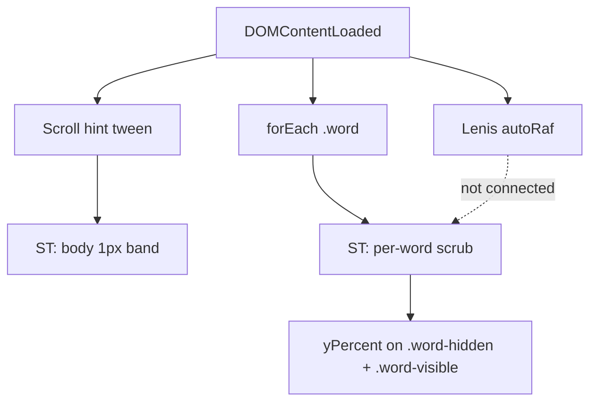

# Animation Audit — MWG Effect 015

**Audited:** `script.js`, `style.css`, `index.html`  
**Reference:** [ANIMATION_OVERVIEW.md](./ANIMATION_OVERVIEW.md)

---

## High-Level Overview

This effect is a **scroll-scrubbed dual-layer word reveal**: seven headline words each contain `.word-visible` and `.word-hidden` (duplicate text). CSS `clip-path` on `.word` acts as a horizontal slot; GSAP animates both children from `yPercent: 0` to `100` as the user scrolls. A fixed “Scroll” hint fades out on the first pixel of scroll via a separate ScrollTrigger on `document.body`. Lenis runs with `autoRaf: true` but is not wired into ScrollTrigger’s scroll proxy.

**Concepts in play:** ScrollTrigger scrubbing, `autoAlpha`, relative `yPercent` (`+=100`), CSS mask + transform stacking, optional smooth scroll (Lenis).

---

## Code Flow

```
[Page load]
    │
    ├─> gsap.registerPlugin(ScrollTrigger)     [module scope, line 1]
    │
    └─> DOMContentLoaded
            │
            ├─> lenis = new Lenis({ autoRaf: true })    [implicit global]
            │
            ├─> gsap.to(".scroll", { autoAlpha: 0, ... scrollTrigger })
            │       trigger: document.body
            │       start: "top top"  end: "top top-=1"   [1px band]
            │       toggleActions: "play none reverse none"
            │
            └─> querySelectorAll(".mwg_effect015 .word")
                    │
                    └─> forEach(word) ──> gsap.to(word.children, { yPercent: "+=100", ... })
                            trigger: word
                            start: "bottom bottom"
                            end: "top 55%"
                            scrub: 0.4
                            ease: "expo.inOut"
```

**Parallel instances:** 1 hint tween + **7 independent** word tweens (no shared timeline, no `defaults`, no batch API).



---

## First Impressions

The animation logic is short (34 lines) but **not structured for reuse or reading**: there is no storyboard block, no config object, and no named entry point—only an anonymous `DOMContentLoaded` handler with two unrelated tweens glued together. The biggest structural gap is **seven separate ScrollTrigger instances** created in a loop without shared defaults, refresh handling, or teardown. That pattern works for a demo but becomes spaghetti the moment you add resize logic, Lenis integration, reduced motion, or drop this into a framework route. A second immediate concern: **`lenis` is assigned without `const`/`let`**, creating an implicit global, and Lenis is never passed to ScrollTrigger—so smooth scroll and scrub math can disagree under load or on touch devices.

---

## Overall Design Architecture

Today the code is **markup-coupled procedural GSAP**: selectors and magic numbers live inline, and the HTML must hand-author duplicate `.word-hidden` / `.word-visible` pairs for every word. That is appropriate for a CodePen-style snippet but not for dropping into a production site.

Three viable directions, ordered by fit for this repo’s teaching goals:

| Approach | What it looks like | Best when |
| -------- | ------------------- | --------- |
| **A. Config + `initEffect015(root)`** | Top-of-file storyboard comment + `EFFECT_015_CONFIG`; one function receives a section element, queries inside it, returns `{ kill() }` | Smallest diff; good for a one-off demo with no variants |
| **B. Class / module `MwgEffect015` (or `ScrollTextReveal`)** | Constructor/factory takes `root` + **options**; strategy methods per `mode`; exposes `refresh()` / `destroy()` | Variants (word / char / line / pinned), CMS sections, SPA lifecycle |
| **C. Single master timeline + ScrollTrigger batch** | One pinned section ST drives staggered progress (less common for per-word geometry triggers) | Pinned headline + explicit stagger across words/chars |

**Recommendation (updated):** **B — class or ES module with a typed options object.** The variation ideas below (especially character stagger and pinned timelines) multiply branching, DOM prep, and ScrollTrigger topology. A flat `init` + config file stops scaling once `mode` switches how markup is split, how many ScrollTriggers exist, and whether motion is geometry-driven or timeline-driven. Ship **Phase 1** as module + default `mode: 'word'` (current behavior); add modes behind the same API so docs and demos stay one entry point.

**Per-word ScrollTriggers remain valid** for `mode: 'word'` (geometry drives reading order). Other modes may intentionally use fewer triggers, one pinned ST, or nested timelines — that is a **mode decision**, not a universal rule.

---

## Table of Fixes / Refactors

| Issue / Problem | Refactor / Fix | Why | Priority / Impact |
| ----------------- | ---------------- | --- | ----------------- |
| No storyboard or config at top of `script.js`; magic numbers (`0.2`, `0.4`, `55%`, `expo.inOut`) scattered | Add `ANIMATION STORYBOARD` comment block + `DEFAULT_OPTIONS` (scrollHint, reveal, stagger, pin) in module | One place to tune timing; same object drives future `mode` variants | **High** |
| All logic inside anonymous `DOMContentLoaded`; no init / destroy; no variant hook | `class MwgEffect015` (or factory) + `gsap.context()` + `REVEAL_STRATEGIES[mode]` registry; Phase 1 only implements `word` | Variants (char stagger, pinned timeline) need lifecycle and mode switch without rewriting Lenis/ST wiring | **High** |
| `lenis` implicit global; typo comments (`LIENIS`) | `const lenis = new Lenis(...)`; fix comments; optional `window.__lenis` only if debugging | Prevents globals pollution and strict-mode failures | **High** |
| Lenis + ScrollTrigger not integrated | `lenis.on('scroll', ScrollTrigger.update)` and `gsap.ticker.lagSmoothing(0)` (or official Lenis + ST recipe); call `ScrollTrigger.refresh()` after Lenis init | Without this, scrub progress can track native scroll while visuals use smoothed scroll—jank and desync | **High** |
| Seven tweens built in `forEach` with duplicated options | `gsap.utils.toArray('.word', root).forEach(...)` + `gsap.defaults({ ease })` or spread `WORD_REVEAL` into each `gsap.to` | DRY; changing scrub/ease once updates all words | **Medium** |
| No `ScrollTrigger.refresh()` on resize / font load | `window.addEventListener('resize', debouncedRefresh)`; `document.fonts.ready.then(refresh)` | Word heights and `bottom bottom` / `top 55%` breakpoints shift when `8vw` / `38px` mobile title applies | **Medium** |
| `index.html` loads `assets/script.js` but repo has root `script.js` | Align paths (`assets/` copy or update `<script src>`) | Broken demo when opened from repo root | **Medium** |
| Duplicate `.word-hidden` / `.word-visible` markup ×7 | Keep for teaching, or generate from `data-text` in init (optional) | Cuts HTML errors and copy-paste drift; tradeoff is less visible “layer stack” in markup | **Low** (pedagogy) / **Medium** (maintenance) |
| `yPercent: "+=100"` relative syntax | Prefer `yPercent: 100` with `from` vars or document why `+=` is required | Relative adds are easy to misread on restart/revert; absolute target is clearer for scrub 0→1 | **Low** |
| No `prefers-reduced-motion` guard | `matchMedia('(prefers-reduced-motion: reduce)')` → set `scrub: false`, shorter range, or skip word scrub | Accessibility expectation for scroll-driven motion | **Medium** |
| `.word` `clip-path` polygon with comment “depends on font” | Extract `WORD_MASK` constant in CSS custom properties or JS-injected style from config | Font swap breaks mask; centralizing documents the coupling | **Low** |
| Empty mobile `@media (max-width: 768px)` block (same padding as default) | Remove dead rule or add real mobile ST offsets (`end: "top 60%"` etc.) via `gsap.matchMedia()` | Dead CSS confuses future edits | **Low** |
| Scroll hint uses `document.body` trigger | Scope to `.mwg_effect015` or `root` if effect is embedded mid-page | Body-level ST fires globally; wrong if multiple effects or layout changes | **Low** (single full-page demo) |
| No `invalidateOnRefresh: true` on word ScrollTriggers | Add where layout shifts (font size breakpoint at 500px) | Prevents stale start/end after resize | **Medium** |
| CDN GSAP/Lenis without version lock in HTML | Pin versions in HTML (already 3.12.5); document in README | Reproducible audits and teaching | **Low** |

---

## Deeper Notes (Teaching)

### Why per-word ScrollTriggers are OK here

Staggered “reading order” comes from **geometry** (`start: "bottom bottom"`), not from a `stagger:` property. Collapsing into one timeline would require normalizing all word positions to one parent progress value—more complex, not more correct. The refactor target is **shared config and lifecycle**, not fewer triggers.

### Lenis + ScrollTrigger (worth implementing on refactor)

ScrollTrigger measures scroll position; Lenis changes how scroll values change over time. The usual fix is to let Lenis drive updates:

```javascript
lenis.on("scroll", ScrollTrigger.update);
gsap.ticker.add((time) => lenis.raf(time * 1000));
gsap.ticker.lagSmoothing(0);
```

Then remove `autoRaf: true` from Lenis (or follow the pattern in Lenis docs for your version) so one RAF loop owns both.

### Config object pattern (concrete win)

```javascript
const WORD_REVEAL = {
  yPercent: 100,
  ease: "expo.inOut",
  scrub: 0.4,
  scrollTrigger: {
    start: "bottom bottom",
    end: "top 55%",
    invalidateOnRefresh: true,
  },
};
```

Use `gsap.to(word.children, { ...WORD_REVEAL, scrollTrigger: { ...WORD_REVEAL.scrollTrigger, trigger: word } })` so `trigger` stays per-word while everything else stays DRY.

### Component sketch (target for `/gsap-refactor refactor`)

```javascript
// mwg-effect-015.js — single module, multiple strategies
export class MwgEffect015 {
  constructor(root, options = {}) {
    this.root = root;
    this.options = { ...DEFAULT_OPTIONS, ...options };
    this._ctx = gsap.context(() => this._setup(), root);
  }

  _setup() {
    this._lenis = this.options.smoothScroll ? createLenis(this.options) : null;
    this._scrollHint = createScrollHint(this.root, this.options.scrollHint);
    this._reveal = REVEAL_STRATEGIES[this.options.mode](this.root, this.options);
  }

  refresh() {
    ScrollTrigger.refresh();
  }

  destroy() {
    this._ctx?.revert();
    this._lenis?.destroy();
  }
}

// Usage
new MwgEffect015(document.querySelector(".mwg_effect015"), {
  mode: "word", // 'word' | 'char' | 'line' | 'pinned' | ...
});
```

Use `gsap.context()` so `destroy()` reverts all tweens/ST instances created inside the section — required once modes multiply instance counts.

---

## Future Animation Variations

Catalog of enhancements to explore **after** the module shell exists. Each row notes what changes relative to today (dual-layer, per-word scrub, seven STs).

### Character-level

| Variant | Motion / structure | What changes vs current |
| ------- | ------------------ | ------------------------ |
| **Char stagger scrub** | Split each `.word` into char spans; one ST per word (or line); `stagger: { each: 0.03, from: "start" }` on `yPercent` / `opacity` | Needs `splitChars()` or SplitText; same clip slot per word; stagger spreads one progress value over time |
| **Char stagger + dual layer** | Split both `.word-hidden` and `.word-visible`; offset stagger between layers | 2× DOM nodes; clearest “ghost then solid” but heaviest markup |
| **Char opacity wave** | `autoAlpha` / `opacity` per char, minimal `yPercent` | Lighter motion; reduced-motion friendly variant |
| **Stagger `from` variants** | `start`, `center`, `random`, `edges` | Same code path; config only |

### Word-level (same layers, different timing)

| Variant | Motion / structure | What changes vs current |
| ------- | ------------------ | ------------------------ |
| **Section timeline + word stagger** | One ST on `.homepage-title`; timeline scrubs with `stagger: 0.15` across words | Reading order in code, not only geometry; fewer STs |
| **Line stagger** | Group by `<br>` rows; stagger lines then words | DOM queries by row; good for three-line headline |
| **Alternating direction** | Even words `yPercent` down, odd up (or `xPercent`) | Per-index modifier in loop |

### Mask & reveal mechanics

| Variant | Motion / structure | What changes vs current |
| ------- | ------------------ | ------------------------ |
| **Horizontal wipe** | `scaleX` or animated `clip-path` on one text node | Drops duplicate hidden/visible markup |
| **Moving slot** | Animate clip window over static text | CSS/JS on `.word` mask only |
| **Blur reveal** | `filter: blur()` → `0` on scrub | Optional char stagger; GPU cost on long strings |

### Scroll behavior

| Variant | Motion / structure | What changes vs current |
| ------- | ------------------ | ------------------------ |
| **Pinned headline block** | `pin: true` on `.container` for ~200–300vh; internal timeline | One narrative arc; hint → words → media in one scrub |
| **Velocity-aware scrub** | Scrub lag or stagger scales with scroll speed | Custom sync with Lenis velocity |
| **Bidirectional rewind** | Scroll-up restores chars/words in reverse | `toggleActions` / scrub direction; critical with stagger |

### Typography & layout extras

| Variant | Motion / structure | What changes vs current |
| ------- | ------------------ | ------------------------ |
| **Scale pop-in** | `scale` + `back.out` per char/word | May mix scrub + short ease segment |
| **3D flip** | `rotationX` per char, `transformOrigin: "50% 100%"` | Perspective on parent; clip still applies |
| **Media parallax** | `.media` `y` / `scale` tied to section ST | Second target on shared or pinned ST |
| **Intro sync** | `.top .text` fade before headline | Extends pinned timeline or separate ST |

### Recommended first prototypes (after refactor)

1. **`char`** — char stagger + existing clip slot (largest visual change; validates split + stagger API).
2. **`pinned`** — pinned section + word timeline stagger (one scrub story).
3. **`charOpacity`** or reduced-motion — blur/opacity wave (simpler than dual-layer per char).

---

## Refactor Plan: Module / Class Component

Phased plan so refactor does not try to ship every variant at once.

### Phase 1 — Shell (default = current visual)

| Deliverable | Detail |
| ----------- | ------ |
| **Module file** | e.g. `mwg-effect-015.js` — `export class MwgEffect015` or `export function createMwgEffect015(root, options)` |
| **Options object** | `DEFAULT_OPTIONS` merged with user config; storyboard comment documents defaults |
| **Lifecycle** | `destroy()` / `refresh()`; `gsap.context()` scoped to `root` |
| **Lenis** | Optional via `smoothScroll: true`; wired to ScrollTrigger when enabled |
| **Mode** | Only `mode: 'word'` implemented; others throw or `console.warn` + fallback |
| **Paths** | Fix `index.html` ↔ `script.js` / `style.css` locations |

### Phase 2 — Strategy registry

| Deliverable | Detail |
| ----------- | ------ |
| **`REVEAL_STRATEGIES`** | Map `mode` → `function (root, options) => { tweens, scrollTriggers }` |
| **DOM adapters** | `getWords(root)`, `splitWordChars(word)`, `getLines(root)` — isolate markup assumptions |
| **Shared config layers** | `scrollHint`, `reveal`, `stagger`, `scrollTrigger` blocks composed per mode |
| **Docs** | One storyboard block per mode in module header or `ANIMATION_OVERVIEW.md` |

### Phase 3 — Variants (pick 1–2)

Implement chosen modes from [Future Animation Variations](#future-animation-variations); add demo flag or query param `?mode=char` for teaching.

### Proposed options surface (complexity contract)

Document these in the module so callers know what they are opting into:

```javascript
const DEFAULT_OPTIONS = {
  mode: "word", // 'word' | 'char' | 'line' | 'pinned' | 'charOpacity' | ...

  smoothScroll: true,
  reducedMotion: "respect", // 'respect' | 'ignore' — maps to matchMedia

  scrollHint: {
    selector: ".scroll",
    duration: 0.2,
    scrollTrigger: { start: "top top", end: "top top-=1" },
    toggleActions: "play none reverse none",
  },

  reveal: {
    ease: "expo.inOut",
    scrub: 0.4,
    yPercent: 100,
    scrollTrigger: { start: "bottom bottom", end: "top 55%" },
  },

  stagger: {
    each: 0.03,
    from: "start", // 'start' | 'center' | 'random' | 'edges'
  },

  split: {
    type: "chars", // for char modes: 'chars' | 'words' (SplitText-style)
    deepSlice: true, // duplicate-layer trees need consistent splitting
  },

  pin: {
    enabled: false,
    trigger: ".container",
    start: "top top",
    end: "+=200%",
  },

  selectors: {
    word: ".word",
    visible: ".word-visible",
    hidden: ".word-hidden",
    media: ".media",
  },
};
```

Not every key applies to every `mode` — invalid combinations should be validated in `_setup()` with a clear error (e.g. `stagger` ignored when `mode: 'word'` and geometry-only).

---

## Complexity to Manage

Refactoring for variants **will** increase complexity. Treat the following as explicit risks, not surprises.

| Area | Why complexity grows | Mitigation |
| ---- | -------------------- | ---------- |
| **DOM shape** | `word` mode expects duplicate layers; `char` mode needs splits; `pinned` may not use per-word boxes | DOM adapters per mode; optional init-time split; document required HTML per mode |
| **ScrollTrigger count** | 7 word STs today → 7 × N chars, or 1 pinned ST + timeline | Mode docs state ST count; use `gsap.context()` + `kill()`; avoid leaking ST on route change |
| **Stagger + scrub** | Stagger spreads motion in time while scrub ties to scroll; feels wrong if mis-tuned | Expose `stagger.each` and `reveal.scrub` together; prototype char mode early |
| **CSS coupling** | `clip-path`, `line-height: 0.8`, `translate(0,-100%)` assume word-level box | Char modes may need per-char `overflow: hidden` or nested clips — test font/mobile breakpoint |
| **Lenis + ST** | More instances = more refresh sensitivity | Single refresh debounce; `invalidateOnRefresh`; font-load hook |
| **Reduced motion** | Char stagger is heavy; needs fallback mode | `reducedMotion: 'respect'` → switch to `charOpacity` or instant `set` |
| **Markup generation** | Auto-split vs hand-authored HTML | Phase 1 keep hand markup; Phase 2 optional `buildLayers(word, text)` for CMS |
| **Testing / debug** | Harder to “see” seven vs seventy tweens | `debug: true` logs mode, ST count, `ScrollTrigger.getAll()` filtered by `root` |
| **Teaching docs** | One overview doc is no longer enough | Per-mode section in `ANIMATION_OVERVIEW.md` or `docs/variants/<mode>.md` |

**Scope rule for refactor PR:** Phase 1 must not change the default look. Variants ship behind `mode` with no regression to current `word` behavior.

---

## What Works (Specific)

- **Dual-layer + clip-path** is the right model for a “slot reveal”; CSS initial state (`translate(0, -100%)` on hidden) matches GSAP’s 0→100 scrub.
- **Per-word `trigger: word`** correctly ties scrub range to each word’s box.
- **`autoAlpha` on the hint** is the right property (opacity + visibility) for a dismissible overlay.

---

## Suggested Next Step

1. **Refactor (Phase 1):** Run `/gsap-refactor refactor` to implement **`MwgEffect015` module + `DEFAULT_OPTIONS` + `mode: 'word'` only** + Lenis/ScrollTrigger wiring + path fix + `gsap.context()` teardown. Default output must match today’s demo pixel-for-pixel (scrub feel included).
2. **Document:** Run `/gsap-refactor document` after Phase 1 to record the options API and what Phase 2/3 will add.
3. **Variants (Phase 2+):** Prototype `mode: 'char'` first if the goal is staggered per-character reveal; update this audit’s variant table with “shipped” / “deferred” once decided.
