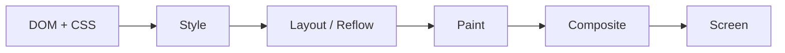

> Shorter version: [EXPLANATIONS_SIMPLIFIED.md](./EXPLANATIONS_SIMPLIFIED.md)

# What `clip-path` does here?

On each word, the **parent** `.word` gets a rectangular “window” — not the individual text spans:

```59:64:style.css
.mwg_effect015 .word {
  line-height: 0.8;
  position: relative;
  text-transform: uppercase;
  clip-path: polygon(0 2%, 0 98%, 100% 98%, 100% 2%); /* Depends on the font */
}
```

`polygon(0 2%, 0 98%, 100% 98%, 100% 2%)` is a box with corners at:

- top-left: 0% across, **2%** down  
- bottom-left: 0% across, **98%** down  
- bottom-right: 100% across, 98% down  
- top-right: 100% across, **2%** down  

So you keep a **thin horizontal band** in the middle of the word’s box (~96% of its height). Everything above 2% and below 98% is **cut off** — for the whole `.word`, including both children inside it.

That band is the **mask**. You only ever see text that falls inside it.

---

## Two layers inside the mask

Each `.word` holds duplicate text:

```29:31:index.html
          <span class="word">
            <span class="word-hidden">Soundtrack®</span>
            <span class="word-visible">Soundtrack®</span>
          </span>
```

| Layer | CSS | Role |
|--------|-----|------|
| `.word-visible` | Normal flow | Starts **in** the window — that’s what you read first |
| `.word-hidden` | `position: absolute`, `translate(0, -100%)` | Same text, parked **one line above** the window |

`clip-path` does **not** move anything. It only **hides** whatever is outside the polygon. The hidden span is still there; it’s just above the visible strip, so you don’t see it until it moves down into the band.

---

## How scroll “reveals” the hidden word

GSAP moves **both** spans down with `yPercent` (0 → 100):

```
BEFORE SCROLL                         AFTER SCROLL
                                      
   [ hidden ]  ← above window            [ hidden ]  ← now IN window ✓
═══════════════  ← clip window          ═══════════════
   [ visible ] ← in window               [ visible ] ← below window (clipped away)
```

1. **Start:** The window shows `.word-visible`. `.word-hidden` sits above the window (clipped out).  
2. **Scroll:** Both layers slide down together.  
3. **End:** `.word-hidden` has moved into the window; `.word-visible` has moved below it and is clipped away.

So the “reveal” is really: **slide two copies of the word through a fixed slot**. The hidden copy was always there; `clip-path` just defines which slice of the stack is visible.

---

## Why 2% and 98%?

The comment in CSS says it **depends on the font**. Tight `line-height: 0.8` and uppercase glyphs often have ascenders/descenders that stick outside a strict `0%–100%` box. Nudging the polygon to **2% / 98%** trims a little extra ink so the slot looks clean and you don’t get stray pixels at the top or bottom of the mask.

---

**One-line summary:** `clip-path` on `.word` is a fixed horizontal peephole; scroll pulls the duplicate “hidden” text down from above the peephole while the “visible” text slides out below it.


# What is x versus xPercent?

For `x`, `y`, `xPercent`, and `yPercent`, GSAP almost always writes to the element’s **`transform`** (e.g. `translateX`, `translateY`), not `top` / `left` / `margin`.

So the browser is moving the **painted layer** of the element. Layout (where the box “reserves” space) usually stays the same unless you animate layout properties separately.

---

## `x` vs `yPercent` — same axis family, different units and axis

| Property | Axis | Typical meaning | CSS equivalent (conceptually) |
|----------|------|-----------------|----------------------------------|
| **`x`** | horizontal | Move by **pixels** (default) | `transform: translateX(100px)` when `x: 100` |
| **`y`** | vertical | Move by **pixels** (default) | `transform: translateY(100px)` when `y: 100` |
| **`xPercent`** | horizontal | Move by **% of that element’s width** | `transform: translateX(50%)` when `xPercent: 50` |
| **`yPercent`** | vertical | Move by **% of that element’s height** | `transform: translateY(50%)` when `yPercent: 50` |

So **`x` and `yPercent` are not alternatives for the same thing** — one is horizontal, one is vertical. The real pairings are:

- **`x` vs `xPercent`** — horizontal, pixels vs % of width  
- **`y` vs `yPercent`** — vertical, pixels vs % of height  

---

## Why `%` matters for your hidden word

In your CSS, the hidden span starts one line up:

```css
transform: translate(0, -100%);  /* -100% of its own height */
```

In GSAP you scrub:

```javascript
yPercent: '+=100'  // add another 100% of this span's height downward
```

**`yPercent`** is used because “one line of text” should scale with the element:

- Tall word / big font → bigger pixel shift  
- Small word → smaller pixel shift  

If you used **`y: 60`** (pixels), every word would move the same distance in px, which would **not** match “one full line height” per word.

**`yPercent: 100`** ≈ “move down by exactly my height” — which matches the CSS `-100%` setup.

---

## Visual: pixel `y` vs percent `yPercent`

Same span, height = 60px:

```
y: 30          → moves 30px down (half height, fixed px)
yPercent: 50   → moves 30px down (50% of 60px)
yPercent: 100  → moves 60px down (full height)
```

For a span that’s 40px tall, `yPercent: 100` only moves 40px. Same property, different result per element — that’s the point.

---

## How this stacks with your existing CSS transform

GSAP doesn’t replace `transform` with a single unrelated property — it **merges** into one transform on that element:

1. **CSS:** `translate(0, -100%)` on `.word-hidden`  
2. **GSAP:** adds `yPercent` on top → combined `translate` / matrix on the same node  

So at scroll end you get roughly:

- Hidden: started at **-100%**, animated **+100%** → about **0%** (sits in the clip window)  
- Visible: started at **0%**, animated **+100%** → **+100%** (sits below the window, clipped away)

`clip-path` on the parent `.word` doesn’t move; only the children’s **transform** changes.

---

## What is *not* changing (in your setup)

| Property | Changing in your word tween? |
|----------|--------------------------------|
| `transform` (translate) | **Yes** — main motion |
| `clip-path` | **No** — fixed on `.word` |
| `top` / `left` | **No** — hidden uses `top: 0; left: 0` only for anchoring |
| `opacity`, `color`, etc. | **No** |
| Layout box size | **No** — `inline-block` span box stays; only drawing position shifts |

---

## GSAP strings you might also see

- **`y: "100%"`** — also a percentage, but as a string on `y`; GSAP 3 treats % on `x`/`y` relative to the element too.  
- **`yPercent: '+=100'`** — relative add: “from wherever I am now, go 100% more down” (handy if the tween runs again or you’re building on CSS’s -100%).

---

**Short answer:** `x` / `y` move in **pixels** (by default); `xPercent` / `yPercent` move in **percent of the element’s own width/height**. Your reveal uses **`yPercent`** so each word slides exactly one line of *its own* size through the fixed `clip-path` window, which pairs with CSS `translate(0, -100%)` on the hidden copy.


# Layout vs painted

**Layout (flow / box model)**  
The browser decides where the element **claims space** in the document: its width, height, and position in the tree (inline flow, flex, absolute containing block, etc.). Siblings wrap around that box. Scrolling and reflow use this.

**Paint / composite (what you see)**  
After layout, the browser draws the element. A **`transform`** moves (or scales/rotates) that **drawn result** without changing where the layout box was calculated.

So when GSAP sets `yPercent`, it’s saying: “keep the layout slot where it is, but draw this text lower (or higher).”

---

## Simple picture

```
LAYOUT (invisible box — still here)
┌─────────────┐
│   "sound"   │  ← box stays in the headline flow
└─────────────┘

PAINTED (what you see after transform)
      ┌─────────────┐
      │   "sound"   │  ← glyphs shifted down 50% of height
      └─────────────┘
```

Other words don’t jump aside when the text moves — because the **layout box didn’t move**.

---

## In your word effect

| Element | Layout | Painted |
|---------|--------|---------|
| `.word` | Inline box sized by `.word-visible` in normal flow | `clip-path` cuts what’s drawn inside that box |
| `.word-visible` | In flow → gives `.word` its size | GSAP `yPercent` slides glyphs down |
| `.word-hidden` | `position: absolute` → **no extra width/height** in flow; anchored to `.word` | CSS `-100%` + GSAP `yPercent` slides glyphs down |

The **slot** (`.word`’s box in the headline) stays in the sentence. The **two text layers** slide through the clip window on the painted side.

---

## What actually changes with `transform`

| Changes | Doesn’t change (usually) |
|---------|---------------------------|
| Where pixels appear on screen | Where the element’s layout box sits in flow |
| Hit-testing area (follows the transformed visual in modern browsers) | Sibling positions / line breaks |
| Can paint outside the box (overflow permitting) | `clip-path` on the parent — that’s still on `.word` |

---

## “Two layers” wording

I used “painted layer” loosely — not a second DOM node. In devtools you’ll still see **one** `<span>`. The browser applies **layout first**, then **transform at paint time** (often on its own compositor layer for performance).

---

**One sentence:** The element still **occupies** its place in the layout; `transform` only **relocates how it’s drawn** (and what you can click), which is why this reveal can slide text without reflowing the whole headline.


# Layout change vs `transform`

| What you change | Typical pipeline impact |
|-----------------|-------------------------|
| `width`, `height`, `padding`, `margin`, `font-size`, `display`, etc. | **Layout** (reflow) → often **paint** → **composite** |
| `transform`, `opacity` (often) | Often **composite only** — layout box unchanged |

So:

- **Resize the box** → browser recomputes geometry (“where do things go?”). Neighbors can move. That’s layout.
- **Only `transform`** → the **layout result** for that element’s slot usually stays the same; the browser moves/scales the **already-painted** result (or repaints only that layer if needed).

Caveats:

- `transform` can still cause **paint** if something else invalidates the element (new children, `filter`, `clip-path` changes, etc.).
- **`clip-path` on `.word`** is applied at paint time; it doesn’t move the layout box, but it’s not “composite-only” in the same way as a pure `translate` on a promoted layer.
- Reading `offsetHeight` / `getBoundingClientRect()` during a tween can force **layout sync** and hurt performance.

GSAP prefers `transform` partly because it often stays off the expensive reflow path.

---

## A more technical model (not “two DOM layers”)

Think of **one DOM node** going through a **pipeline**, not two parallel elements.



### 1. DOM + CSS

Tree of nodes + computed styles. No pixels yet.

### 2. Layout (reflow)

Builds **boxes**: position, width, height, line breaks, flex/grid placement.  
Output: “this inline box is here, this tall, this wide.”

That’s the **layout box** — what flow and scroll use. Still not necessarily what you *see* if a transform will shift it later.

### 3. Paint

Rasterize **what** to draw inside (and around) those boxes: text, fills, borders, `clip-path`, shadows.  
Output: **display list** / **paint records** (draw commands), often tiled into **bitmaps** per region or layer.

### 4. Composite

**Compositor** (often GPU) stacks **layers** (textures), applies `transform`, `opacity`, `filter` on layers, blends, outputs final frame.

This is where “move on screen without reflow” usually happens: the **texture** moves, not the layout coordinates of siblings.

---

## What people mean by “layers”

There are **three** related ideas — don’t mix them up:

| Term | What it is |
|------|------------|
| **Layout box** | Reserved space in the document (flow, hit area baseline) |
| **Stacking context** | CSS painting order (`z-index`, `opacity`, `transform`, etc.) |
| **Compositor layer** | Optional GPU-backed surface; cheap to move with `transform` |

`transform` on an element often **creates a compositor layer** (especially with `will-change: transform` or when promoted for animation). That’s a **bitmap + transform matrix**, not a second DOM node.

So the better phrase than “layout layer vs painted layer” is:

> **Layout box** (geometry in the tree) vs **compositor layer** (pixels moved on the GPU).

---

## Side-by-side: resize vs transform

**Change `height` on a word span:**

```
Style change
  → Layout: headline reflows?, line height recalculates
  → Paint: affected text re-rasterized
  → Composite: full frame updated
```

**Only `yPercent` (transform):**

```
Style/transform change
  → Layout: (usually skipped for that change)
  → Paint: (often skipped if layer already valid)
  → Composite: update matrix on existing layer
```

Visually the text moves; inline siblings don’t reflow.

---

## How this maps to your effect

```
.word                 ← layout box from .word-visible; clip-path at paint
  .word-visible        ← in flow (defines size); transform at composite
  .word-hidden         ← absolute (out of flow); transform at composite
```

- **Layout:** headline line breaks and word spacing come from in-flow `.word-visible`.
- **Paint:** glyphs + `clip-path` masking on `.word`.
- **Composite:** GSAP `yPercent` slides each span’s layer through the mask window.

The **mask window** (clip) stays fixed in layout/paint space on `.word`; the **text textures** slide under it via transform.

---

## One-sentence summary

Browsers don’t duplicate the element: they **compute layout once**, **paint** content into layers, then **composite** those layers to the screen — and **`transform` mainly nudges the composite step**, while **width/height changes redo layout** (and usually repaint too).


# Pipeline first (what happens each frame)

You’re connecting the right ideas. The tweak is: it’s **mostly a pipeline** (steps in time), and **sometimes a stack** (layers at composite time)—not several permanent “planes” every element always lives on.

For each frame (or after a change), the browser roughly does:

```
DOM + styles → layout → paint → composite → screen
```

That’s **process**: one element, one moment in time, data gets richer at each step.

| Stage | What exists for the element |
|-------|-----------------------------|
| After **layout** | A **box**: x, y, width, height, line position — geometry in the document |
| After **paint** | **Pixels** (or draw commands) for how it should look inside/over that box |
| After **composite** | Those pixels placed in the **final image** (possibly moved/scaled by `transform`) |

So yes: you can think of **states** — “layout state” then “visual state” — but they’re **stages of one frame**, not three separate elements.

---

## Where “stack” enters

The **stack** shows up at **composite**, not at layout.

The compositor works with **layers** (textures + transforms + opacity). A layer is like a sheet of glass. The final screen is those sheets **blended in order** (stacking contexts, `z-index`, etc.).

```
COMPOSITOR (one frame — simplified)

   [ fixed .scroll label layer ]
   [ headline word layer — transform applied here ]
   [ photo layer ]
   [ background ]
        ↓ blend
      screen
```

Important:

- **Not every element** gets its own compositor layer. Many elements share one painted surface; the browser only promotes layers when it’s worth it (e.g. animated `transform`).
- **Layout** doesn’t stack elements for display — it **places boxes** in one coordinate system.
- **Paint** can clip/mask (your `clip-path`) on a region.
- **Composite** moves/scales **already-painted** layers.

So: **flow chart for the pipeline**, **stack only for the last step** (and only for layers that were created).

---

## A mental model that fits both

**One element, one frame — three representations:**

```
1. LAYOUT BOX     "Where does this sit in the document?"
                  (flow, scroll, siblings)

2. PAINT OUTPUT   "What should it look like?" 
                  (glyphs, colors, clip-path cut)

3. COMPOSITE XFORM "Where do those pixels land on screen?"
                  (transform, opacity on a layer)
```

They’re **not three DOM nodes**. They’re **three results** of one node going through the pipeline.

- **Layout** sticks around until something triggers reflow (size, font, content…).
- **Paint** may be cached until something invalidates it (color change, `clip-path` change, text change…).
- **Composite** can update every frame with only a matrix change (`yPercent`) — cheap.

That’s the “different states” idea, framed as **cached artifacts** updated at different rates.

---

## Your word effect on this model

For one `.word-visible` span during scroll:

| State | What’s happening |
|-------|------------------|
| **Layout** | `.word` still takes the same space in the headline line |
| **Paint** | Text + parent `clip-path` define what’s visible in the slot |
| **Composite** | GSAP `yPercent` slides the span’s layer down through the slot |

You **see** the word move; you **don’t** see the line reflow — layout state unchanged, composite state changing every scrub frame.

---

## What *not* to picture

- Not: element “lives on layout plane” and a **copy** “lives on compositor plane.”
- Not: three permanent parallel universes per `<span>`.

Better: **one element → layout box (geometry) + painted bits (appearance) → compositor positions those bits (final pixels).**

---

## One line

**Pipeline** = how the browser *builds* the frame; **compositor stack** = how it *assembles* pre-painted pieces at the end. Layout is “where the slot is”; composite is “where the drawing is shown this frame”—often the same slot, shifted by `transform` without redoing layout.
