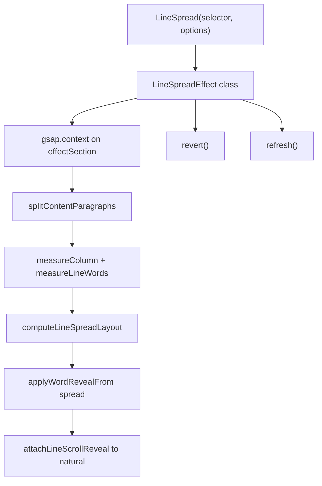

# LineSpread component and configurable reveal options

**Status:** Planned (not yet implemented)  
**Source:** [refactor.js](../refactor.js) · [ANIMATION_AUDIT.md](./ANIMATION_AUDIT.md)  
**Saved:** For revisiting the next refactor phase

---

## Implementation checklist

- [ ] Add `DEFAULT_OPTIONS` + `mergeOptions()` with split/scroll/spread/reveal/layout sections
- [ ] Create `LineSpreadEffect` class with `gsap.context`, `fonts.ready`, `revert`/`refresh`
- [ ] Implement `spread.mode`: justify | fixed | scaled | clamp | none in `computeLineSpreadLayout`
- [ ] Replace `attachLineScrollReveal` with `attachLineReveal` (`fromTo`, `x: "spread"`, opacity/y/scale/stagger)
- [ ] Add `LineSpread(target, options)` factory and update bootstrap
- [ ] Document API and example configs in ANIMATION_OVERVIEW

---

## Goal

Turn the current procedural [refactor.js](../refactor.js) into a **reusable initializer** you call from any page:

```javascript
const effect = LineSpread(".mwg_effect097", { /* options */ });
// later: effect.revert() or effect.refresh()
```

No bundler required: attach `LineSpread` to `window` (or keep a one-line bootstrap at the bottom of the same file). [script.js](../script.js) stays as the original reference.

---

## Recommended API shape

```javascript
/**
 * @param {string|Element} target - selector or .mwg_effect097 element
 * @param {LineSpreadOptions} [options]
 * @returns {LineSpreadInstance|null}
 */
function LineSpread(target, options = {}) { ... }
```

**Instance methods** (audit step 5 — lifecycle for SPAs / Lenis / orchestrators):

| Method | Purpose |
|--------|---------|
| `revert()` | `gsap.context().revert()` — kills tweens, ScrollTriggers, SplitText revert |
| `refresh()` | Re-measure column + words, re-apply spread, `ScrollTrigger.refresh()` |
| `init()` | Internal; called once from constructor (async if `waitForFonts: true`) |

**Bootstrap** at bottom of [refactor.js](../refactor.js):

```javascript
LineSpread(".mwg_effect097");
```

---

## Architecture



**File layout (single pass, minimal churn):**

- Evolve [refactor.js](../refactor.js) in place: config defaults + `LineSpreadEffect` class + thin `LineSpread()` factory + 3-line bootstrap.
- Optional later split: `line-spread.js` (component) + `refactor.js` (demo bootstrap only) — only if the file grows past ~250 lines.

**Internals:** Keep existing extracted functions; pass `options` into `computeLineSpreadLayout`, `applySpreadOffsets`, and `attachLineScrollReveal` instead of module-level `SCROLL` only.

---

## Config object design

Merge user options over defaults (shallow merge per section):

```javascript
const DEFAULT_OPTIONS = {
  split: {
    type: "lines, words",
    linesClass: "line",
    wordsClass: "word",
    paragraphSelector: ".content p",
    columnSelector: ".container",
  },
  scroll: {
    start: "top bottom",
    end: "top 60%",
    scrub: 0.2,
    ease: "power2.out",
  },
  spread: {
    mode: "justify",           // see modes below
    fixedOffsetXPx: 120,      // used when mode === "fixed"
    multiplier: 1,            // scale computed offsets
    maxOffsetXPx: null,       // optional clamp
  },
  reveal: {
    from: { x: "spread", opacity: 1, y: 0, scale: 1 },
    to:   { x: 0,         opacity: 1, y: 0, scale: 1 },
    staggerSeconds: 0,      // per-word delay inside line (0 = line moves as block)
  },
  layout: {
    waitForFonts: true,
    refreshOnResize: false,   // phase 2; debounced re-init
  },
};
```

### Spread offset modes (`spread.mode`)

This answers **“hardcode spreadOffsetX with a starting value”**:

| Mode | Behavior | Use case |
|------|----------|----------|
| `"justify"` (default) | Current math: full-column spread, per-word `spreadOffsetX` | Demo as-is |
| `"fixed"` | Every word gets `x: spread.fixedOffsetXPx` (ignores layout math) | Uniform slide-in from the right (e.g. all words +120px) |
| `"scaled"` | `spreadOffsetX * spread.multiplier` after justify math | Subtle spread (0.5) or exaggerated (1.5) |
| `"clamp"` | Justify math, then `Math.min(computed, maxOffsetXPx)` | Cap how far words can separate |
| `"none"` | Skip spread; start at natural (`x: 0`) | Only opacity/Y reveal |

**Implementation note:** `"spread"` in `reveal.from.x` resolves per word to that word’s computed (or fixed) offset; scroll still tweens toward `reveal.to.x` (usually `0`).

Example — fixed starting offset:

```javascript
LineSpread(".mwg_effect097", {
  spread: { mode: "fixed", fixedOffsetXPx: 80 },
  reveal: { from: { x: "spread", opacity: 0 }, to: { x: 0, opacity: 1 } },
});
```

---

## Animatable properties beyond `x`

GSAP can scrub any numeric/CSS prop on `.word` elements. Sensible options for this effect:

| Property | Typical `from` → `to` | Notes |
|----------|----------------------|-------|
| **`x`** | `"spread"` → `0` | Core effect; keep `"spread"` keyword |
| **`opacity`** | `0` → `1` | Fade words in as line settles; very common pairing |
| **`y`** | `12` → `0` or `20` → `0` | Subtle rise into place |
| **`scale`** | `0.95` → `1` | Soft zoom-in per word |
| **`rotation`** | `-3` → `0` | Playful; use sparingly |
| **`skewX`** | `8` → `0` | Editorial motion |
| **`filter`** | `"blur(8px)"` → `"blur(0px)"` | Heavier paint cost; pretty but expensive on long copy |

**Not ideal on `.word` without more SplitText:** `color` (per-word ok via GSAP), `letterSpacing` (chars-level is better). Titles vs body could use `paragraphSelector` split configs later.

**Stagger:** `reveal.staggerSeconds: 0.05` maps to `gsap.to(lineWords, { ..., stagger: 0.05 })` so words in a line cascade slightly while scrubbing (still one ScrollTrigger per line).

**Refactor `attachLineScrollReveal`** → rename to `attachLineReveal` and build `from`/`to` vars:

```javascript
const fromVars = resolveRevealVars(wordLayouts, options.reveal.from);
const toVars = resolveRevealVars(options.reveal.to);
gsap.fromTo(lineWords, fromVars, { ...toVars, ease, scrollTrigger: { ... } });
```

Use `gsap.fromTo` (or `to` with implied from via `gsap.set`) so opacity/Y start states are applied before scrub.

---

## `gsap.context` and fonts (audit items 4–5)

Wrap the per-line loop inside:

```javascript
this.context = gsap.context(() => {
  // split, measure, apply, attach
}, this.effectSection);
```

`revert()` calls `this.context.revert()` plus SplitText instances if tracked.

If `layout.waitForFonts` and `document.fonts` exists:

```javascript
await document.fonts.ready;
// then measure + ScrollTrigger.refresh()
```

Prevents wrong `spreadOffsetX` when Inter loads after measure.

---

## Storyboard / docs updates

After implementation, update:

- [ANIMATION_OVERVIEW.md](./ANIMATION_OVERVIEW.md) — add config table and spread modes
- [ANIMATION_AUDIT.md](./ANIMATION_AUDIT.md) — mark steps 4–5 done or link to `LineSpread` API

---

## Example configs (for the guide)

```javascript
// 1. Default (current behavior)
LineSpread(".mwg_effect097");

// 2. Fixed spread — every word starts +100px right, no justify math
LineSpread(".mwg_effect097", {
  spread: { mode: "fixed", fixedOffsetXPx: 100 },
});

// 3. Justify + fade
LineSpread(".mwg_effect097", {
  reveal: { from: { x: "spread", opacity: 0 }, to: { x: 0, opacity: 1 } },
});

// 4. Subtle spread + rise
LineSpread(".mwg_effect097", {
  spread: { mode: "scaled", multiplier: 0.4 },
  reveal: { from: { x: "spread", y: 16, opacity: 0.6 }, to: { x: 0, y: 0, opacity: 1 } },
});
```

---

## Implementation order

1. Add `DEFAULT_OPTIONS` + `mergeOptions()` helper
2. Introduce `LineSpreadEffect` class with `gsap.context`, guards, optional `fonts.ready`
3. Thread `options` through layout + reveal functions; implement `spread.mode`
4. Replace `attachLineScrollReveal` with `attachLineReveal` (`from`/`to` + `"spread"` resolver)
5. Export `LineSpread()` factory + update bootstrap
6. Document config in `docs/` (short section in ANIMATION_OVERVIEW)

---

## Out of scope (unless requested later)

- Lenis + ScrollTrigger wiring
- `refreshOnResize` debounce
- Multiple instances registry
- ES module `export` (can add later without changing the `LineSpread()` call signature)
