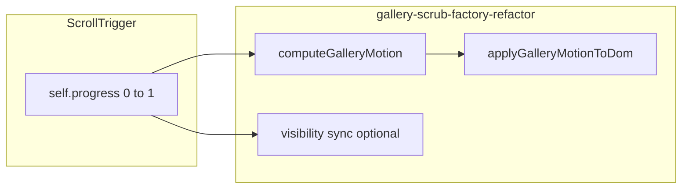

# Refactoring the gallery scrub: a junior-friendly guide

This guide explains **how** we turned a single-page spike ([`script.js`](script.js)) into a **reusable, multi-instance** setup ([`gallery-scrub-factory-refactor.js`](gallery-scrub-factory-refactor.js)), with **[`main.js`](main.js)** as the page orchestrator. It is written for someone who knows JavaScript and the DOM but is newer to **GSAP ScrollTrigger** and to **refactoring** in production-shaped code.

Layering, scroll track height, and the “fixed stage vs scrolling content” story live in [`ANIMATION.md`](ANIMATION.md). **Read that for the cinematic layout.** Read **this** for **why the code is shaped the way it is** and **how to repeat the pattern** on your next animation.

---

## Metaphors cheat sheet (GSAP + motion + JS)

Use these mentally when reading the code. They are not perfect 1:1 models, but they build intuition fast.

| Idea | Metaphor | Why it fits |
|------|-----------|-------------|
| **`self.progress` (0 → 1)** | **Dimmer switch** or **fuel gauge** | One number summarizes “how far through this scroll segment you are.” Fully off → fully on. |
| **ScrollTrigger `start` / `end`** | **Start line and finish line** on a course | The race only “counts” while the runner (your trigger element) is between those lines relative to the viewport. |
| **`scrub`** | **Heavy camera dolly** (or power steering with lag) | You turn the wheel (scroll), but the camera **catches up smoothly** instead of snapping to every micro-movement. `scrub: 1` means “don’t teleport; ease toward the scroll position.” |
| **Trigger element vs things you animate** | **Thermostat vs radiators** | The thermostat **senses** when to run (trigger + range). The radiators are **what actually change temperature** (grid, columns, image). Same room can have one sensor driving many outputs. |
| **`querySelector` inside `onUpdate`** | **Asking the librarian for the same book on every page turn** | It works, but you already knew where the book was—you should **remember the shelf once** (cache refs). |
| **One global selector, two galleries** | **Two actors sharing one spotlight** | The first `.gallery-wrapper` wins forever; the second gallery never gets its own light. |
| **Factory (`createGalleryScrollScrub`)** | **Ordering the same appliance model with different color / settings** | Same blueprint; different `galleryId`, `sideTranslateDirection`, etc. |
| **`computeGalleryMotion` (no DOM)** | **Recipe card vs cooking** | The recipe only says “2 cups flour”—it doesn’t open your pantry for you. Cooking (`applyGalleryMotionToDom`) applies it. |
| **Closing over cached DOM nodes** | **Sticky notes on your monitor** | You write the element references once; every `onUpdate` glances at the sticky note instead of searching the building again. |
| **Lenis + `ScrollTrigger.update`** | **Smooth escalator handrail** | The handrail (scroll position) glides; ScrollTrigger needs a **ping** on each tick so it doesn’t think the user is still on the old step. |
| **`ScrollTrigger.refresh()` after resize** | **Re-measuring furniture after you knock down a wall** | Layout changed; distances and pin positions may be wrong until you refresh the ruler. |
| **`destroy()` / `kill()`** | **Unplugging gear before you move apartments** | Prevents orphaned listeners and “ghost” triggers when a section unmounts or you swap demos. |

Keep these in mind while you read the sections below.

---

## High-level: what GSAP is doing here

We are **not** building a classic time-based timeline (“animate over 1.2s”). We are building a **scroll-native** effect: **scroll position is the clock**.

Official reference: [ScrollTrigger](https://gsap.com/docs/v3/Plugins/ScrollTrigger/) (plugin docs).

### The three “channels” of motion

While the user scrolls through the trigger’s range, we drive three kinds of change (see [`script.js`](script.js) lines 18–28 and [`gallery-scrub-factory-refactor.js`](gallery-scrub-factory-refactor.js) `computeGalleryMotion` + `applyGalleryMotionToDom`):

1. **Grid** — zoom with `translate(-50%, -50%) scale(...)`. **Metaphor:** **camera push-in** on a framed collage; center stays pinned in the middle of the stage.
2. **Side columns** — `translateY(...)` **Metaphor:** **escalator steps** beside a fixed center—the sides drift past at a different rate than the “hero” story in the middle.
3. **Hero image** — `scale(...)` shrinks as progress grows. **Metaphor:** **stepping back** from a poster so more of the wall grid reads.

On the real landing page, the **trigger** is usually an in-flow **scroll track** (`#ruler`), while the **grid** may live in a **fixed** viewport. **Metaphor:** **the finish line is painted on the road** (trigger moves with the document), but **the marching band is on a stationary podium** (fixed layer). [`ANIMATION.md`](ANIMATION.md) explains that stacking.

### `progress` and `scrub`, in one breath

- **`progress`** answers: “**Where am I** between start and end?” — 0% to 100% of that segment.
- **`scrub`** answers: “**How tightly** does the motion stick to the scrollbar?” — higher smoothing = more **inertia**, less jitter.

---

## What was wrong with the reference [`script.js`](script.js)

The reference file is great for **learning the math**; it is weak for **multiple instances** and **long-term maintenance**.

### Problems (teaching table)

| Problem | Metaphor | Practical pain |
|---------|----------|----------------|
| **Queries inside `onUpdate`** | Librarian every tick | Wasted work; hides intent (“we need the same nodes every frame”). |
| **Global selectors** | One spotlight | Only the **first** match updates; chapter 2 never owns its DOM. |
| **No teardown API** | Leaving appliances running | Hard to reuse in SPAs, tests, or Storybook. |
| **Lenis + effect in one file** | Mixing tour bus schedule with one rider’s playlist | Smooth scrolling is **page policy**; gallery motion is **feature policy**—split them (see [`main.js`](main.js)). |

### Naming note (don’t trip juniors)

[`script.js`](script.js) uses `.ws`, `.gallery-wrapper`, `.col:not(.main)`. The current HTML uses **`data-gallery-id`**, `.gallery-scroll-track`, `.gallery-viewport`, `.gallery-grid`. **The refactor follows the current markup**; treat `script.js` as **portable math + intent**, not copy-paste selectors.

---

## Refactoring decisions (why we chose this shape)

### 1. One ScrollTrigger per chapter

**Metaphor:** **One race per athlete.** Each gallery gets its own `progress` clock tied to **its** scroll track.

### 2. Scope by `galleryId`

**Metaphor:** **Name tags at a conference.** `data-gallery-id="1"` ties the ruler on the page to the correct fixed stage so queries **can’t wander** into another chapter.

### 3. Small pipeline functions

Order in [`gallery-scrub-factory-refactor.js`](gallery-scrub-factory-refactor.js):

1. `resolveChapterElements` — find **ruler + stage** for this id  
2. `queryGalleryTargets` — find **columns + hero** under the grid  
3. `computeGalleryMotion` — **numbers only**  
4. `applyGalleryMotionToDom` — **strings → style**  
5. Visibility helpers when multiple fixed viewports stack  

**Metaphor:** **Assembly line** — each station does one job; `createGalleryScrollScrub` is the **floor manager** wiring the belt.

### 4. Configuration object + factory

**Metaphor:** **Constructor options on a car** — same chassis (`createGalleryScrollScrub`); pick paint (`sideTranslateDirection`), wheel size (`sideTranslateMaxPx`), etc.

### 5. Return `{ scrollTrigger, destroy }`

**Metaphor:** **Remote control + off switch.** You can debug (`scrollTrigger`) and clean up (`destroy` → `kill()`).

### 6. Page shell stays in [`main.js`](main.js)

Lenis runs **once**. Resize/orientation triggers **coalesced** `ScrollTrigger.refresh()`. **Metaphor:** **building utilities** (water, electricity) are municipal; **apartments** (each gallery) plug in but don’t own the water plant.

---

## Patterns and paradigms (vocabulary for your PR descriptions)

- **Factory function** — `createGalleryScrollScrub(options)` produces a configured instance (closure + ScrollTrigger).
- **Separation o concerns** — math vs DOM vs global scroll infrastructure.
- **Pure function (locally)** — `computeGalleryMotion` avoids side effects; easier to test and reason about.
- **Closure over cached refs** — `targets` captured once, reused in `onUpdate`.
- **Declarative configuration** — defaults in destructuring; overrides per chapter from [`main.js`](main.js).

---

## Data flow (skim this diagram)

---

## Steps to recreate this refactor (template for future work)

1. **Keep the spike** — one file that proves the effect end-to-end.
2. **Name the clock** — identify what drives values (`ScrollTrigger` `progress`, `scrub`, `start`, `end`).
3. **List every animated node** — grid, columns, hero, anything that gets `style` or GSAP props.
4. **Eliminate global ambiguity** — introduce `data-*` id or a root element per instance.
5. **Query once** — resolve elements **before** `ScrollTrigger.create`; store in `const` / closure.
6. **Extract math** — function(progress, viewportWidth, options) → plain object of numbers.
7. **Extract DOM writes** — function(nodes, motion) — only assignment, no new queries.
8. **Parameterize** — replace literals with options + sensible defaults.
9. **Return a handle** — `{ scrollTrigger, destroy }` (or your framework’s equivalent).
10. **Hoist page-level behavior** — smooth scroll, global refresh, analytics: **one** entry module.
11. **Fail loudly** — throw if required nodes missing at setup time, not silently on scroll.

---

## Quick map: [`script.js`](script.js) → refactor

| `script.js` | Refactored home |
|-------------|-----------------|
| Lines 15–20 (`maxScale`, `yTranslate`, `mainImgScale`) | `defaultGetMaxScale`, `computeGalleryMotion` |
| Lines 22–28 DOM writes | `applyGalleryMotionToDom` |
| Lines 11–13 selectors | `resolveChapterElements` + `queryGalleryTargets` (scoped by `galleryId`) |
| `ScrollTrigger.create({ … })` | Same, inside `createGalleryScrollScrub` |
| Lenis + ticker | [`main.js`](main.js) only |

---

## Further reading

- **[`ANIMATION.md`](ANIMATION.md)** — storyboard, layering, why the scroll track height matters.  
- **[`gallery-scrub-factory-refactor.js`](gallery-scrub-factory-refactor.js)** — inline config summary at top of file.  
- **[GSAP ScrollTrigger](https://gsap.com/docs/v3/Plugins/ScrollTrigger/)** — API details beyond this project.

---

## Closing metaphor

Refactoring this script is like turning a **one-off stage sketch** into a **touring show**: same choreography (math), but **each city** (each `galleryId`) gets its **own props and lighting cues**, the **road crew** ([`main.js`](main.js)) handles **travel and power once**, and every show **packs up cleanly** (`destroy`) when the truck leaves.
