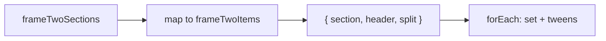
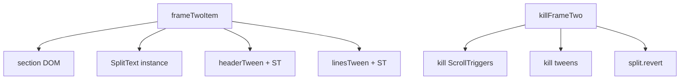
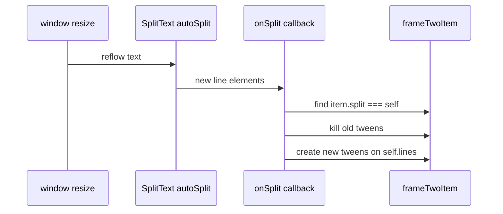
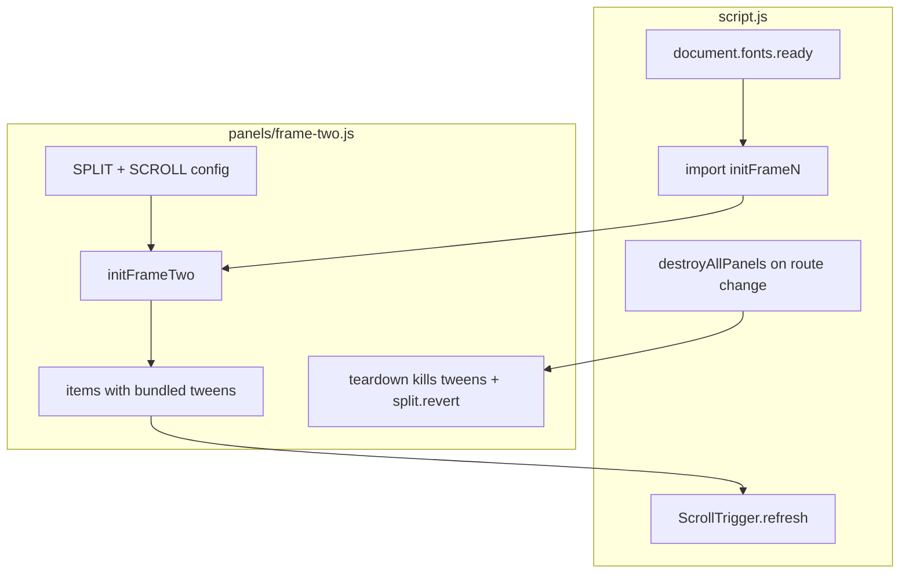

# Considerations


- Running the split text trigger via a timeline to sync with master timeline
- Setting a config for values
- Create a factory for timelines, splittext, scroll trigger
- Export each frame as a separate file and import into the main file
- Code organization with separate files for each frame
- Code patterns used for all frames: timelines, scroll trigger, split text, etc...
- Code structure with a storyboard config object for each element


## Component Ideas

- Could implement a cloneNode for frame 4 for further optimization
- How to combine waterfall cascade, slot machine rool, falling letters?
https://madewithgsap.com/effects/tutorial041
https://madewithgsap.com/effects/tutorial027

- Component based on html shape
- Or tagging the html with a data-animation="animationType" to then create the markup, assign styles and run the code


# Before Refactoring

- convert gsap.set to styles
- extract repeated properties styles into css properties
- re-order the html and css to be in sync, make sure each data-panel proceeds ASC
- review refactoring approaches


- add more types of split text
- character slide ins, etc...
- map out some variations
- create just a hide class versus a autoAlpha and opacity?
- create functions for removing anim-hide


# Refactoring Approach


### What the pattern gives you

Right now your loop does three jobs at once: query DOM, split text, animate. The instances are created and immediately orphaned — nothing references them for cleanup or resize.

```js
const splits = frameTwoSections.map((section) => ({
  section,
  header: section.querySelector("h1"),
  split: new SplitText(section.querySelector("p"), {
    type: "lines",
    smartSplit: true,
    linesClass: "paragraph++",
    autoSplit: true,
    onSplit(self) {
      // re-run animations when lines reflow on resize
    },
  }),
}));
```

Each entry is a **section bundle**: DOM refs + SplitText instance + (optionally) tweens/triggers.

---

### 1. Readability — separate setup from animation

**Phase 1: Build registry**

```js
const FRAME_TWO_SPLIT_CONFIG = {
  type: "lines",
  smartSplit: true,
  linesClass: "paragraph++",
};

const frameTwoItems = frameTwoSections.map((section) => ({
  section,
  header: section.querySelector("h1"),
  split: new SplitText(section.querySelector("p"), FRAME_TWO_SPLIT_CONFIG),
}));
```

**Phase 2: Animate from registry**

```js
frameTwoItems.forEach(({ section, header, split }) => {
  gsap.set([header, split.lines], { autoAlpha: 0 });

  gsap.to(header, {
    autoAlpha: 1,
    scrollTrigger: { trigger: section, start: "top center", once: true },
  });

  gsap.to(split.lines, {
    autoAlpha: 1,
    stagger: 0.1,
    scrollTrigger: { trigger: section, start: "top center-=120", once: true },
  });
});
```

Benefits:
- Config lives in one named object
- `frameTwoItems` reads like a manifest — scan it and see all sections
- You can drop `frameTwoHeaders` / `frameTwoParagraphs` — they duplicate what’s already in each bundle

---

### 2. Organization — store tweens and triggers on the bundle

For debugging and teardown, attach what GSAP creates:

```js
frameTwoItems.forEach((item) => {
  const { section, header, split } = item;

  gsap.set([header, split.lines], { autoAlpha: 0 });

  item.headerTween = gsap.to(header, { ... });
  item.linesTween = gsap.to(split.lines, { ... });

  // item.headerTween.scrollTrigger is accessible later
});
```

Then you can:
- `frameTwoItems.forEach((item) => item.split.revert())` on route change
- `ScrollTrigger.getAll().filter(st => st.vars.trigger === item.section)` for debugging
- Log one item and see the full story: section → split → lines → tween

---

### 3. Performance — where it actually helps

Splitting 3 paragraphs: **no meaningful perf gain** from map vs forEach. The wins are elsewhere:

| Technique | Benefit |
|-----------|---------|
| **Single `autoSplit` + `onSplit` callback** | On resize, SplitText re-splits and you rebuild animations once per section — no manual `window.resize` listeners |
| **Batch `gsap.set`** | One set per section instead of scattered calls |
| **`split.revert()` before re-split** | Avoids nested wrapper buildup on resize |
| **Store instances** | Prevents duplicate splits if init runs twice (SPA navigation) |

**Resize pattern** (the main perf/robustness win):

```js
const frameTwoItems = frameTwoSections.map((section) => ({
  section,
  header: section.querySelector("h1"),
  split: new SplitText(section.querySelector("p"), {
    type: "lines",
    smartSplit: true,
    linesClass: "paragraph++",
    autoSplit: true,
    onSplit(self) {
      const item = frameTwoItems.find((i) => i.split === self);
      if (!item) return;

      // kill old scroll-linked tweens before creating new ones
      item.linesTween?.scrollTrigger?.kill();
      item.linesTween?.kill();

      gsap.set(self.lines, { autoAlpha: 0 });
      item.linesTween = gsap.to(self.lines, {
        autoAlpha: 1,
        stagger: 0.1,
        scrollTrigger: {
          trigger: item.section,
          start: "top center-=120",
          once: true,
        },
      });
    },
  }),
}));
```

Without the registry, `onSplit` has no clean way to find “which section is this?” or kill the old tween.

---

### 4. Factory pattern — scales to more frames

Extract a reusable builder:

```js
function createSectionSplitItem(section, splitConfig, scrollConfig) {
  const header = section.querySelector("h1");
  const split = new SplitText(section.querySelector("p"), splitConfig);

  gsap.set([header, split.lines], { autoAlpha: 0 });

  const headerTween = gsap.to(header, {
    autoAlpha: 1,
    scrollTrigger: {
      trigger: section,
      start: scrollConfig.headerStart,
      once: true,
    },
  });

  const linesTween = gsap.to(split.lines, {
    autoAlpha: 1,
    stagger: scrollConfig.lineStagger,
    scrollTrigger: {
      trigger: section,
      start: scrollConfig.linesStart,
      once: true,
    },
  });

  return { section, header, split, headerTween, linesTween };
}

const frameTwoItems = frameTwoSections.map((section) =>
  createSectionSplitItem(section, FRAME_TWO_SPLIT_CONFIG, {
    headerStart: "top center",
    linesStart: "top center-=120",
    lineStagger: 0.1,
  })
);
```

Frame 3 can call the same factory with different config — no copy-pasted `forEach` blocks.

---

### 5. Cleanup helper — one function for the whole frame

```js
function revertFrameTwo(items) {
  items.forEach(({ split, headerTween, linesTween }) => {
    headerTween?.scrollTrigger?.kill();
    linesTween?.scrollTrigger?.kill();
    headerTween?.kill();
    linesTween?.kill();
    split.revert();
  });
}
```

Critical for SPAs, hot reload, or `matchMedia` breakpoints where you tear down and rebuild.

---

### What you can remove from current code

```155:157:scroll-trigger-architecture/script.js
  const frameTwoHeaders = frameTwo.querySelectorAll("h1");
  const frameTwoParagraphs = frameTwo.querySelectorAll("p");
```

Unused if everything lives on each bundle. Same for `console.log(frameTwoSections)`.

---

### Mental model

```
frameTwoSections (DOM)
       ↓ map
frameTwoItems[] (registry)
  ├── section      → ScrollTrigger trigger
  ├── header       → header tween target
  ├── split        → SplitText instance (revert, autoSplit)
  ├── split.lines  → line tween targets
  ├── headerTween  → optional: kill / debug
  └── linesTween   → optional: kill / debug
```

**Per-loop split** = correct for your layout. **Collected registry** = correct for maintainability, resize, and cleanup. They work together — the map doesn’t change how lines are computed, it changes how you **own** the result.

If you want this refactored into `script.js` directly, switch to Agent mode and I can apply it.


## Refactor Approaches

## Your starting point

```159:192:scroll-trigger-architecture/script.js
  frameTwoSections.forEach((section) => {
    let header = section.querySelector("h1");
    let paragraph = section.querySelector("p");
    let paragraphLines = new SplitText(paragraph, { ... }).lines;

    gsap.set([header, paragraphLines], { autoAlpha: 0 });
    gsap.to(header, { ... scrollTrigger ... });
    gsap.to(paragraphLines, { ... scrollTrigger ... });
  });
```

**Problems this solves over time:**
- SplitText instances are orphaned (no revert on resize/navigation)
- Config is inline and duplicated when Frame 3+ copy the pattern
- `frameTwoHeaders` / `frameTwoParagraphs` are queried but unused
- Setup and animation are fused — hard to scan or debug one section

---

## Option A — Registry (minimal refactor)

**When to use:** You want better organization now with almost no architectural change.

**Idea:** Replace the `forEach` body with a `map` that builds a registry, then animate in a second pass.

```js
// ── Frame 2: Registry ──────────────────────────────

const FRAME_TWO_SPLIT = {
  type: "lines",
  smartSplit: true,
  linesClass: "paragraph++",
};

const frameTwoItems = frameTwoSections.map((section) => ({
  section,
  header: section.querySelector("h1"),
  split: new SplitText(section.querySelector("p"), FRAME_TWO_SPLIT),
}));

frameTwoItems.forEach(({ section, header, split }) => {
  gsap.set([header, split.lines], { autoAlpha: 0 });

  gsap.to(header, {
    autoAlpha: 1,
    scrollTrigger: {
      trigger: section,
      start: "top center",
      end: "center center",
      once: true,
    },
  });

  gsap.to(split.lines, {
    autoAlpha: 1,
    stagger: 0.1,
    scrollTrigger: {
      trigger: section,
      start: "top center-=120",
      once: true,
    },
  });
});
```

**Flow:**



| Pros | Cons |
|------|------|
| Drop unused queries + console.logs | No resize handling yet |
| Named config object | Tweens still not stored on bundle |
| `frameTwoItems` is debuggable in DevTools | Same logic, just reorganized |

**Effort:** ~10 lines moved, zero behavior change.

---

## Option B — Bundle tweens on the registry

**When to use:** You want to debug ScrollTriggers or tear down Frame 2 cleanly.

**Idea:** Option A, but attach tweens to each item so you own the full lifecycle.

```js
const frameTwoItems = frameTwoSections.map((section) => {
  const header = section.querySelector("h1");
  const split = new SplitText(section.querySelector("p"), FRAME_TWO_SPLIT);

  gsap.set([header, split.lines], { autoAlpha: 0 });

  const headerTween = gsap.to(header, {
    autoAlpha: 1,
    scrollTrigger: {
      trigger: section,
      start: "top center",
      end: "center center",
      once: true,
    },
  });

  const linesTween = gsap.to(split.lines, {
    autoAlpha: 1,
    stagger: 0.1,
    scrollTrigger: {
      trigger: section,
      start: "top center-=120",
      once: true,
    },
  });

  return { section, header, split, headerTween, linesTween };
});
```

**Teardown helper:**

```js
function killFrameTwo(items) {
  items.forEach(({ split, headerTween, linesTween }) => {
    headerTween.scrollTrigger?.kill();
    linesTween.scrollTrigger?.kill();
    headerTween.kill();
    linesTween.kill();
    split.revert();
  });
}
```

**Flow:**



| Pros | Cons |
|------|------|
| One item = full story in console | Slightly more verbose per item |
| Ready for SPA / hot reload / `matchMedia` | Still no auto-resize |
| `item.linesTween.scrollTrigger` for debugging | |

**Effort:** Small step up from A. Best if you're heading toward Lenis or a router.

---

## Option C — Factory function

**When to use:** Frame 3, 4, 8 will repeat the same "header + split lines + two triggers" pattern.

**Idea:** Extract the repeated loop body into a reusable function. Frame 2 becomes a one-liner map.

```js
// ── Shared factory ─────────────────────────────────

function animateSectionReveal({
  section,
  splitConfig,
  scrollConfig,
}) {
  const header = section.querySelector("h1");
  const split = new SplitText(section.querySelector("p"), splitConfig);

  gsap.set([header, split.lines], { autoAlpha: 0 });

  const headerTween = gsap.to(header, {
    autoAlpha: 1,
    scrollTrigger: {
      trigger: section,
      start: scrollConfig.headerStart,
      end: scrollConfig.headerEnd ?? "center center",
      once: scrollConfig.once ?? true,
    },
  });

  const linesTween = gsap.to(split.lines, {
    autoAlpha: 1,
    stagger: scrollConfig.lineStagger ?? 0.1,
    scrollTrigger: {
      trigger: section,
      start: scrollConfig.linesStart,
      once: scrollConfig.once ?? true,
    },
  });

  return { section, header, split, headerTween, linesTween };
}

// ── Frame 2: consume factory ─────────────────────

const frameTwoItems = frameTwoSections.map((section) =>
  animateSectionReveal({
    section,
    splitConfig: FRAME_TWO_SPLIT,
    scrollConfig: {
      headerStart: "top center",
      linesStart: "top center-=120",
      lineStagger: 0.1,
    },
  })
);
```

**How it scales to Frame 8** (your callback panel):

```js
const frameEightItems = frameEightSections.map((section) =>
  animateSectionReveal({
    section,
    splitConfig: { type: "lines", mask: "lines", autoSplit: true },
    scrollConfig: {
      headerStart: "top center",
      linesStart: "top center-=80",
      lineStagger: 0.05,
    },
  })
);
```

| Pros | Cons |
|------|------|
| DRY across frames | Factory can grow — watch for one-size-fits-all |
| Scroll config readable at call site | Hero / Frame 1 don't fit — keep them separate |
| Matches your file header comment ("animation factory") | |

**Effort:** Medium. Pays off after 2+ similar frames.

---

## Option D — `autoSplit` + `onSplit` (resize-safe)

**When to use:** Paragraph line counts change on resize (you already do this in Frame 1).

**Idea:** Combine registry + factory, but move animation into `onSplit` so lines reflow correctly.

```js
const frameTwoItems = frameTwoSections.map((section) => {
  const header = section.querySelector("h1");
  const item = { section, header, split: null, headerTween: null, linesTween: null };

  item.split = new SplitText(section.querySelector("p"), {
    type: "lines",
    smartSplit: true,
    linesClass: "paragraph++",
    autoSplit: true,
    onSplit(self) {
      // kill previous scroll-linked tweens before rebuilding
      item.headerTween?.scrollTrigger?.kill();
      item.linesTween?.scrollTrigger?.kill();
      item.headerTween?.kill();
      item.linesTween?.kill();

      gsap.set([item.header, self.lines], { autoAlpha: 0 });

      item.headerTween = gsap.to(item.header, {
        autoAlpha: 1,
        scrollTrigger: {
          trigger: item.section,
          start: "top center",
          once: true,
        },
      });

      item.linesTween = gsap.to(self.lines, {
        autoAlpha: 1,
        stagger: 0.1,
        scrollTrigger: {
          trigger: item.section,
          start: "top center-=120",
          once: true,
        },
      });
    },
  });

  return item;
});
```

**Why the registry matters here:**



Without `item` on the closure, `onSplit` can't kill old tweens → duplicate ScrollTriggers stack up on resize.

| Pros | Cons |
|------|------|
| Matches Frame 1's resize pattern | More complex — only needed if resize matters |
| No manual `resize` listeners | Must kill old tweens every re-split |
| Correct line count after breakpoint | Slight init cost |

**Effort:** Medium-high. Choose this if panel 2 sections go full-width on mobile (they do at 768px).

---

## Option E — Config layer (project-wide)

**When to use:** You want the file structure from your top-of-file comment to become real.

**Idea:** Separate **config**, **factories**, and **init** into clear zones. Frame 2 is just init glue.

```js
// ═══════════════════════════════════════════════════
// CONFIG
// ═══════════════════════════════════════════════════

const SPLIT = {
  frameTwo: {
    type: "lines",
    smartSplit: true,
    linesClass: "paragraph++",
  },
};

const SCROLL = {
  frameTwo: {
    headerStart: "top center",
    headerEnd: "center center",
    linesStart: "top center-=120",
    lineStagger: 0.1,
    once: true,
  },
};

// ═══════════════════════════════════════════════════
// FACTORIES
// ═══════════════════════════════════════════════════

function createFrameTwoItems(sections) {
  return sections.map((section) =>
    animateSectionReveal({
      section,
      splitConfig: SPLIT.frameTwo,
      scrollConfig: SCROLL.frameTwo,
    })
  );
}

// ═══════════════════════════════════════════════════
// INIT (inside document.fonts.ready)
// ═══════════════════════════════════════════════════

const frameTwo = document.querySelector("[data-panel='2']");
const frameTwoSections = [...frameTwo.querySelectorAll("section")];
const frameTwoItems = createFrameTwoItems(frameTwoSections);
```

**File shape over time:**

```
script.js
├── imports + registerPlugin
├── CONFIG (all frames)
├── FACTORIES (reusable builders)
└── document.fonts.ready
    ├── initHero()
    ├── initFrameOne()
    ├── initFrameTwo()  → createFrameTwoItems()
    └── initFrameEight()
```

| Pros | Cons |
|------|------|
| Scannable — config vs logic | Overkill for a single demo page |
| Tweaking timing without touching factories | More files may be better eventually (`config.js`, `frames/`) |
| Aligns with gsap-refactor storyboard skill | |

**Effort:** Highest upfront, best when the page grows to 7+ panels.

---

## Decision guide

| Your priority | Pick |
|---------------|------|
| Quick cleanup, no behavior change | **Option A** — Registry |
| Debug ScrollTriggers / future Lenis teardown | **Option B** — Bundle tweens |
| Frame 3+ will copy Frame 2's pattern | **Option C** — Factory |
| Text reflows on resize (mobile breakpoints) | **Option D** — autoSplit + onSplit |
| Whole page is becoming an animation system | **Option E** — Config layer (+ split into files later) |

**Practical combo:** Start with **A → B** (one session). Add **C** when you touch Frame 8. Add **D** when you see wrong line counts after resize. **E** when `script.js` passes ~250 lines.

---

## Side note: Frame 1 already uses Option D's pattern

Your Frame 1 paragraph split is the resize-safe approach:

```126:147:scroll-trigger-architecture/script.js
  const frameOneParagraphsLines = new SplitText(frameOneParagraphs, {
    type: "lines",
    mask: "lines",
    autoSplit: true,
    onSplit(self) {
      gsap.set(self.lines, { ... });
      return gsap.to(self.lines, { ... scrollTrigger ... });
    },
  });
```

Frame 2 doesn't — that's the inconsistency. Option D brings Frame 2 in line with Frame 1.

---

## What stays the same in every option

- Split **per paragraph**, not one `SplitText` on all `<p>`s
- **Per-section** `ScrollTrigger` (`trigger: section`)
- **`document.fonts.ready`** wrapper (keep this)
- Remove dead queries: `frameTwoHeaders`, `frameTwoParagraphs`, `console.log`

If you want one of these applied directly to `script.js`, switch to Agent mode and say which option (or combo) you prefer.


## A vs B: what "bundling tweens on the registry" means

### Option A — registry only

The registry stores **DOM + SplitText**. Tweens are created but **not saved**:

```js
const frameTwoItems = frameTwoSections.map((section) => ({
  section,
  header: section.querySelector("h1"),
  split: new SplitText(section.querySelector("p"), FRAME_TWO_SPLIT),
}));

frameTwoItems.forEach(({ section, header, split }) => {
  gsap.to(header, { autoAlpha: 1, scrollTrigger: { ... } });      // ← orphaned
  gsap.to(split.lines, { autoAlpha: 1, scrollTrigger: { ... } }); // ← orphaned
});
```

GSAP still runs the animations. You just have **no handle** to them. To stop or debug, you'd hunt through `ScrollTrigger.getAll()` or guess.

### Option B — registry + bundled tweens

Same registry, but **each item owns its tweens**:

```js
const frameTwoItems = frameTwoSections.map((section) => {
  const header = section.querySelector("h1");
  const split = new SplitText(section.querySelector("p"), FRAME_TWO_SPLIT);

  gsap.set([header, split.lines], { autoAlpha: 0 });

  const headerTween = gsap.to(header, {
    autoAlpha: 1,
    scrollTrigger: { trigger: section, start: "top center", once: true },
  });

  const linesTween = gsap.to(split.lines, {
    autoAlpha: 1,
    stagger: 0.1,
    scrollTrigger: { trigger: section, start: "top center-=120", once: true },
  });

  return { section, header, split, headerTween, linesTween };
  //                              ^^^^^^^^^^^  ^^^^^^^^^^
  //                              bundled — you own these
});
```

**Bundling** = attaching the GSAP objects you created to the same bundle as the DOM and SplitText, so one `item` is the complete unit of work.

### What bundling gets you

| Capability | A (no bundle) | B (bundled) |
|------------|---------------|-------------|
| Debug one section in console | `item.split.lines` only | `item.linesTween.scrollTrigger.progress` |
| Kill one section's animations | Hard — search `ScrollTrigger.getAll()` | `item.linesTween.scrollTrigger.kill()` |
| Revert SplitText cleanly | Need to re-query or keep split only | `item.split.revert()` after killing tweens |
| Page change / SPA teardown | Risk orphaned ST + ST instances | One loop kills everything |
| Resize with `autoSplit` | Must find old tweens somehow | Kill `item.linesTween` in `onSplit` |

**A** = organized setup. **B** = organized setup **plus lifecycle ownership**.

For a static landing page you might never call teardown. For Lenis, View Transitions, Turbo, or hot reload during dev, B pays off immediately.

---

## Init + teardown: how you'd use B

### Init (inside `document.fonts.ready`)

```js
// panels/frame-two.js
export function initFrameTwo(root = document) {
  const frame = root.querySelector("[data-panel='2']");
  const sections = [...frame.querySelectorAll("section")];

  const items = sections.map((section) => {
    const header = section.querySelector("h1");
    const split = new SplitText(section.querySelector("p"), FRAME_TWO_SPLIT);

    gsap.set([header, split.lines], { autoAlpha: 0 });

    const headerTween = gsap.to(header, {
      autoAlpha: 1,
      scrollTrigger: { trigger: section, start: "top center", once: true },
    });

    const linesTween = gsap.to(split.lines, {
      autoAlpha: 1,
      stagger: 0.1,
      scrollTrigger: { trigger: section, start: "top center-=120", once: true },
    });

    return { section, header, split, headerTween, linesTween };
  });

  return { items, teardown: () => teardownFrameTwo(items) };
}

function teardownFrameTwo(items) {
  items.forEach(({ split, headerTween, linesTween }) => {
    headerTween?.scrollTrigger?.kill();
    linesTween?.scrollTrigger?.kill();
    headerTween?.kill();
    linesTween?.kill();
    split.revert();
  });
}
```

### Parent orchestrator

```js
// script.js
import { initFrameTwo } from "./panels/frame-two.js";
import { initFrameOne } from "./panels/frame-one.js";
// ...

let activePanels = [];

document.fonts.ready.then(() => {
  activePanels = [
    initFrameOne(),
    initFrameTwo(),
    // initFrameThree(),
  ];
});

// page change — only if you need it
function onPageLeave() {
  activePanels.forEach((panel) => panel.teardown?.());
  activePanels = [];
  ScrollTrigger.refresh();
}
```

### When do you actually call teardown?

| Scenario | Need teardown? |
|----------|----------------|
| Static landing page, user scrolls and leaves | Usually **no** |
| SPA / Turbo / View Transitions navigation | **Yes** |
| `matchMedia` — rebuild animations at breakpoint | **Yes** (per affected panel) |
| Dev hot reload | Helpful |
| `autoSplit` resize | Kill **per item** inside `onSplit`, not full page teardown |

So: **full teardown on page change** — yes, that's the right mental model. **Partial kill** inside `onSplit` when only lines reflow.

---

## Your fused approach: A config + B bundling

This is a solid default:

```js
// config at top of panel file
const SPLIT = { type: "lines", smartSplit: true, linesClass: "paragraph++" };
const SCROLL = { headerStart: "top center", linesStart: "top center-=120", lineStagger: 0.1 };

// init returns { items, teardown }
// each item bundles: section, header, split, headerTween, linesTween
```

Readable config at the top, full lifecycle ownership in the bundle.

---

## Option C: factory returning timeline / ScrollTrigger / SplitText?

### The idea

```js
const split = createSplit(paragraph, SPLIT_CONFIG);
const headerTween = createScrollTween(header, SCROLL_CONFIG.header);
const linesTween = createScrollTween(split.lines, SCROLL_CONFIG.lines);
const tl = gsap.timeline().add(headerTween).add(linesTween, "-=0.2");
```

Or factories return raw components you assemble in init.

### Tradeoff

| More granular factories | Monolithic `animateSectionReveal` |
|------------------------|-----------------------------------|
| Flexible composition | Faster to read top-to-bottom |
| Harder for newcomers to trace | One function = one section's story |
| Good for panels that share *parts* not whole recipes | Good when panels repeat the same recipe |

**Verdict:** For 7 panels with **different markup and animation options**, don't make one mega-factory that returns arbitrary types. Use:

1. **Small primitives** (optional, shared):
   - `createLineSplit(el, config)`
   - `createRevealTween(targets, scrollConfig)`
   - `killBundledItem(item)`

2. **Per-panel init** that composes primitives for *that* panel's needs.

That's C's flexibility without "everything is abstract."

```js
// shared/primitives.js — small, obvious tools
export function createLineSplit(target, config) { ... }
export function createScrollReveal(targets, animVars, stVars) { ... }
export function killItem(item) { ... }

// panels/frame-two.js — readable composition
export function initFrameTwo() {
  const items = sections.map((section) => {
    const split = createLineSplit(section.querySelector("p"), SPLIT.frameTwo);
    const headerTween = createScrollReveal(section.querySelector("h1"), { autoAlpha: 1 }, SCROLL.frameTwo.header);
    const linesTween = createScrollReveal(split.lines, { autoAlpha: 1, stagger: 0.1 }, SCROLL.frameTwo.lines);
    return { section, split, headerTween, linesTween };
  });
  return { items, teardown: () => items.forEach(killItem) };
}
```

Still readable — the panel file tells the story; primitives remove duplication.

---

## C + D: config + optional `autoSplit`

Make `autoSplit` a config flag; init branches once:

```js
// config
const SPLIT = {
  frameTwo: {
    type: "lines",
    smartSplit: true,
    linesClass: "paragraph++",
    autoSplit: true,  // ← flag
  },
};

// panel init
function initSectionItem(section, splitConfig, scrollConfig) {
  const header = section.querySelector("h1");
  const item = { section, header, split: null, headerTween: null, linesTween: null };

  const buildTweens = (lines) => {
    item.headerTween?.scrollTrigger?.kill();
    item.linesTween?.scrollTrigger?.kill();
    item.headerTween?.kill();
    item.linesTween?.kill();

    gsap.set([item.header, lines], { autoAlpha: 0 });

    item.headerTween = gsap.to(item.header, { autoAlpha: 1, scrollTrigger: { ... } });
    item.linesTween = gsap.to(lines, { autoAlpha: 1, stagger: scrollConfig.lineStagger, scrollTrigger: { ... } });
  };

  if (splitConfig.autoSplit) {
    item.split = new SplitText(section.querySelector("p"), {
      ...splitConfig,
      onSplit(self) { buildTweens(self.lines); },
    });
  } else {
    item.split = new SplitText(section.querySelector("p"), splitConfig);
    buildTweens(item.split.lines);
  }

  return item;
}
```

- **`autoSplit: false`** — Frame 2 on desktop-only, no resize reflow concern
- **`autoSplit: true`** — Frame 1-style paragraphs, mobile breakpoints

Same pattern, config-driven. Bundled tweens make `buildTweens` safe to call multiple times.

---

## Option E: one factory per frame?

Yes — that's the right read.

Each frame is its own **module** with:
- Its own `SPLIT` / `SCROLL` config (or animation vars)
- Its own `initFrameN()` that knows that panel's markup (`section` vs `.panel__body` vs grid cells)
- Its own returned `{ items, teardown }` (or `{ timeline, teardown }` for hero)

**Predictable pattern, flexible contents:**

```
panels/
  hero.js        → initHero()     — timelines, no ScrollTrigger
  frame-one.js   → initFrameOne() — chars + scrubbed lines
  frame-two.js   → initFrameTwo() — section registry
  frame-five.js  → initFrameFive() — grid / tarot
  ...
shared/
  primitives.js  — createLineSplit, killItem, SCROLL defaults
  config.js      — only if multiple panels share exact same numbers
script.js        — orchestrator only
```

Moving a panel in markup = change HTML order only; `script.js` import order controls init order (or init all — ScrollTrigger uses DOM position for refresh order).

---

## Per-panel JS files + parent assembly — yes, that's the move

Your instinct is correct for 7+ panels.

### `script.js` (thin orchestrator)

```js
import gsap from "...";
import { ScrollTrigger } from "...";
import { SplitText } from "...";

import { initHero } from "./panels/hero.js";
import { initFrameOne } from "./panels/frame-one.js";
import { initFrameTwo } from "./panels/frame-two.js";
// ...

gsap.registerPlugin(ScrollTrigger, SplitText);

let panels = [];

document.fonts.ready.then(() => {
  panels = [
    initHero(),
    initFrameOne(),
    initFrameTwo(),
    // ...
  ];

  ScrollTrigger.refresh(); // once after all panels register
});

// optional — SPA / Turbo
export function destroyAllPanels() {
  panels.forEach((p) => p.teardown?.());
  panels = [];
}
```

### Each panel file contract

Every `initFrameN()` should return the same shape:

```js
{
  id: "frame-two",           // optional, for debugging
  items: [...],              // bundled registry
  teardown: () => void,      // kill tweens + revert splits
}
```

Hero might return `{ timeline, teardown }` instead of `items` — that's fine, as long as teardown exists.

### Why this works

- **Long file problem** — solved; each panel ~40–80 lines
- **Config per panel** — `SPLIT` / `SCROLL` live next to the markup they animate
- **Content changes** — edit one file; orchestrator untouched
- **Reorder panels** — reorder imports + HTML; no scroll logic entanglement
- **`fonts.ready`** — stays in parent; all panels init after fonts (your layout shift fix)

### One caveat

Call **`ScrollTrigger.refresh()` once** after all panels init, not per panel. Pinning panels further down the page depend on init order matching DOM order — your NOTES already touch this.

---

## Recommended stack for your needs

Given everything you said:

| Layer | Choice |
|-------|--------|
| Config | **A-style** named objects per panel file |
| Registry | **B-style** bundle `split` + `headerTween` + `linesTween` on each item |
| Resize | **D-style** `autoSplit` as config flag + kill bundled tweens in `onSplit` |
| Structure | **E-style** one `init` per panel file |
| Shared code | Small **primitives** (not one god factory) |
| Parent | `script.js` imports + `fonts.ready` + `ScrollTrigger.refresh()` |

Skip a single factory that returns "timeline OR ScrollTrigger OR SplitText" unless a panel genuinely needs that composition — per-panel `init` functions are easier to read and match your "different markup per frame" requirement.

---

## Mental model (full lifecycle)




## 1. What “bundling” means

Exactly. **Bundling = storing the tween references on the registry item** so they’re not orphaned.

```js
// Not bundled — tween exists in GSAP's internal list, you have no variable
gsap.to(header, { autoAlpha: 1, scrollTrigger: { ... } });

// Bundled — same tween, but you hold the handle
const headerTween = gsap.to(header, { autoAlpha: 1, scrollTrigger: { ... } });
return { header, split, headerTween, linesTween };
```

**What the handle gets you:**

| Task | Without bundle | With bundle |
|------|----------------|-------------|
| Pause / resume | `ScrollTrigger.getAll()` grep | `item.headerTween.pause()` |
| Check if fired | Guess | `item.headerTween.scrollTrigger.progress` |
| Kill on resize | Hard to find | `item.linesTween.kill()` |
| Revert SplitText | Possible if you kept `split` | Kill tweens first, then `item.split.revert()` |
| Debug in console | — | `panels[1].items[0].linesTween` |

GSAP always runs the animation either way. Bundling is about **your code owning the lifecycle**, not GSAP needing it.

For a static landing page you might never touch those handles. For resize (`autoSplit`), teardown, or tweaking timing in dev — you want them.

---

## 2. Why `scrollTrigger?.kill()` in C + D?

Two separate things get created when you add `scrollTrigger` to a tween:

1. The **tween** (`gsap.to(...)`)
2. A **ScrollTrigger instance** attached as `tween.scrollTrigger`

Killing only the tween doesn’t always clean up the ScrollTrigger listener. Killing only ScrollTrigger leaves a paused/dead tween. **Both** should be killed before rebuilding.

```js
item.linesTween?.scrollTrigger?.kill();  // remove scroll listener + pin state
item.linesTween?.kill();                 // remove tween
```

The `?.` is defensive for:

- First `onSplit` run — nothing to kill yet
- Item partially built — tween failed or wasn’t created
- You already tore down that item

**Is it necessary?**

| Scenario | Kill old tweens? |
|----------|------------------|
| `autoSplit: false`, static page | Optional — init once, never rebuild |
| `autoSplit: true` (resize reflow) | **Required** — otherwise duplicate ScrollTriggers stack up |
| Page teardown | **Required** |
| Dev hot reload | **Required** |

Without kill on resize you get: double animations, triggers firing twice, wrong progress, memory leaks. That’s not hypothetical — it’s the main failure mode of `onSplit` without cleanup.

For Frame 2 **today** (no `autoSplit`), you could skip kill until you add resize support. Once you add `autoSplit: true`, kill becomes non-optional.

---

## 3. Option E — your read is correct

Yes:

```
panels/
  frame-two.js   → initFrameTwo()  + SPLIT/SCROLL config + teardown
  frame-three.js → initFrameThree() + different config + teardown
shared/
  primitives.js  → createLineSplit, killItem (optional shared helpers)
script.js        → fonts.ready → init all → ScrollTrigger.refresh()
                 → destroyAllPanels() on route change (if needed)
```

**Each frame = its own init function** (your “factory” for that panel). Not one generic factory for everything — each knows its markup and animation recipe.

**Primitives** = shared low-level tools when 3+ panels do the same kill/split/tween setup. Not required on day one.

**Predictable lifecycle per frame:**

```js
initFrameN()  →  { items, teardown }
teardown()    →  kill ScrollTriggers → kill tweens → split.revert()
```

**Parent orchestrator** = global concerns only:

- `document.fonts.ready`
- `gsap.registerPlugin`
- import and call each `initFrameN()`
- one `ScrollTrigger.refresh()` at the end
- optional global `destroyAllPanels()`

Frames don’t know about each other. Parent doesn’t know animation details.

---

## 4. Is that where your code should end up?

**Yes — very close to the destination** for a 7+ panel landing page.

A practical migration path:

| Stage | What you have |
|-------|----------------|
| **Now** | Monolithic `script.js`, inline config |
| **Next** | Config objects + bundled registry in same file (A + B) |
| **Then** | Extract `panels/frame-two.js` as template; repeat per panel |
| **Then** | `shared/primitives.js` when you copy-paste kill/split logic 3x |
| **Optional** | `autoSplit` + kill in `onSplit` per panel that needs resize (D) |
| **Optional** | Global teardown only if SPA/router/Lenis navigation |

You don’t need the full structure on day one. The end state you described — **per-panel files, config per panel, bundled lifecycle, thin orchestrator** — is the right architecture for maintainability at 7+ panels.

What I’d **avoid** as the end state:

- One mega-factory returning arbitrary timeline/ST/tween types (too abstract)
- One giant config file for all panels (loses locality)
- Primitives layer before you feel duplication pain (premature)

**Sweet spot:** per-panel `init` + bundled items + teardown, shared primitives only where patterns repeat, parent handles fonts + refresh + global destroy.

That’s readable, predictable, and scales when you reorder panels or change copy — without over-engineering.