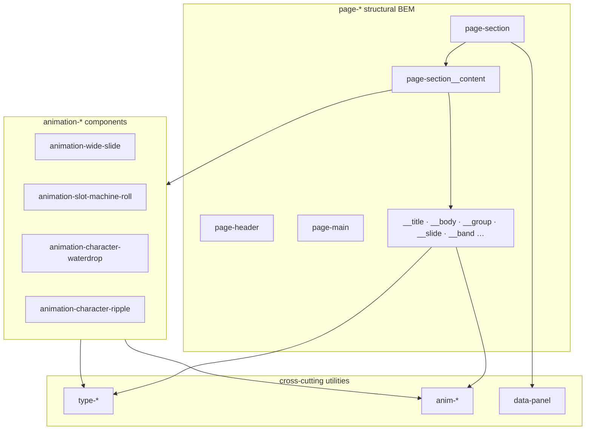

# Markup & animation refactor plan

Progressive migration to a unified BEM naming system, generic `anim-*` utilities, and self-contained `animation-*` components.

## Implementation checklist

- [ ] Finalize `page-*` BEM vocabulary and pattern catalog
- [ ] **Phase 1:** Migrate hero + panels 1–3 (`index.html`, `page.css`, `script.js`)
- [ ] Consolidate `animation.css` (remove panel-specific rules, slim `anim-clip-slot`)
- [ ] Add `.type-heading` to `typography.css`
- [ ] **Phases 2–8:** Migrate panels 4–9 + `animation-*` components (one panel per pass)
- [ ] Extract component styles into `css/components/animation-*.css`
- [ ] Remove hide-only `gsap.set` calls; use `anim-prehide` + `autoAlpha` tweens
- [ ] Visual verification after each phase

---

## Class layer overview

| Layer | Prefix | Purpose |
|-------|--------|---------|
| **Structure** | `page-*` | Page grid skeleton — viewport sections, content shell |
| **Components** | `animation-*` | Self-contained animated UI patterns (own markup + styles) |
| **Motion utilities** | `anim-*` | Low-level GSAP/SplitText hooks, pre-hide, clip, char layers |
| **Typography** | `type-*` | Font size, weight, leading |

`data-panel="N"` stays as the **stable JS hook** throughout migration.

### Target architecture



### CSS file ownership

- `css/animation.css` — motion utilities only (`anim-prehide`, `anim-mask`, `anim-char-*`, `anim-clip-slot`)
- `css/typography.css` — `type-*` tokens
- `css/page.css` — `page-*` layout; stops at `.page-section__content`
- `css/components/animation-*.css` — component-internal layout (future)

---

# Part A — Animation utility consolidation

## A1. Consolidate char layer utilities

| Remove | Replace with |
|--------|--------------|
| `.panel-six__char-hidden`, `.panel-nine__char-hidden`, `.word-hidden` | `.anim-char-hidden` |
| `.panel-six__char-visible`, `.panel-nine__char-visible`, `.word-visible` | `.anim-char-visible` |
| `.panel-six__char`, `.panel-nine__char` | `.anim-char-parent` |

Delete dead `.panel-eight__char` CSS (JS uses `linesClass`, not this selector).

## A2. Split typography from `.anim-clip-slot`

Add `.type-heading` to `typography.css`. `.anim-clip-slot` keeps only `display`, `position`, `clip-path`.

## A3. Replace hide-only `gsap.set` with `anim-prehide`

**Rule:** opacity/autoAlpha-only hides → `anim-prehide` in HTML or SplitText `linesClass`. Mixed hides → `anim-prehide` + `gsap.set` for transforms only.

**Companion rule:** reveal tweens use `autoAlpha: 1` (not `opacity: 1`) when `anim-prehide` is present.

Replace `gsap.set(el, { visibility: "visible" })` with `el.classList.remove("anim-prehide")` where appropriate.

---

# Part B — Unified BEM naming scheme

## B1. Vocabulary

### Page shell

| Current | Proposed | Notes |
|---------|----------|-------|
| `<body>` | `<body class="page">` | Root context |
| `<header class="hero">` | `<header class="page-header">` | Full-viewport intro |
| `.hero__circle` | `.page-header__icon` | `__circle` also acceptable |
| `.hero__scroll-tag` | `.page-header__tag` | |
| `.hero__main` | `.page-header__titles` | Wraps multiple `h1` lines |
| `.hero__scroll-hint` | `.page-header__hint` | |
| `<main>` | `<main class="page-main">` | |

### Scroll sections (panels)

| Current | Proposed | Notes |
|---------|----------|-------|
| `section.panel` | `section.page-section` | One per viewport chapter |
| `.panel__content` | `.page-section__content` | Universal inner layout shell |
| bare `h1` | `h1.page-section__title` | Layout class on semantic element |
| `.panel__content__more` | `.page-section__body` | Fixes invalid `__content__more` chain |
| `.panel__body` | `.page-section__body` | Panel 3 |
| `.panel__title` | `.page-section__label` | Feature subheading (panel 3) |
| `.panel__header` | `header.page-section__title` | Panel 5 display heading |
| `.panel__content-section-1/2/3` | `.page-section__group--pos-1/2/3` | Grid placement modifiers |
| `.panel__content-section` (panel 6) | `.page-section__slide` | Horizontal scroll column |
| `.panel__content` (panel 6 track) | `.page-section__track` | Flex row GSAP translates |
| `panel 9` caption rows | `.page-section__band` | Top/bottom caption strips |
| `.grid-span-full` | `.page-section__full` | Full-width grid span |

### Nested groups (BEM correction)

Use `page-section__group` for nested topic units — not a separate `page-body` block:

```
section.page-section
  div.page-section__content
    h1.page-section__title
    div.page-section__body
      section.page-section__group
        h1.page-section__title
        p …
```

### SplitText / motion hooks

| Current | Proposed |
|---------|----------|
| `panel-eight__line` | `anim-line` |
| `panel-six__char-*` | `anim-char-*` |
| `panel__phrase-char/hidden/visible` | Component-scoped (see panel 8) |
| SplitText `.line`, `.word` (panel 3) | `anim-line`, `anim-word` (optional phase 2) |

---

## B1b. Page skeleton vs animation components

**Boundary rule:** `page.css` stops at `.page-section__content`. JS-driven animation markup lives inside an `animation-*` component block.

```
.page
└── .page-section[data-panel="N"]
    └── .page-section__content        ← page grid only
        └── .animation-{pattern}      ← component root
            └── .animation-{pattern}__*
                └── .anim-* / .type-*  ← utilities on leaves
```

| Panel | Component block | JS responsibility |
|-------|-----------------|-------------------|
| 3 | `animation-wide-slide` | SplitText word spread, horizontal scrub |
| 4 | `animation-slot-machine-roll` | Clip-slot yPercent scrub per row |
| 7 | `animation-character-waterdrop` | SplitText char shuffle + waterfall |
| 8 | `animation-character-ripple` | Phrase layer build, hover char ripple |

Panels 1, 2, 5, 6, 9 keep content directly under `__content`, `__body`, `__group`, etc.

**Naming split:**
- `animation-*` = portable **component** (own BEM subtree + styles)
- `anim-*` = reusable **utility** (prehide, mask, clip-slot, char layers)

---

## B2. Markup pattern catalog

### Pattern 0 — Page header (hero)

```
page-header
├── page-header__icon
├── page-header__tag          + type-caption
├── page-header__titles
│   └── h1 × 4
└── page-header__hint         + type-caption
```

**JS today:** `.hero`, `.hero__circle`, `.hero__scroll-tag`, `.hero__scroll-hint`

---

### Pattern 1 — Title + body (panels 1, 5)

```
page-section[data-panel="1"|"5"]
└── page-section__content
    ├── h1.page-section__title
    └── page-section__body      (panel 1; panel 5 may omit)
        └── p × n               + type-body
```

---

### Pattern 2 — Staggered groups (panel 2)

```
page-section[data-panel="2"]
└── page-section__content
    ├── section.page-section__group.page-section__group--pos-1
    ├── section.page-section__group.page-section__group--pos-2
    └── section.page-section__group.page-section__group--pos-3
```

---

### Pattern 3 — Feature list + wide-slide component (panel 3)

```
page-section[data-panel="3"]
└── page-section__content
    └── div.page-section__body
        └── div.animation-wide-slide
            ├── p.animation-wide-slide__label + p.type-body …
            └── …
```

---

### Pattern 4 — Slot-machine component (panel 4)

```
page-section[data-panel="4"]
└── page-section__content
    └── div.animation-slot-machine-roll
        └── div.animation-slot-machine-roll__row × 18
            └── div.animation-slot-machine-roll__track.type-heading.anim-clip-slot
                ├── span.anim-char-hidden
                └── span.anim-char-visible
```

---

### Pattern 5 — Horizontal track + slides (panel 6)

```
page-section[data-panel="6"]
└── page-section__track
    └── section.page-section__slide × 8
        ├── h1.page-section__title
        └── p …
```

---

### Pattern 6 — Character list components (panels 7, 8)

```
page-section[data-panel="7"]
└── page-section__content
    └── div.animation-character-waterdrop
        └── ul.animation-character-waterdrop__list
            └── li.animation-character-waterdrop__item × n

page-section[data-panel="8"]
└── page-section__content
    └── div.animation-character-ripple
        ├── h1.animation-character-ripple__title
        └── ul.animation-character-ripple__list
            └── li.animation-character-ripple__item × n
```

---

### Pattern 7 — Three-band outro (panel 9)

```
page-section[data-panel="9"]
└── page-section__content
    ├── section.page-section__band
    ├── div.page-section__band.page-section__band--title
    └── section.page-section__band
```

---

## B3. Example markup — panels 1–3 (phase 1)

### Page shell + header

```html
<body class="page">
  <header class="page-header">
    <div class="page-header__icon anim-prehide" aria-hidden="true"></div>
    <p class="page-header__tag type-caption anim-prehide">scroll trigger experience</p>
    <div class="page-header__titles">
      <h1>ScrollTrigger</h1>
      <h1>SplitText</h1>
      <h1>Timeline</h1>
      <h1>Architecture</h1>
    </div>
    <p class="page-header__hint type-caption anim-prehide">
      scroll down for scroll trigger experience
    </p>
  </header>

  <main class="page-main">
```

### Panel 1

```html
<section class="page-section" data-panel="1">
  <div class="page-section__content">
    <h1 class="page-section__title">Split Text</h1>
    <div class="page-section__body">
      <p class="type-body type-body--spaced">…</p>
      <p class="type-body type-body--spaced">…</p>
    </div>
  </div>
</section>
```

### Panel 2

```html
<section class="page-section" data-panel="2">
  <div class="page-section__content">
    <section class="page-section__group page-section__group--pos-1">
      <h1 class="page-section__title anim-prehide">WRAPPING</h1>
      <p class="type-body type-body--spaced type-body--section">…</p>
    </section>
    <section class="page-section__group page-section__group--pos-2">
      <h1 class="page-section__title anim-prehide">CLASSES</h1>
      <p class="type-body type-body--spaced type-body--section">…</p>
    </section>
    <section class="page-section__group page-section__group--pos-3">
      <h1 class="page-section__title anim-prehide">MASKING</h1>
      <p class="type-body type-body--spaced type-body--section">…</p>
    </section>
  </div>
</section>
```

### Panel 3

```html
<section class="page-section" data-panel="3">
  <div class="page-section__content">
    <div class="page-section__body">
      <div class="animation-wide-slide">
        <p class="animation-wide-slide__label">Screen reader Accessibility</p>
        <p class="type-body type-body--panel">…</p>
        <p class="animation-wide-slide__label">Responsive re-splitting</p>
        <p class="type-body type-body--panel">…</p>
        <!-- …remaining label + body pairs… -->
      </div>
    </div>
  </div>
</section>
```

---

## B4. Example markup — panels 4 and 8 (component boundary)

### Panel 4 — `animation-slot-machine-roll`

```html
<section class="page-section" data-panel="4">
  <div class="page-section__content">
    <div class="animation-slot-machine-roll">

      <div class="animation-slot-machine-roll__row">
        <div class="animation-slot-machine-roll__track type-heading anim-clip-slot">
          <span class="anim-char-hidden">CHARS</span>
          <span class="anim-char-visible">CHARS</span>
        </div>
      </div>

      <div class="animation-slot-machine-roll__row">
        <div class="animation-slot-machine-roll__track type-heading anim-clip-slot">
          <span class="anim-char-hidden">WORDS</span>
          <span class="anim-char-visible">WORDS</span>
        </div>
      </div>

      <!-- …remaining 16 rows same structure… -->

    </div>
  </div>
</section>
```

**CSS ownership:**
- `page.css` — viewport placement for `.page-section[data-panel="4"] .page-section__content`
- Component CSS — 8-column grid, row centering, track span display

**JS:** `[data-panel='4'] .word` → `.animation-slot-machine-roll__track`

### Panel 8 — `animation-character-ripple`

```html
<section class="page-section" data-panel="8">
  <div class="page-section__content">
    <div class="animation-character-ripple">

      <h1 class="animation-character-ripple__title">Methods</h1>

      <ul class="animation-character-ripple__list">
        <li class="animation-character-ripple__item type-display type-display--tracked anim-prehide anim-mask">
          Disable
        </li>
        <li class="animation-character-ripple__item type-display type-display--tracked anim-prehide anim-mask">
          Enable
        </li>
        <!-- …remaining items… -->
      </ul>

    </div>
  </div>
</section>
```

**JS-built layers** (not in static HTML):

```html
<li class="animation-character-ripple__item …">
  <span class="animation-character-ripple__layer animation-character-ripple__layer--hidden">
    <span class="animation-character-ripple__char">D</span>…
  </span>
  <span class="animation-character-ripple__layer animation-character-ripple__layer--visible">
    <span class="animation-character-ripple__char">D</span>…
  </span>
</li>
```

**State modifier:** `animation-character-ripple__item--hovered`

---

## B5. Progressive migration order

| Phase | Scope |
|-------|-------|
| **1** | `page` shell, `page-header`, panels **1–3** |
| **2** | Panel **3** — wrap content in `animation-wide-slide` |
| **3** | Panel **4** — `animation-slot-machine-roll` + `anim-char-*` |
| **4** | Panel **5** — char waterfall |
| **5** | Panel **6** — `page-section__track` / `__slide` |
| **6** | Panel **7** — `animation-character-waterdrop` |
| **7** | Panel **8** — `animation-character-ripple` |
| **8** | Panel **9** — `page-section__band` outro |

During each phase: update `index.html`, `page.css`, and `script.js` for that panel only. Prefer clean swap over long-lived dual class names.

---

## B6. Selector migration cheat sheet

| Concern | Old | New |
|---------|-----|-----|
| Hero root | `.hero` | `.page-header` |
| Hero icon | `.hero__circle` | `.page-header__icon` |
| Panel root | `.panel` | `.page-section` |
| Inner shell | `.panel__content` | `.page-section__content` |
| Panel 6 track | `.panel__content` (in panel 6) | `.page-section__track` |
| Panel 3 bounds | `.panel__content` | `.animation-wide-slide` |
| Panel 4 tracks | `[data-panel='4'] .word` | `.animation-slot-machine-roll__track` |
| Panel 5 header | `.panel__header` | `.page-section__title` |
| Panel 7 items | `.panel-nine__line` | `.animation-character-waterdrop__item` |
| Panel 8 items | `.panel__phrase-item` | `.animation-character-ripple__item` |
| JS panel hook | `data-panel` | `data-panel` (unchanged) |

---

## Verification (per phase)

- No visual regression for migrated panels
- GSAP selectors resolve (no null queries in console)
- Pre-JS flash: `anim-prehide` on static targets
- `ScrollTrigger.refresh()` after panels 6 and 8
- Resize: panel 3 word spread + panel 8 phrase rebuild
