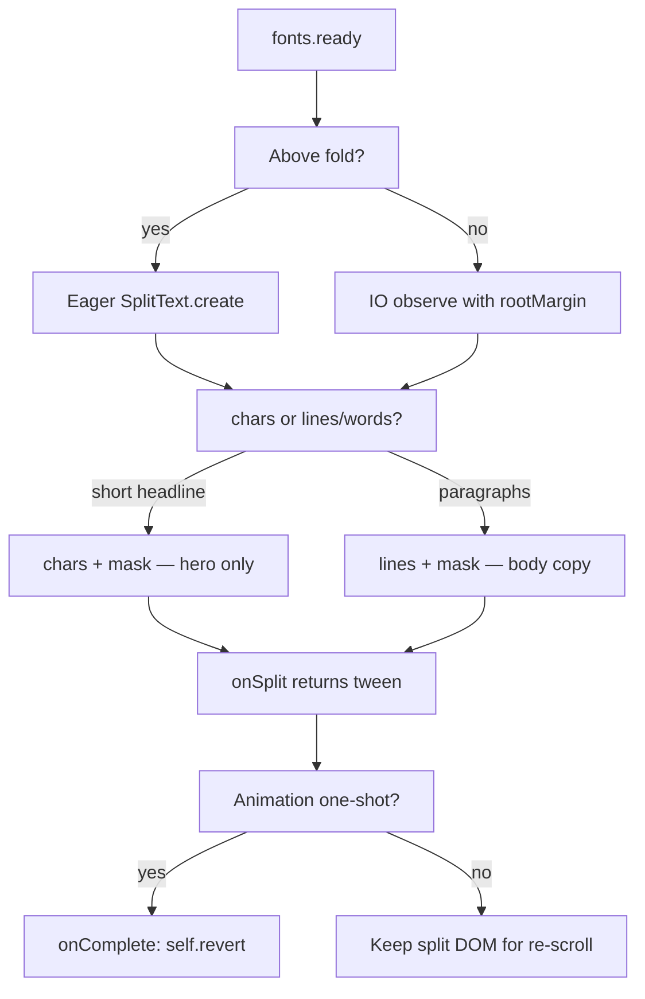

# Prevent Visible Flash

1. HTML + CSS paint → `.hero__circle` is fully visible (`background: white`, no `opacity` in CSS)
2. `script.js` loads and runs (as `type="module"`, deferred until after parse)
3. `gsap.set(heroIcon, { opacity: 0 })` finally hides it
4. `fromTo` animates it back to `opacity: 1`

Steps 1 and 3 are separated by at least one frame — that’s the flash.

`gsap.set` and the `fromTo` “from” values only apply **after** GSAP initializes. They can’t affect the first paint.

### What you’re missing

An **initial hidden state in CSS** (or HTML), so the icon is never visible before JS:

```css
.hero__circle {
  opacity: 0;
  /* or visibility: hidden; */
}
```

Then GSAP animates it in. CSS wins the race to first paint; JS handles the reveal.

### Optional GSAP tweak

Use `autoAlpha` instead of `opacity` — it sets both `opacity: 0` and `visibility: hidden`, which avoids edge cases where a 0-opacity element still affects rendering:

```js
gsap.set(heroIcon, { autoAlpha: 0 });

iconTimeline.fromTo(heroIcon, { autoAlpha: 0 }, { autoAlpha: 1, duration: 1, ease: 'power2.inOut' });
```

That improves GSAP behavior but **does not** fix the pre-JS flash on its own. CSS (or an inline `style="opacity:0"` on the element) does.

### Summary

| Approach | Prevents flash? |
|----------|-----------------|
| `gsap.set` only | No — runs too late |
| `fromTo` with `opacity: 0` | No — same timing |
| CSS `opacity: 0` on `.hero__circle` | Yes |
| `autoAlpha` | Helps GSAP; still needs CSS for first paint |


# Layout shift on page load

The DevTools grid overlay tracks the **computed size of `.hero`**. Your hero uses:

```48:56:scroll-trigger-architecture/styles.css
.hero {
  min-height: 100vh;
  ...
  grid-template-columns: var(--grid-4);
  grid-template-rows: var(--grid-4);
```

`repeat(4, 1fr)` divides whatever height `.hero` ends up with. When that height changes, every track boundary moves — that's the shift between your screenshots.

### Cause 1: Font loading (most likely)

`body` uses Basier Circle from `fonts.css`, loaded asynchronously:

```40:42:scroll-trigger-architecture/styles.css
body {
  ...
  font-family: var(--font-basier-circle);
```

Your script runs SplitText and animations **immediately**, with no `document.fonts.ready`:

```64:92:scroll-trigger-architecture/script.js
const headerLines = new SplitText(heroHeaders, {
  type: "lines",
  mask: "lines",
  ...
});
```

Sequence:

1. First paint → fallback `sans-serif` metrics for the four huge `h1`s
2. Grid calculates against that text block size
3. Basier Circle loads → different ascenders, line-height (`0.75`), and `clamp(2rem, 10vw, 6rem)` sizing
4. `.hero__main` (rows 2–4) reflows → `.hero` may grow past `min-height: 100vh` → `1fr` rows redistribute → **grid lines jump**

That matches screenshot 1 (tag only, headings not settled) vs screenshot 2 (full headings, font + SplitText applied).

### Cause 2: SplitText DOM changes (also contributes)

SplitText restructures the `h1`s into line wrappers and masks. That changes measured height **after** the first layout pass — another reflow on top of the font swap, even if fonts were already loaded.

### What `autoAlpha` does *not* do here

`autoAlpha: 0` sets `opacity: 0` + `visibility: hidden`. Both still **reserve layout space** in the grid. So `autoAlpha` on icon/tag/hint:

- Can cause a **flash** if CSS doesn't hide them before JS runs
- Does **not** move grid tracks — those elements are tiny in rows 1 and 4

Missing CSS initial states is a flash problem, not a grid-shift problem.

### Fix order (recommended)

```js
document.fonts.ready.then(() => {
  // gsap.set initial states
  // SplitText
  // build timelines and play
});
```

Plus:

1. **CSS initial hidden state** on animated elements (stops flash, not shift)
2. **Lock hero height** if you want stable tracks: `height: 100vh` instead of only `min-height: 100vh`, so content growth doesn't resize the grid
3. **Run SplitText inside `fonts.ready`** so line breaks are computed with final font metrics

### Quick diagnosis

| Symptom | Likely cause |
|---------|----------------|
| White dot / text flash before animation | Missing CSS `opacity: 0` / `visibility: hidden` before JS |
| Grid overlay lines jumping | Font swap + SplitText reflow changing `.hero` height |
| Headers sliding from wrong position | SplitText run before fonts ready (wrong line splits) |

**Bottom line:** The grid shift is related to **`document.fonts.ready` and SplitText timing**, not `autoAlpha`. Wrap your hero setup in `document.fonts.ready`, hide elements in CSS for the flash, and consider fixing `.hero` to `height: 100vh` if you want immovable grid tracks.


# Split Text Creation/Configuration/Lifecycle Details

Yes — for anything with `autoSplit: true`, define `onSplit` at **SplitText creation**. That is the lifecycle hook SplitText uses on the initial split and every re-split (font load, width change). Animating `self.lines` outside `onSplit` will eventually target stale DOM nodes.

Your frame-one paragraphs are the case where this matters:

```120:120:scroll-trigger-architecture/script.js
   const frameOneParagraphsObject = new SplitText(frameOneParagraphs, {type: "lines", mask: "lines", autoSplit: true});
```

The hero header split (line 78) is a different story — no `autoSplit`, already inside `document.fonts.ready`, and lines are animated immediately. `onSplit` is optional there.

---

## 1. `beforeEnter` + `onSplit` — is that an optimization?

There is no `beforeEnter` on SplitText or ScrollTrigger. ScrollTrigger has `onEnter`, `onLeave`, `onEnterBack`, `onLeaveBack`, and `onToggle`.

What people usually mean by "before enter" is one of two things:

| Pattern | What it does | Real optimization? |
|---|---|---|
| **`onSplit` at creation** | Runs after every split/re-split; keeps animations on fresh elements | Correctness, not perf — required with `autoSplit` |
| **Defer `SplitText.create()` until scroll** | Split only when the section nears the viewport (`onEnter` or `start: "top bottom"`) | Yes — avoids upfront DOM restructuring for off-screen text |

You cannot call `onSplit` as a method. It runs when SplitText splits internally. The lazy pattern is:

```js
// Split + animate only when section approaches viewport
ScrollTrigger.create({
  trigger: frameOne,
  start: "top bottom", // fires as section is about to enter
  once: true,
  onEnter: () => {
    SplitText.create(frameOneParagraphs, {
      type: "lines",
      mask: "lines",
      autoSplit: true,
      onSplit(self) {
        return gsap.from(self.lines, { /* ... */ });
      },
    });
  },
});
```

**Do not** use `onEnter` to manually re-invoke `onSplit` on an already-created instance — that is what `autoSplit` handles. Calling `splitInstance.split()` from `onEnter` only makes sense if you deferred creation entirely.

**Tradeoffs of lazy splitting:**
- Wins: fewer DOM nodes on load, less initial layout work
- Costs: possible jank on first scroll-in (split + animate in one pass), brief un-split text flash unless you hide paragraphs in CSS (`opacity: 0` or `visibility: hidden`) until `onSplit` runs

**When lazy splitting is worth it:** many off-screen SplitText sections on a long page. **When it is not:** a single panel like frame one — the cost is small, and eager split inside `fonts.ready` is simpler.

---

## 2. Separating config, creation, and execution

This matches the storyboard pattern your file comments already point toward. The key rule: **static config at the top, DOM-dependent execution inside `onSplit`.**

```js
// ── CONFIG (no DOM, no SplitText instance) ──
const FRAME_ONE = {
  panel: "[data-panel='1']",

  header: {
    split: { type: "chars,lines", mask: "chars" },
    from: { yPercent: 100 },
    to: { yPercent: 0, stagger: 0.02 },
    scrollTrigger: { start: "top 50%" },
  },

  paragraphs: {
    split: { type: "lines", mask: "lines", autoSplit: true },
    from: { yPercent: 100, stagger: 0.05, duration: 0.8, ease: "power2.out" },
    scrollTrigger: { start: "top 50%" },
  },
};

// ── FACTORY (config → tween; receives fresh split elements) ──
function revealLines(self, animConfig, trigger) {
  return gsap.from(self.lines, {
    ...animConfig.from,
    scrollTrigger: {
      trigger,
      ...animConfig.scrollTrigger,
    },
  });
}

function revealChars(chars, animConfig, trigger) {
  gsap.set(chars, animConfig.from);
  return gsap.to(chars, {
    ...animConfig.to,
    scrollTrigger: {
      trigger,
      ...animConfig.scrollTrigger,
    },
  });
}

// ── INIT (wire DOM → config → execution) ──
const frameOne = document.querySelector(FRAME_ONE.panel);

const headerSplit = SplitText.create(frameOne.querySelector("h1"), FRAME_ONE.header.split);
const headerTween = revealChars(headerSplit.chars, FRAME_ONE.header, frameOne);

const paragraphSplit = SplitText.create(frameOne.querySelectorAll("p"), {
  ...FRAME_ONE.paragraphs.split,
  onSplit(self) {
    return revealLines(self, FRAME_ONE.paragraphs, frameOne);
    // return is important — SplitText cleans up + time-syncs on re-split
  },
});
```

### Design choices

**Return the tween from `onSplit`** when using `autoSplit`. SplitText will `revert()` the old animation and preserve `totalTime()` across re-splits. A bare `gsap.from()` without `return` breaks that contract.

**Put `scrollTrigger` inside the returned tween** (inside `onSplit`) so each re-split gets a fresh trigger tied to new line elements. If you build a master timeline instead, return the timeline from `onSplit` and add it with `.add()` — same rule applies.

**Keep `split` config separate from `from`/`to` config** because they serve different roles:
- `split` → passed to `SplitText.create()`
- `from`/`to` → passed to `gsap.from()` / `gsap.to()` with `self.lines` or `self.chars`

**Factory functions stay generic; panel-specific values stay in config objects.** That is the separation your comments describe — config objects at the top, factories in the middle, initialization at the bottom.

### Optional: lazy + config pattern combined

```js
const paragraphAnim = null; // filled in onSplit, if you need a reference later

ScrollTrigger.create({
  trigger: frameOne,
  start: "top bottom",
  once: true,
  onEnter: () => {
    SplitText.create(frameOneParagraphs, {
      ...FRAME_ONE.paragraphs.split,
      onSplit(self) {
        paragraphAnim = revealLines(self, FRAME_ONE.paragraphs, frameOne);
        return paragraphAnim;
      },
    });
  },
});
```

---

**Bottom line:** Use `onSplit` at creation for `autoSplit` correctness. Use deferred `SplitText.create()` on scroll (`onEnter` / early `start`) only when you have enough off-screen text to justify the complexity. Keep animation values in named config objects and factory functions — run the factories inside `onSplit` so they always receive the current `self.lines`.


# SplitText Performance Checklist

## `once: true` in ScrollTrigger

In ScrollTrigger, `once: true` does **not** mean "fire `onEnter` one time and never again." It means:

> Kill this ScrollTrigger instance after the scroll position passes **`end`** in the **forward** direction.

After it kills itself, that trigger (and any linked animation control) is gone — scrolling back up will not reactivate it.

```js
ScrollTrigger.create({
  trigger: frameTwo,
  start: "top bottom",
  end: "top 80%",      // kills shortly after entering
  once: true,
  onEnter: () => {
    // runs when start is crossed forward
    SplitText.create(frameTwoParagraphs, { /* ... */ });
  },
});
```

**Important distinction from IntersectionObserver:**

| Mechanism | One-shot behavior |
|---|---|
| **IO + `unobserve()`** | Split fires once when intersecting; observer stops watching that element |
| **ScrollTrigger `once: true`** | Trigger lives until you scroll past `end`, then `kill()` — not tied to first intersection alone |
| **Manual flag** | `let split = false; onEnter: () => { if (split) return; split = true; ... }` |

For lazy split, IO + `unobserve()` is the cleaner one-shot gate. ScrollTrigger `once: true` works when the section already has a scroll animation with a defined `end`, but it is awkward as a pure "split on first approach" trigger.

---

## `autoSplit` after `revert()` — yes, it goes away

Calling `split.revert()`:

1. Restores original `innerHTML` (split nodes removed)
2. Calls `kill()` — disconnects `ResizeObserver`, removes font-load listener
3. Reverts the animation returned from `onSplit` (if any)

After revert, `autoSplit` machinery is inactive. For a landing page where text animates once per visit at initial device width, that is a valid pattern:

```js
onSplit(self) {
  return gsap.to(self.lines, {
    opacity: 1,
    yPercent: 0,
    stagger: 0.01,
    scrollTrigger: { trigger: frameOne, start: "top 50%" },
    onComplete: () => self.revert(), // kills observers + restores markup
  });
}
```

**Tradeoff:** text cannot re-animate without a fresh `SplitText.create()`. For one-shot scroll reveals on a marketing page, that is usually fine.

**When to keep `autoSplit`:** fonts load late, layout shifts after split, or the section re-animates on resize/back-scroll. For "split → animate once → done," `autoSplit` is insurance during the brief window before animation completes; `revert()` makes it unnecessary afterward.

---

## Performance catalogue for split-text-heavy landing pages

### 1. Use IO for lazy creation when…

- **5+ off-screen text sections** would otherwise split on load
- Body copy uses `lines` or `words` (not just a single hero)
- Initial load shows jank or long tasks in Performance panel before first scroll
- Page is long-form (your `index.html` has many panels — this applies)

**Pattern:** `document.fonts.ready` → observe off-screen panels → `rootMargin: "150–300px"` → `unobserve()` after create.

**Skip IO when:** hero + next 1–2 panels are above the fold — eager split is simpler and cheaper than observer overhead.

---

### 2. Prefer `words` and `lines` over `chars` on heavy pages

| Type | Cost | Use when |
|---|---|---|
| `lines` | Lowest node count | Paragraph reveals, section headers |
| `words` | Medium | Emphasis on key phrases |
| `chars` | Highest (~1 node per character, masks double it) | Hero headlines, short labels only |

Your frame-one header chars are fine. Scaling `chars` across every panel heading is where cost compounds.

---

### 3. `split.revert()` after animation completes

- Frees split DOM nodes (can be hundreds with chars)
- Kills `ResizeObserver` and font listeners from `autoSplit`
- Reduces scroll paint cost for sections already revealed

**Best for:** one-shot scroll reveals. **Skip when:** text re-animates on scroll-back, scrubbed timelines need persistent structure, or hover/interaction targets split elements.

---

### 4. Eager split for the next 2–3 viewport frames

Split immediately (inside `fonts.ready`) for:

- Hero / first screen
- First panel fully or partially visible on load
- Anything the user sees before first scroll

Lazy split everything below that. This avoids observer latency on content the user sees instantly.

---

### 5. Target composite properties over paint/layout properties

**Prefer (GPU-composited):**
- `transform` / `x`, `y`, `yPercent`, `scale`, `rotation`
- `opacity` / `autoAlpha`

**Avoid animating during scroll:**
- `width`, `height`, `top`, `left`, `margin`, `padding`
- `clip-path` on many elements simultaneously
- `filter` (blur) on many split nodes

With `mask: "lines"`, you already have extra wrapper elements — composited transforms on the inner line elements keep paint cost down.

---

### 6. Other known patterns and issues

**Fonts before split**
- Always split inside `document.fonts.ready` (you already do)
- Wrong line breaks without it cause re-split churn even with `autoSplit`

**CSS hide before split**
- `visibility: hidden` on `<p>` / headings until `onSplit` runs
- Prevents flash of unsplit text on fast scroll or lazy create

**Split only what you animate**
- `type: "lines"` not `"chars,words,lines"` if you only tween lines
- GSAP docs: fewer wrappers = less layout work

**`autoSplit` scope**
- Useful during the pre-animation window; optional after `revert()`
- On resize, re-splitting 10+ sections at once causes visible stutter — another reason to revert after animate on landing pages

**Stagger + scrub cost**
- `stagger: 0.01` with `scrub: true` on 20+ lines means 20+ simultaneously interpolated targets
- For scrubbed reveals, consider fewer split units (`words` instead of `lines`) or a single container tween

**`will-change` sparingly**
- `will-change: transform` on animated split elements during reveal only
- Remove after animation — too many promoted layers hurts mobile memory

**`gsap.context()` for cleanup**
- Bundles SplitText instances + ScrollTriggers for teardown on SPA navigation
- Less relevant for static landing pages, essential for React/SPA

**Avoid `text-wrap: balance`**
- GSAP docs: interferes with line splitting measurements

**Kerning shift on chars**
- `font-kerning: none` on split headings if char spacing looks off

**Don't stack lazy create + immediate scrub on same frame**
- IO creates split → `onSplit` returns scrubbed tween — if `start` is already passed, tween jumps to mid-progress
- Coordinate: IO `rootMargin` early enough, or set initial state in `onSplit` before returning tween

**Section batching**
- If multiple panels enter viewport in one scroll burst, queue splits across frames (`requestAnimationFrame` stagger) to avoid one long main-thread block

**Measure, don't guess**
- Chrome Performance: long tasks > 50ms at split time
- Mobile throttling: 4× CPU slowdown
- Layer count in Rendering tab after 5+ panels wired

---

## Suggested decision flow for your page



For your current architecture: frame one eager (visible soon), frame two+ lazy via IO, chars on headings only, lines on paragraphs, `revert()` after one-shot reveals, `autoSplit` only until animation completes. That covers a split-heavy landing page without over-engineering responsive re-split for the full session.