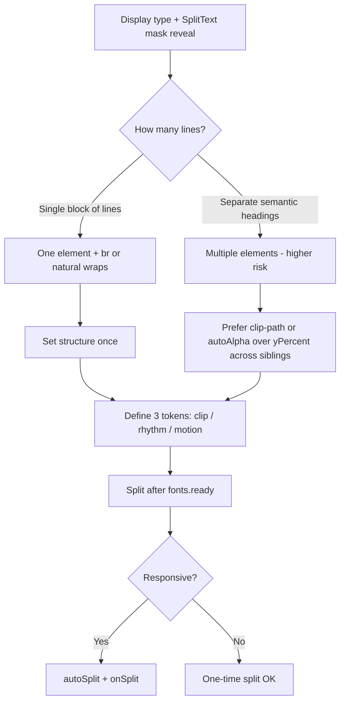

Yes — this is a **layout + mask stacking** problem, not something `line-height` on the line/mask classes alone can fix.

## What’s going wrong

You have three things fighting each other:

1. **Four separate `h1`s**, each with its own SplitText line mask  
2. **Negative margin** pulling those `h1`s into each other:

```97:99:scroll-trigger-architecture/css/page.css
  .page-header__title + .page-header__title {
    margin-top: -0.25rem;
  }
```

3. **`yPercent: ±100`** sliding lines in from above/below:

```115:127:scroll-trigger-architecture/script.js
    gsap.set(line, {
      yPercent: lineCount ? -100 : 100,
    });

    gsap.to(line, {
      yPercent: 0,
      duration: 1,
      ...
    });
```

Negative margin makes the **mask boxes overlap in screen space**. Each mask only clips its own line, but when two masks occupy the same vertical band, the lower `h1` paints on top. During the reveal, the incoming line becomes visible inside its mask while that mask is already sitting on top of the line above — hence the overlap in your screenshot.

So: tight static layout works, but the animation exposes the overlap because the masks were never truly isolated.

## Why your CSS block doesn’t help

```101:116:scroll-trigger-architecture/css/page.css
  .page-header-lines { overflow: hidden; ... }
  .page-mask-header-mask-lines-mask { overflow: hidden; ... }
```

Three issues:

1. **Wrong mask selector** — with `linesClass: "page-header-lines"`, SplitText generates `.page-header-lines-mask`, not `.page-mask-header-mask-lines-mask`.

2. **`overflow` on `.page-header-lines` is the wrong layer** — that’s the element GSAP translates. The clip boundary needs to be the **mask wrapper** (or the `h1`), not the moving line.

3. **Neither rule prevents sibling overlap** — they clip inside each box, but negative margin still makes those boxes share the same pixels.

## Fixes (best → acceptable)

### 1. Remove negative margin; tighten with line-height + mask padding (simplest)

Drop the sibling negative margin entirely. Use a safe line-height on the `h1`/mask, then add slack for glyphs on the mask only:

```css
.page-header__title {
  line-height: 0.92; /* or 1 on mobile */
}

.page-header-lines-mask {
  padding-block: 0.04em;
  /* optional: margin-block: -0.04em only if you need to cancel padding expansion */
}
```

Rhythm comes from `line-height`, not from pulling siblings together. Masks stay vertically separate, so `yPercent` reveals stay clean.

### 2. One `h1`, multiple lines (best for SplitText line masks)

This is the most robust pattern when using `mask: "lines"`:

```html
<h1 class="page-header__title">
  ScrollTrigger<br>
  SplitText<br>
  Timeline<br>
  Architecture
</h1>
```

One SplitText call → four line masks stacked in **one flow**. No inter-`h1` overlap possible. Tightness is one `line-height` knob; animation targets `headerLines.lines` the same way.

### 3. If you must keep four `h1`s: clip at the `h1`, not negative margin

Each title becomes its own non-overlapping clip region:

```css
.page-header__title {
  line-height: 1;
  overflow: hidden; /* h1 is the clip boundary */
}
/* NO negative margin between titles */
```

You lose the extra tightness from negative margin, but animation stays clean. If you need tighter visual rhythm, reduce `line-height` slightly instead of overlapping boxes.

### 4. Change the animation model (keep tight margin)

If you really want overlapping layout boxes, don’t use `yPercent: ±100` across overlapping masks. Alternatives:

- **`clip-path` / `autoAlpha` reveal** inside each mask (text stays put, mask reveals it)
- **Smaller travel**: `yPercent: ±40` so motion stays inside the mask without crossing into the neighbor’s band
- **Stagger + `overflow: hidden` on `.page-header__titles`** as a group clip (less control per line)

## Recommended combo for your setup

| Do | Don’t |
|---|---|
| Remove `margin-top: -0.25rem` on sibling titles | Negative margin + per-line masks |
| Target `.page-header-lines-mask` for padding/overflow | Style `.page-header-lines` with `overflow: hidden` |
| Use `line-height: 0.9–1` for rhythm | Use line-height on inner line *and* mask as duplicate fix |
| Consider single `h1` + `<br>` | Four masked `h1`s if tight stacking matters |

## Quick mental model

```
Negative margin  →  mask boxes overlap in Y
yPercent reveal  →  visible text appears in overlapping zone
Later h1         →  paints on top of earlier line
                 →  overlap visible during + after animation
```

The fix is to **separate mask territories**, not add more `overflow: hidden` on the wrong element.


If you switch to Agent mode, I can refactor to the single-`h1` approach or apply the mask-padding + remove-negative-margin fix directly.


Here is a reusable strategy for **tight stacked display type + SplitText masks + responsive sizing**. The core idea is to treat this as **three independent systems** that people often collapse into one property (`line-height`), which creates the circular coupling you hit.

---

## The coupling problem (why tweaks fight each other)

Tight stacked headlines with masked reveals involve **four jobs**:

| Job | What it controls | Typical wrong knob |
|---|---|---|
| **A. Glyph safety** | Ascenders/overshoot not clipped | `line-height` ↓ |
| **B. Visual rhythm** | Space between lines | `line-height` ↓ or negative margin |
| **C. Mask geometry** | Clip box for reveal | Same as A/B |
| **D. Motion path** | Where text travels during tween | `yPercent: ±100` everywhere |

When one knob controls multiple jobs, you get loops:

- ↑ `line-height` → fixes clip, loosens stack  
- ↓ `line-height` → tight stack, clip returns  
- negative margin → tight stack, masks overlap → animation bleeds  
- mask padding → fixes clip, changes measured height → reflow / re-split issues  

**Strategy:** assign **one dedicated control per job**. Never use negative margin between masked siblings to fake tight leading.

---

## Decision framework (start here every time)



---

## Phase 1 — Choose structure (most important decision)

### Preferred: one split target, many lines

```html
<h1 class="display-stack">
  Line one<br>
  Line two<br>
  Line three
</h1>
```

```js
SplitText.create(".display-stack", {
  type: "lines",
  mask: "lines",
  linesClass: "stack-line++",
});
```

**Why this wins**

- Masks stack in **one vertical flow** — no sibling box overlap
- One `line-height` governs rhythm consistently
- One SplitText instance, one re-split on resize
- `stack-line1`, `stack-line2` still available for stagger

### Acceptable: multiple elements (your current hero)

Only if semantics require separate `h1`s. Rules:

- **No negative margin** between masked siblings
- **No `yPercent: ±100`** unless mask territories are guaranteed non-overlapping
- Prefer **clip-path / opacity reveal** over translate across neighbors

---

## Phase 2 — Separate the three CSS layers

Think in layers, outside-in:

```
┌─ Motion layer ────────────────┐  ← GSAP transforms (.stack-line)
│  actual glyphs                │
├─ Clip layer ──────────────────┤  ← SplitText mask (.stack-line-mask)
│  overflow: clip + padding     │
├─ Rhythm layer ────────────────┤  ← line-height OR gap (parent / h1)
│  vertical spacing between lines│
└─ Layout layer ────────────────┘  ← grid/flex, max-width, font-size
```

### Layer controls (one knob each)

| Layer | Property | Purpose | Example |
|---|---|---|---|
| **Layout** | `--type-heading: clamp(...)` | Responsive size | `clamp(2rem, 10vw, 6rem)` |
| **Rhythm** | `--stack-leading` on parent | Visual tightness | `0.88` desktop, `0.94` mobile |
| **Clip** | `padding-block` on **mask only** | Glyph slack without changing rhythm | `0.04em` top/bottom on `.stack-line-mask` |
| **Motion** | `yPercent` / `clip-path` in GSAP | Reveal travel | Must fit inside clip layer |

### Token pattern (future-proof)

```css
:root {
  --type-heading: clamp(2rem, 10vw, 6rem);

  /* Rhythm — how tight lines sit */
  --stack-leading: clamp(0.88, 0.82 + 0.25vw, 0.96);

  /* Clip — mask-only slack (not rhythm) */
  --stack-mask-pad: 0.05em;
}
```

```css
.display-stack {
  font-size: var(--type-heading);
  line-height: var(--stack-leading); /* rhythm only */
}

.stack-line-mask {
  padding-block: var(--stack-mask-pad);
  /* Do NOT negative-margin masks to “pull tight” */
}
```

**Rule:** if clipping appears, increase `--stack-mask-pad` first — not `--stack-leading`.

---

## Phase 3 — SplitText configuration conventions

### Short, namespaced classes

```js
linesClass: "stack-line++"
// → lines:   .stack-line .stack-line1
// → masks:   .stack-line-mask .stack-line1-mask  (auto)
```

Use short prefixes for animation internals; keep BEM on the source element only.

### Mask + motion pairing

| Motion type | Safe when | Avoid when |
|---|---|---|
| `yPercent: ±100` | Masks do **not** overlap vertically | Negative margin between siblings |
| `yPercent: ±100` | Single-element multi-line split | Multiple masked `h1`s pulled together |
| `clip-path` / `autoAlpha` | Overlapping layout boxes | Need physical slide feel |
| `y: "100%"` relative to mask | Fine-grained control | Default choice |

**Default motion recipe for tight stacks:**

1. Text starts at rest inside mask  
2. Reveal via `clip-path: inset(...)` or small `yPercent` (±30–50)  
3. Reserve `±100` only when mask boxes are fully separated  

---

## Phase 4 — Responsive sizing strategy

Font size and leading should not use the same breakpoint logic unless they must.

### Fluid size (always)

```css
--type-heading: clamp(2rem, 10vw, 6rem);
```

### Fluid leading (inverse relationship)

Smaller type → **relatively more** leading for clip safety:

```css
--stack-leading: clamp(0.92, 0.84 + 0.35vw, 0.88);
/* small viewport → higher number → safer */
```

### Fluid mask padding (optional)

```css
--stack-mask-pad: clamp(0.03em, 0.02em + 0.02vw, 0.06em);
```

### GSAP resize contract

If anything fluid affects line breaks or mask height:

```js
SplitText.create(el, {
  type: "lines",
  mask: "lines",
  linesClass: "stack-line++",
  autoSplit: true,
  onSplit(self) {
    // kill old tweens
    // rebuild on self.lines / self.masks
    return buildReveal(self.lines);
  },
});
```

**Always split after `document.fonts.ready`.**  
SplitText + font swap changes metrics → wrong masks → layout jump.

---

## Phase 5 — Implementation checklist

Use this before shipping any masked headline:

### Structure
- [ ] One split target for multi-line display stacks (preferred)
- [ ] No negative margin between masked siblings
- [ ] Parent uses flex/grid with explicit `gap: 0` (not negative)

### CSS
- [ ] `line-height` on **parent / source element** only (rhythm)
- [ ] `padding-block` on **`.xxx-mask`** only (clip slack)
- [ ] Selectors match SplitText output (`linesClass` + `-mask` suffix)
- [ ] Do not set `overflow: hidden` on the animated line element

### JS
- [ ] Split inside `document.fonts.ready`
- [ ] `autoSplit: true` if viewport/font-size is fluid
- [ ] `onSplit` rebuilds tweens; return tween from `onSplit` when using `autoSplit`
- [ ] Motion travel ≤ mask clip box; test at start of animation, not just rest state

### QA matrix (test all four)
- [ ] Desktop wide
- [ ] Mobile narrow (smallest `clamp` size)
- [ ] Mid-resize (if `autoSplit`)
- [ ] First paint (before/after fonts load)

---

## Troubleshooting map

| Symptom | Likely cause | Fix layer |
|---|---|---|
| Top glyph clipped | Line box too short | ↑ mask padding, or ↑ stack-leading slightly |
| Stack too loose | Leading too high | ↓ `--stack-leading` (not negative margin) |
| Overlap on animate | Mask boxes overlap in Y | Remove sibling negative margin; or change motion |
| Overlap at rest | Same | Structural — merge to one element |
| Jump on load | Split before fonts | `document.fonts.ready` |
| Jump on resize | No `autoSplit` / stale tweens | `onSplit` lifecycle |
| CSS “does nothing” | Wrong class (mask suffix) | Target `{linesClass}-mask` |
| Mobile only clip | Small size + tight leading | Fluid leading + mask pad, not desktop values |

---

## Recommended default recipe (copy for future projects)

**HTML**
```html
<h1 class="display-stack type-heading">
  Line A<br>Line B<br>Line C
</h1>
```

**CSS**
```css
.display-stack {
  font-size: var(--type-heading);
  line-height: var(--stack-leading);
}

.stack-line-mask {
  padding-block: var(--stack-mask-pad);
}
```

**JS**
```js
document.fonts.ready.then(() => {
  SplitText.create(".display-stack", {
    type: "lines",
    mask: "lines",
    linesClass: "stack-line++",
    autoSplit: true,
    onSplit(self) {
      gsap.from(self.lines, {
        yPercent: 100,
        duration: 1,
        stagger: 0.08,
        ease: "power3.out",
      });
    },
  });
});
```

Adjust `--stack-leading` for tightness, `--stack-mask-pad` for clipping, motion amount last.

---

## Mental model to keep

> **Rhythm is spacing. Clip is safety. Motion is travel.  
> Never trade rhythm by overlapping clip boxes.**

When you feel the circular coupling return, stop and ask:

1. Which job am I trying to fix — A, B, C, or D?  
2. Am I turning the wrong knob?  
3. Would one split target remove the sibling overlap entirely?

That question order saves most of the iteration you went through on the hero.

If you want this turned into a `TYPOGRAPHY-MASKING.md` reference in the repo, switch to Agent mode and I can add it alongside your existing NOTES/DOCUMENTATION.


Yes — that jives, with one nuance worth keeping explicit.

## What you’re really saying

**Out-of-the-box SplitText masking** (`mask: "lines"`) is a **convenience layer**. It builds clip wrappers from font metrics (`line-height`, overshoot, subpixel rounding). That’s great for speed and consistency, but the clip box is **derived**, not **authored**. For ultra-tight display type, “derived” almost always means compromise.

**Custom `clip-path` / `inset()`** is **authored geometry**. You decide exactly what gets revealed, independent of how tight the lines sit visually. That’s where pixel-level polish lives.

So the refinement ladder looks like:

| Tier | Approach | Best for |
|---|---|---|
| **Good** | SplitText split + `mask: "lines"` + safe leading | Demos, body copy, fast iteration |
| **Better** | SplitText split + separate rhythm/clip tokens (mask padding, no negative margin) | Responsive headlines that need to hold up |
| **Craft** | SplitText split + **you own the clip** (`inset`, `polygon`, animated insets) | Tight stacks, brand type, hero moments |

Your instinct is right: the last tier is where the detail shows.

## Why `inset` / `clip-path` wins for “pixel perfect”

SplitText’s built-in mask answers: *“clip to whatever the line box measures today.”*

Custom clip answers: *“clip to the shape I want, at every breakpoint.”*

That matters because:

1. **Rhythm and clip decouple completely** — you can run `line-height: 0.82` for tight stack *and* `inset(4% 0 4% 0)` (or em-based insets) for safe glyph edges.
2. **Motion is bounded by your clip, not the neighbor’s mask** — no sibling overlap bleed when you animate.
3. **Reveal quality** — animating `clip-path: inset(100% 0 0 0)` → `inset(0 0 0 0)` keeps text stationary; the window moves. That reads cleaner than `yPercent: ±100` on tight stacks.
4. **Subpixel consistency** — you can nudge insets per breakpoint instead of fighting mobile line-height jumps.

You already have a version of this idea in the project:

```28:32:scroll-trigger-architecture/css/animation.css
.anim-clip-slot {
  display: inline-block;
  position: relative;
  clip-path: polygon(0 2%, 0 98%, 100% 98%, 100% 2%);
}
```

That’s authored slack — not trusting the line box alone.

## The nuance: SplitText is still doing valuable work

Even in the “craft” tier, you usually **don’t** abandon SplitText entirely. You still want it for:

- Splitting lines/chars/words
- `autoSplit` + `onSplit` on resize
- Access to `self.lines` / `self.chars` as animation targets
- Accessibility handling

What you drop (or override) is **reliance on the default mask wrapper as your final clip boundary**.

Common craft patterns:

```js
// Split without mask — you own clipping
SplitText.create(el, {
  type: "lines",
  linesClass: "stack-line++",
  // no mask: "lines"
});

// Clip on the line element itself, or a wrapper you control
gsap.fromTo(line, 
  { clipPath: "inset(100% 0 0 0)" },
  { clipPath: "inset(0% 0 0 0)", duration: 1 }
);
```

Or hybrid: SplitText mask for structure, but **override** with `clip-path` on `.stack-line-mask` so the effective clip is yours, not the browser’s line-box default.

## Mental model to keep

> **SplitText = DOM structure + break logic**  
> **Clip-path/inset = authored art direction**

Built-in masking conflates both. Refinement means splitting those responsibilities again — which is exactly the strategy we mapped (rhythm / clip / motion as separate layers).

## Practical rule of thumb

- **Prototype / library pages:** out-of-the-box mask is fine.
- **Hero / brand type / tight stacks:** plan on authored clip from the start.
- **If you’re tuning line-height and margin in a loop:** you’ve outgrown the default mask — switch to `inset`, not another leading tweak.

So yes — your read is correct. Out-of-the-box SplitText masking gets you 80% there; `clip-path` / `inset` with intentional tokens is the path to the last 20% where the craft reads as intentional rather than “as good as the plugin allows.”

Yes — and there’s a whole family of craft patterns beyond `clip-path` / `inset`. Some you’re already using in this project; others are natural next steps.

---

## Patterns you’re already touching

### 1. Dual-layer characters (visible / hidden swap)
Your slot machine and waterdrop panels inject two spans per char:

```402:402:scroll-trigger-architecture/script.js
        charEl.innerHTML = `<span class="anim-char-visible">${text}</span><span class="anim-char-hidden">${text}</span>`;
```

**Craft use:** crossfade, shuffle, ripple, “wrong letter → correct letter” without re-splitting.  
**Why it’s craft:** you own the clip boundary (`anim-char-parent`) and motion on each layer independently.

### 2. Authored clip slack (polygon)
`.anim-clip-slot` — hard-coded vertical inset via `polygon`, not line-box trust.

### 3. Mask tier selection (`lines` vs `chars`)
Hero = line masks. Frame 1 header = char masks. Frame 1 body = line masks + `autoSplit`.  
**Craft rule:** mask at the **highest** split level that still reads — chars inside line masks when you need both detail and fewer wrappers.

### 4. `autoSplit` + `onSplit` lifecycle
Split, animate, kill, rebuild — the resize-safe contract.

---

## Clip & reveal patterns (beyond `inset`)

| Pattern | What it does | When to reach for it |
|---|---|---|
| **`clip-path: inset()` tween** | Window slides; text stays put | Tight stacked lines, hero type |
| **`clip-path: polygon()`** | Curved/diagonal/angled reveals | Brand wipes, editorial motion |
| **`mask-image: linear-gradient()`** | Soft/feathered edge | Luxury feel, less “digital hard clip” |
| **SVG `<clipPath>` / `<mask>`** | Complex shapes, logos | Letterforms as masks |
| **Separate mask tween vs content tween** | Clip opens on timeline A, text subtle on B | Cinematic sequencing |

**Craft insight:** animate the **clip property**, not always `yPercent`. Text stationary + moving window reads more controlled on display type.

---

## Split geometry patterns

### 5. Lines-only mask, chars inside (efficient hybrid)
```js
SplitText.create(el, {
  type: "chars,lines",
  mask: "lines", // one clip per line, not per char
});
```
Fewer DOM nodes than `mask: "chars"`, still get per-char stagger inside each line mask. Codrops/GSAP’s recommended efficiency pattern for long headlines.

### 6. Words for horizontal, lines for vertical
Your wide-slide panel uses words + `anim-line { width: max-content }` — correct pattern for horizontal scrub/spread without reflow fighting the container.

### 7. Manual break control
`<br>` + `white-space` + optional `smartWrap` / `deepSlice` — **authored line breaks** vs browser-wrapped breaks. Craft headlines almost always want authored breaks for consistent animation timing across viewports.

### 8. `propIndex` + CSS custom properties
SplitText can set `--char: 0`, `--char: 1`… on each element. Drive stagger, rotation, or blur from CSS:

```css
.char { transform: rotate(calc(var(--char) * 3deg)); }
```
Useful for wave/ripple without hand-indexing every char in JS.

---

## Motion patterns (after split)

### 9. Transform-origin per unit
Set `transformOrigin: "50% 100%"` on chars for baseline-rise, or `"50% 0%"` for descender drops. Display type reads very differently with origin at cap height vs baseline.

### 10. 3D perspective stack
`rotateX` + `perspective` on lines/chars — your 3D title flip direction in the library. Needs `transform-style: preserve-3d` and often **authored clip** so backfaces don’t bleed.

### 11. Filter reveals
`filter: blur(8px)` → `blur(0)` + opacity on split units. Soft, not mask-dependent. Heavy on GPU if overused — best on short hero strings.

### 12. Custom stagger functions
```js
stagger: { each: 0.03, from: "center" } // or "edges", "random"
```
`from: "center"` on lines/chars is a common craft move for headlines.

### 13. ScrollTrigger scrub on splits
`scrub: true` on word/char offsets — your wide-slide territory. Craft note: split **once** inside `onSplit`, scrub transforms only (don’t rebuild split on scroll).

---

## Structural / DOM patterns

### 14. Duplicate text (ghost layer)
Two identical strings stacked — one blurred/colored/offset as shadow, one sharp on top. Split both or split one and sync. Common in award-site typography.

### 15. Split target ≠ visible target
Split a hidden measurer or use `SplitText` on off-screen clone for layout, apply classes to visible layer. Rare, but useful when CMS HTML can’t be restructured.

### 16. Lazy split on enter
Defer `SplitText.create()` until `ScrollTrigger.onEnter` for long pages. You noted this in NOTES.md — craft when perf matters, not for single hero blocks.

### 17. Bundle + teardown contract
Registry pattern from DOCUMENTATION.md: `{ split, linesTween, scrollTrigger }` per section, kill → revert → rebuild. Craft isn’t just the reveal — it’s **clean lifecycle** on resize and route change.

---

## Typography & responsive craft

### 18. Variable font animation on splits
`fontWeight` / `fontVariationSettings` per char or word. SplitText + variable font = weight wave marquees. Needs `fonts.ready` and often `will-change`.

### 19. Fluid tokens per layer (your strategy doc)
`--stack-leading`, `--stack-mask-pad`, `--stack-inset-top` — separate rhythm from clip from motion. Not a animation trick; it’s what makes the tricks stable.

### 20. Reduced motion branch
```js
const prefersReduced = matchMedia("(prefers-reduced-motion: reduce)").matches;
// inset 0→0 + opacity only, or duration * 0.2
```
Craft includes knowing when **not** to yPercent ±100.

---

## Accessibility craft (often skipped)

### 21. SplitText `aria` modes
`aria: "auto"` (default) — sets `aria-label` on container, hides split fragments.  
Craft check: screen reader should hear the phrase once, not “S-c-r-o-l-l-T-r-i-g-g-e-r”.

### 22. Don’t split critical UI chrome
Navigation, buttons, form labels — avoid SplitText. Reserve for display/marketing type.

---

## How to choose (quick matrix)

| Goal | Pattern |
|---|---|
| Tight stack, clean reveal | Single target + `inset()` clip |
| Char shuffle / slot / ripple | Dual-layer chars (`anim-char-*`) |
| Long headline, perf | `chars,lines` + `mask: "lines"` |
| Horizontal spread/scrub | Words + `width: max-content` |
| Soft luxury reveal | Gradient `mask-image` or blur |
| Resize-safe | `autoSplit` + `return` tween from `onSplit` |
| Pixel nudge at breakpoints | Authored clip tokens, not line-height loop |
| SPA / panel teardown | Bundle kill + `split.revert()` |

---

## The meta-pattern

Most “craft” SplitText work falls into one of three buckets:

1. **Own the clip** — don’t inherit it from line metrics  
2. **Own the layers** — visible/hidden, ghost, mask vs content  
3. **Own the lifecycle** — fonts ready, onSplit, kill, revert  

Built-in `mask: "lines"` is bucket 0: SplitText owns all three. That’s fine for iteration. Refinement is progressively taking ownership back, one bucket at a time.

You’re already in bucket 2 (char layers) and dipping into bucket 1 (`.anim-clip-slot`). The hero headline is the natural place to fully commit to bucket 1 with `inset()` + single split target — and bucket 3 is what your DOCUMENTATION registry is building toward.

If you want, I can sketch a “pattern catalog” outline for `SPLIT-TEXT-REFACTORING.md` that maps each panel in your page to its pattern tier — still in Ask mode, or in Agent mode if you want it written to the file.

---

# Section pattern catalog

Per-section analysis of `index.html` + `script.js` as of this review. Use this to prioritize refactors and assign the right craft tier per block.

## Tier legend

| Tier | Name | Description |
|---|---|---|
| **0** | Baseline | SplitText defaults; no mask or simple opacity |
| **1** | Good | Built-in `mask: "lines"` or `"chars"` + safe leading |
| **2** | Better | Separated rhythm/clip tokens, `autoSplit` + `onSplit`, kill/rebuild |
| **3** | Craft | Authored clip (`inset`/`polygon`), dual layers, custom DOM, owned lifecycle |

## Ownership buckets

| Bucket | Question |
|---|---|
| **Clip** | Who defines the reveal boundary — SplitText mask or you? |
| **Layers** | Single split target or visible/hidden/ghost layers? |
| **Lifecycle** | `fonts.ready`? `autoSplit`? Kill tweens on re-split? Bundled teardown? |

---

## Summary matrix

| Section | DOM target | SplitText? | Mask tier | Motion | `autoSplit` | Current tier | Target tier |
|---|---|---|---|---|---|---|---|
| Hero | 4× `h1.page-header__title` | Yes — lines | Built-in lines | `yPercent ±100` | No | 1 (broken layout) | **3** |
| Panel 1 | `h1` + 2× `p` | Yes — chars + lines | chars / lines | `yPercent` + scrub | Paragraphs only | 2 | 2 → 3 (header) |
| Panel 2 | 3× group (`h1` + `p`) | Yes — lines only | None | `autoAlpha` | No | 0 | 1 |
| Panel 3 | 6× `p.type-body` | Yes — lines + words | None | Word `x` scrub spread | Yes + kill | 2 | 2 (keep) |
| Panel 4 | 17× slot tracks | **No** | `.anim-clip-slot` polygon | Dual-span `yPercent` scrub | N/A | **3** | 3 (reference) |
| Panel 5 | `header` + `p` | Yes — chars + lines | lines / custom char | Shuffle timeline + blur | Header yes | 3 | 3 (polish) |
| Panel 6 | 7× slide (`h1` + `p`) | Yes — lines | Built-in lines | `yPercent` + scrub + `containerAnimation` | Paragraphs only | 2 | 2 → 3 (headings) |
| Panel 7 | 36× list items | Yes — chars | `.anim-mask` + dual layer | Shuffle timeline scrub | Yes | 3 | 3 (polish) |
| Panel 8 | ~30× list items | **No** — manual chars | `.anim-mask` + dual layer | Hover stagger | `refreshInit` rebuild | 3 | 3 (reference) |
| Footer | tag, title, hint | No | N/A | `autoAlpha` timeline | N/A | 0 | 0 |

---

## Hero — `.page-header`

**Purpose:** Full-viewport intro; four stacked display lines + chrome (icon, tag, hint).

### Current implementation

| Aspect | Detail |
|---|---|
| **Structure** | Four separate `h1.page-header__title` inside `.page-header__titles` |
| **SplitText** | `{ type: "lines", mask: "lines", linesClass: "page-header-lines" }` on all four headings |
| **Motion** | Alternating `yPercent: ±100` → `0`, 1s, per line |
| **CSS** | Tight `--leading-tight` on `h1`; `margin-top: -0.25rem` between titles; orphan rules on wrong mask class |
| **Lifecycle** | Inside `document.fonts.ready` ✓ — no `autoSplit` |

### Pattern tier: **1 (layout-degraded)**

Built-in line masks on **sibling** headings with negative margin. Classic coupling: tight rhythm + overlapping mask territories + `yPercent ±100`.

### Issues

1. Four masked siblings + negative margin → overlap on animate (documented above).
2. CSS targets `.page-mask-header-mask-lines-mask` but `linesClass` produces `.page-header-lines-mask`.
3. `overflow: hidden` on `.page-header-lines` (animated element) — wrong layer.
4. `console.log` left in production loop.
5. Hero line tweens not on `heroTimeline` — lines animate independently of tag/hint/icon sequence.

### Refactor direction → **Tier 3**

| Priority | Action |
|---|---|
| P0 | Merge to **one `h1`** with `<br>` breaks; single SplitText call |
| P0 | Remove sibling negative margin |
| P1 | Replace `yPercent ±100` with **`clip-path: inset()`** reveal on lines or masks |
| P1 | Add fluid tokens: `--stack-leading`, `--stack-mask-pad`, `--stack-inset-*` |
| P2 | Short class prefix: `linesClass: "hl++"` |
| P2 | Add `autoSplit: true` + `onSplit` if keeping fluid `clamp()` heading size |
| P3 | Wire line reveal into `heroTimeline` for choreographed entrance |

### Reference pattern

Single-target + authored inset (see Recommended default recipe in this doc).

---

## Panel 1 — `data-panel="1"` · Basic Split Text

**Purpose:** Introduce SplitText; char reveal on title, line reveal on body copy.

### Current implementation

| Aspect | Detail |
|---|---|
| **Header** | `SplitText(h1, { type: "chars,lines", mask: "chars" })` — per-char masks |
| **Body** | `SplitText(paragraphs, { type: "lines", mask: "lines", autoSplit: true, onSplit })` |
| **Motion** | Header: `yPercent 100→0` on scroll enter. Body: opacity + `yPercent` with **scrub** |
| **Lifecycle** | Body returns tween from `onSplit` ✓. Header: one-shot, no resize handling |

### Pattern tier: **2**

Good use of `autoSplit` on reflowing paragraphs. Header uses char masks (acceptable for short title).

### Issues

1. Header chars lack `autoSplit` — title could reflow on narrow viewports.
2. Header has no `charsClass` — harder to target in CSS.
3. Body scrub + header fire on same panel trigger — timing may feel coupled.
4. No bundled `{ split, tweens }` item — orphaned if page becomes SPA.

### Refactor direction → **Tier 2–3**

| Priority | Action |
|---|---|
| P2 | Header: `mask: "lines"` + `type: "chars,lines"` (fewer nodes) OR keep chars with `autoSplit` |
| P2 | Extract `FRAME_ONE` config object (align with DOCUMENTATION registry) |
| P3 | Header craft: `inset()` per char or line if title gets display treatment |

---

## Panel 2 — `data-panel="2"` · Wrapping / Classes / Masking

**Purpose:** Three stacked concept blocks (WRAPPING, CLASSES, MASKING); fade in title + line stagger.

### Current implementation

| Aspect | Detail |
|---|---|
| **SplitText** | Lines only on **paragraphs** — `{ type: "lines", smartSplit: true, linesClass: "paragraph" }` |
| **Mask** | **None** — no reveal clip, just `autoAlpha` |
| **Headers** | Not split — whole `h1` fades in |
| **Lifecycle** | New SplitText per loop iteration; `once: true` triggers; no kill/revert |

### Pattern tier: **0**

Educational content panel; SplitText used for line targeting only, not mask craft.

### Issues

1. Title says "MASKING" but panel doesn't demonstrate masks — content/implementation mismatch.
2. SplitText recreated in `forEach` without storing instances — no revert path.
3. `smartSplit: true` but no `autoSplit` — line breaks won't update on resize.

### Refactor direction → **Tier 1**

| Priority | Action |
|---|---|
| P1 | Add `mask: "lines"` + `yPercent` or `inset` reveal to match panel theme |
| P2 | Add `autoSplit: true` + `onSplit` for paragraph lines |
| P3 | Optionally split headers with line mask for consistency with copy |

---

## Panel 3 — `data-panel="3"` · Wide slide (Star Wars spread)

**Purpose:** Horizontal word spread on scroll — demonstrates lines + words, scrub, `autoSplit`.

### Current implementation

| Aspect | Detail |
|---|---|
| **SplitText** | `{ type: "lines, words", linesClass: "anim-line", wordsClass: "anim-word", autoSplit: true, onSplit }` |
| **Mask** | **None** — motion is horizontal `x`, not vertical reveal |
| **Motion** | `buildLineSpread()` — measures words, sets gap, scrubs `x` to origin |
| **Lifecycle** | Kills prior tweens in `onSplit` ✓ — good reference pattern |
| **CSS** | `.anim-line { width: max-content }` — correct for horizontal spread |

### Pattern tier: **2 (strong)**

Words-for-horizontal, lines-for-structure. Resize-safe with explicit tween cleanup.

### Issues

1. HTML TODO: animation only slides from one side — spread origin config exists but may need bidirectional treatment.
2. Labels (`animation-wide-slide__label`) not split — only body paragraphs animate.
3. No `fonts.ready` guard inside `onSplit` remeasure path (relies on outer wrapper).

### Refactor direction → **Tier 2 (keep, polish)**

| Priority | Action |
|---|---|
| P2 | Fix bidirectional spread per TODO |
| P3 | Extract `FRAME_THREE_SPREAD` + `buildLineSpread` to factory module |
| P3 | Consider `propIndex` on words for CSS-driven stagger experiments |

### Reference pattern

**Words for horizontal scrub** — reuse for any full-bleed line spread.

---

## Panel 4 — `data-panel="4"` · Slot machine roll

**Purpose:** Vertical char-slot roll through SplitText feature names.

### Current implementation

| Aspect | Detail |
|---|---|
| **SplitText** | **Not used** — manual `anim-char-hidden` / `anim-char-visible` spans in HTML |
| **Clip** | **Tier 3** — `.anim-clip-slot` `clip-path: polygon(0 2%, 0 98%, …)` |
| **Motion** | `yPercent` crossfade between layers; ScrollTrigger scrub per row |
| **Trigger** | Per `.animation-slot-machine-roll__track` row |

### Pattern tier: **3 (reference implementation)**

Authored clip + dual layers without SplitText. Best example of **own the clip + own the layers** in this project.

### Issues

1. 17 duplicate HTML rows — could be data-driven or one SplitText char split per row.
2. All rows share one scrub curve — no stagger between rows.
3. Row text hardcoded in HTML — maintenance cost.

### Refactor direction → **Tier 3 (retain as pattern reference)**

| Priority | Action |
|---|---|
| P3 | Document as **canonical dual-layer + clip-slot** pattern |
| P4 | Optionally generate rows from array + `SplitText.create` per track for DRY |

### Reference pattern

**Dual-layer chars + authored polygon clip + scrub** — port to any single-line slot/reveal.

---

## Panel 5 — `data-panel="5"` · ScrollTrigger hero + waterfall body

**Purpose:** Display header with char shuffle; paragraph lines blur up on scrub.

### Current implementation

| Aspect | Detail |
|---|---|
| **Header** | `SplitText.create(header, { type: "chars", charsClass: "anim-char-parent", autoSplit: true, onSplit })` + dual-layer injection in `onSplit` |
| **Header clip** | `.anim-mask` on header + char-parent overflow — custom, not SplitText mask |
| **Body** | `SplitText(paragraphs, { type: "lines", mask: "lines", autoSplit: true })` — **no `onSplit`** |
| **Motion** | Header: shuffled char timeline scrub. Body: opacity + `yPercent` + **blur filter** scrub |
| **Structure** | `SCROLL<br />TRIGGER` in one header — good single-target break |

### Pattern tier: **3**

Header is craft (dual layer + shuffle). Body is tier 2 with filter embellishment.

### Issues

1. Body `autoSplit: true` but animations built **outside** `onSplit` — stale nodes on resize (NOTES.md failure mode).
2. Header returns timeline from `onSplit` ✓; body does not.
3. Blur scrub on many lines — watch perf on low-end mobile.
4. Single `<p>` body — line split may be one line on wide screens (weak demo of waterfall).

### Refactor direction → **Tier 3 (polish)**

| Priority | Action |
|---|---|
| P0 | Move body tweens **inside** `onSplit`; kill prior ScrollTriggers |
| P1 | Return body tween from `onSplit` for time-sync |
| P2 | Split body into shorter paragraphs or narrow measure for multi-line demo |
| P3 | Header: consider `inset()` instead of `yPercent` on layers for tighter clip |

---

## Panel 6 — `data-panel="6"` · Horizontal scroll gallery

**Purpose:** Pinned horizontal track; each slide reveals heading + paragraph on scroll-in.

### Current implementation

| Aspect | Detail |
|---|---|
| **Layout** | `pin: true` on panel; `containerAnimation: panelSixTween` on slide triggers |
| **Heading split** | `{ type: "lines", mask: "lines", linesClass: "anim-line" }` — one-shot, no `autoSplit` |
| **Paragraph split** | `{ type: "lines", mask: "lines", autoSplit: true, onSplit }` — opacity scrub |
| **Motion** | Heading: `yPercent 100→0` + opacity scrub. Paragraph: opacity only scrub |
| **Exit** | `onLeave` fades lines out |

### Pattern tier: **2**

Advanced ScrollTrigger (`containerAnimation`) with mixed lifecycle maturity.

### Issues

1. Heading split lacks `autoSplit` — line masks won't reflow on resize during pin.
2. Heading tweens built outside `onSplit` — not killed on paragraph re-split.
3. TODO in code: reveal timing — "appear closer to center of screen".
4. `onLeave` opacity fade on heading lines not killed/rebuilt.
5. Seven slides × two SplitText instances — 14 instances, no registry bundle.

### Refactor direction → **Tier 2 → 3**

| Priority | Action |
|---|---|
| P1 | Heading: add `autoSplit: true` + move tweens into `onSplit` with kill |
| P2 | Per-slide bundle: `{ headingSplit, paragraphSplit, tweens[] }` |
| P3 | Heading craft: `inset()` reveal; tune `start: "left XX%"` per TODO |
| P3 | Consider `smartSplit: true` on headings for nested markup future-proofing |

---

## Panel 7 — `data-panel="7"` · Character waterdrop list

**Purpose:** Long list of ScrollTrigger API terms; each list item shuffles chars on scrub.

### Current implementation

| Aspect | Detail |
|---|---|
| **SplitText** | Per `li`: `{ type: "chars", charsClass: "anim-char-parent", autoSplit: true, onSplit }` |
| **Layers** | Dual-layer injection in `onSplit` (same as panel 5 header) |
| **Clip** | `.anim-mask` on each `li` |
| **Motion** | Shuffled char timeline, scrub 1, `easeInOutQuart` |
| **Scale** | ~36 list items = 36 SplitText instances |

### Pattern tier: **3**

Craft char pattern at scale. Same dual-layer shuffle as panel 5.

### Issues

1. 36 independent SplitText instances — DOM/heavy; lazy split on enter would help.
2. Duplicate `onSplit` logic vs panel 5 — extract shared `buildCharShuffleTimeline()`.
3. Returns timeline from `onSplit` ✓.
4. List items use `type-display` tight leading — watch glyph clip inside `.anim-mask`.

### Refactor direction → **Tier 3 (polish + DRY)**

| Priority | Action |
|---|---|
| P1 | Extract shared char-shuffle factory used by panels 5, 7 |
| P2 | Lazy split: defer `SplitText.create` until item `start: "top bottom"` |
| P3 | Authored inset on `.anim-mask` if char clip visible on mobile |
| P4 | Consider one SplitText on whole list only if per-item scrub isn't required |

---

## Panel 8 — `data-panel="8"` · Character ripple (hover)

**Purpose:** ScrollTrigger Methods list; hover ripple reveals chars from cursor index.

### Current implementation

| Aspect | Detail |
|---|---|
| **SplitText** | **Not used** |
| **DOM** | Manual `buildPhraseLayers()` — hidden/visible phrase layers + per-char spans |
| **Clip** | `.anim-mask` on each item |
| **Motion** | `mouseover` stagger from hover index; `back.out(2)` ease |
| **Lifecycle** | `ScrollTrigger.refreshInit` → `rebuildPanelEightPhrases()` |

### Pattern tier: **3 (reference — interaction-driven)**

Fully owned layers. SplitText skipped because hover needs stable char indexing and rebuild on refresh.

### Issues

1. Duplicates dual-layer concept from panels 4/5/7 without SplitText benefits (aria, revert).
2. `refreshInit` full rebuild — necessary but expensive for ~30 items.
3. Typo in list: "getTwen" — content issue.
4. No `prefers-reduced-motion` branch.

### Refactor direction → **Tier 3 (keep manual)**

| Priority | Action |
|---|---|
| P2 | Document **when to skip SplitText** (hover-indexed interaction) |
| P3 | Could hybrid: SplitText once, then query `.char` nodes for hover — test aria impact |
| P3 | Reduced motion: opacity crossfade only |

### Reference pattern

**Manual phrase layers + refreshInit rebuild** — use when interaction model doesn't fit SplitText lifecycle.

---

## Footer — `.page-footer`

**Purpose:** End-of-page thank-you block; fade in on scroll.

### Current implementation

| Aspect | Detail |
|---|---|
| **SplitText** | None |
| **Motion** | Staggered `opacity` timeline; `play()` / `reverse()` via ScrollTrigger |
| **Prehide** | CSS `opacity: 0` on `.page-footer__*` in `page.css` — not `anim-prehide` |
| **Lifecycle** | `onComplete` → `removePrehideClasses`; `onReverseComplete` → `clearProps: "opacity"` |

See **Pattern C** in [REFACTOR.md](./REFACTOR.md) for the bulk-`removePrehideClasses` anti-pattern and why component CSS beats `anim-prehide` here.

### Pattern tier: **0**

No text splitting needed. ScrollTrigger orchestration only.

### Refactor direction

No SplitText work unless footer title becomes display type with reveal — then apply hero lessons (single target, inset).

---

## Cross-page refactor priorities

Ordered by impact and risk:

| Order | Section | Action | Why |
|---|---|---|---|
| 1 | **Hero** | Single `h1` + inset reveal + remove negative margin | Broken overlap; first impression |
| 2 | **Panel 5 body** | Move tweens into `onSplit` + kill | Resize bug — documented failure mode |
| 3 | **Panel 6 headings** | `autoSplit` + `onSplit` for heading splits | Pin + resize stale nodes |
| 4 | **Shared factory** | `buildCharShuffleTimeline()`, `buildLineInsetReveal()` | DRY panels 5, 7, hero |
| 5 | **Panel 2** | Add line masks to match "MASKING" content | Content/code alignment |
| 6 | **Registry** | Bundle `{ el, split, tweens, scrollTriggers }` per panel | DOCUMENTATION.md direction |
| 7 | **Panel 7 perf** | Lazy split on enter | 36 instances upfront |

---

## Pattern assignment guide (for new sections)

When adding a new panel, pick **one row**:

| If the effect is… | Start with… | Tier |
|---|---|---|
| Body copy line fade | `lines` + `mask: "lines"` + `autoSplit` | 1–2 |
| Display headline tight stack | One element + `<br>` + `inset()` | 3 |
| Char slot / shuffle | Dual layer + `.anim-clip-slot` OR panel 4/5 pattern | 3 |
| Horizontal word spread | `lines, words` + `anim-line` max-content | 2 |
| Hover char ripple | Manual layers (panel 8) OR SplitText + careful rebuild | 3 |
| Scroll-scrub blur line | `lines` mask + filter in tween; tweens in `onSplit` | 2 |
| Horizontal pin gallery | `containerAnimation` + per-slide bundle | 2–3 |

---

## Files to touch per tier upgrade

| Tier jump | Typical files |
|---|---|
| 0 → 1 | `script.js` — add mask + basic reveal |
| 1 → 2 | `script.js` — `autoSplit`, `onSplit`, kill; `tokens.css` — leading tokens |
| 2 → 3 | `script.js` — inset/clip tweens; `animation.css` — clip utilities; `page.css` — rhythm tokens; possibly `index.html` — merge split targets |

---

*Generated for review — map each section to a refactor ticket when ready.*
