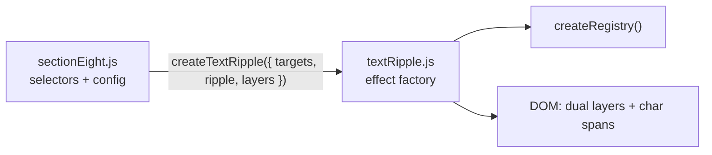
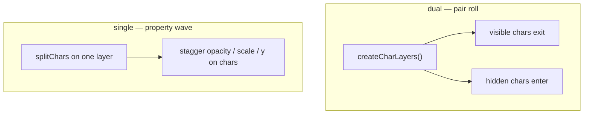
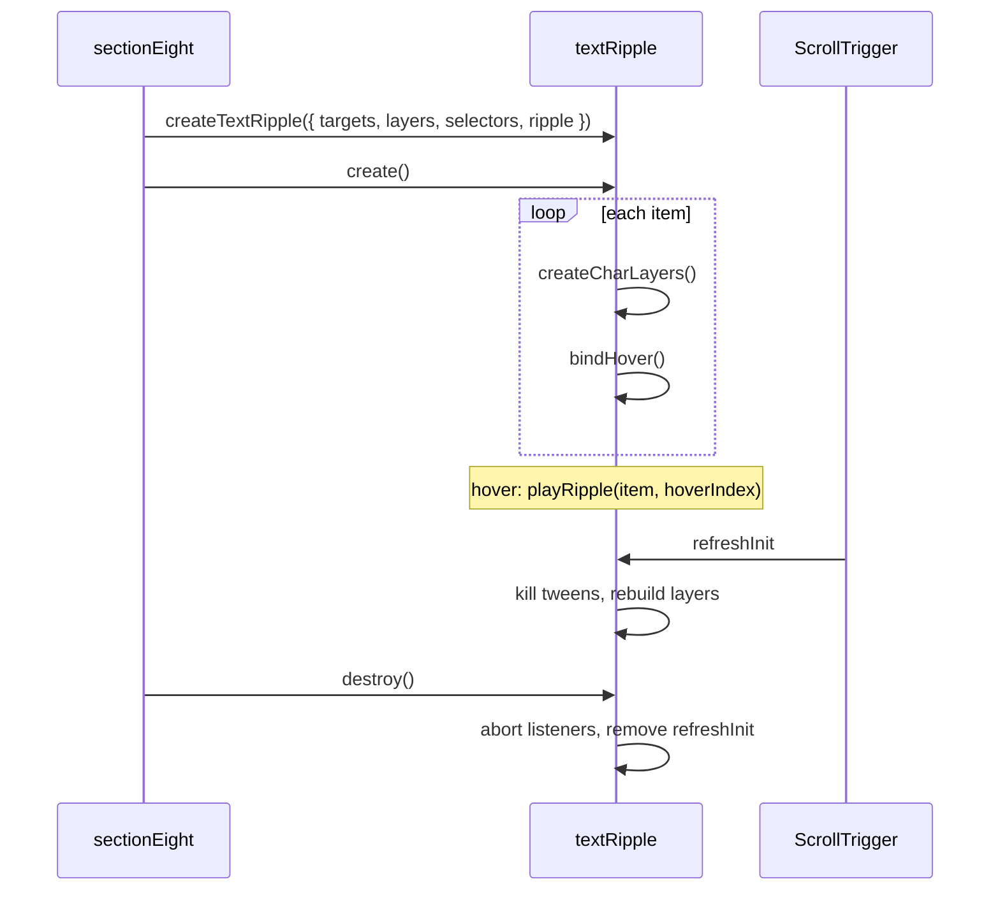

# textRipple Progressive Refactor Plan

## Goal

Move ripple logic out of [`sectionEight.js`](../js/timeline/sectionEight.js) into [`textRipple.js`](../js/effects/textRipple.js), using [`textRoll.js`](../js/effects/textRoll.js) as the structural guide. Each subsequent phase adds one capability without breaking the previous phase — test and fix before moving on.

## Reference pattern

[`sectionSeven.js`](../js/timeline/sectionSeven.js) is the target shape for section 8 after phase 1:



**textRoll interface to mirror:**

| Concern | textRoll | textRipple (phase 1) |
|---------|----------|----------------------|
| Factory | `createTextRoll({ target, targets, ... })` | `createTextRipple({ target, targets, ... })` |
| Tween config | `roll` | `ripple` |
| Per-element keys | `roll-0`, `roll-1` | `ripple-0`, `ripple-1` |
| Lifecycle | `create()`, `destroy()`, `revert()` | `create()`, `destroy()` |
| Resize rebuild | SplitText `onSplit` | `ScrollTrigger.refreshInit` (manual layers) |

**Intentionally not using SplitText** for ripple — hover-indexed stagger needs stable char nodes and manual layer rebuild on refresh. See [SPLIT-TEXT-REFACTORING.md](./SPLIT-TEXT-REFACTORING.md).

---

## Phase 1 — Core extraction (behavior unchanged)

**Status:** implemented

**Scope:** Lift working code from sectionEight into textRipple. Section 8 becomes a thin delegate. No new features.

### 1a. Implement `createTextRipple` factory in textRipple.js

- Export `createTextRipple({ target, targets, layers, selectors, ripple, beforeBind })`
- Move from sectionEight: `splitChars`, `createCharLayers`, `getCharIndex`, `bindHover`, `refreshTargets`
- Phase-1 defaults (same values as before):
  - `ease: "back.out(2)"`, `duration: 0.6`, `stagger.each: 0.023`
  - `yPercent: 100` on visible + hidden char spans
  - `clearProps: "all"` on hidden-layer tween `onComplete`
- Support `target` (single) and `targets` (NodeList) — keys `ripple` / `ripple-${index}`
- Lifecycle: `create()`, `destroy()`

**Principle:** match `textRoll` — flat config, motion fixed in the effect until a later phase needs to change it. Effect-internal functions use Structure / Bind / Play / Refresh phases (see CONTEXT.md).

**Naming (housekeeping):** `createCharLayers`, `splitChars`, `bindHover`, `playRipple`, `initTarget`, `refreshTargets`, `beforeBind`.

### Call chain (textRipple.js)

```text
create()
  └─ elements.forEach → initTarget(index)
       ├─ createCharLayers(target, layerMode)     [Structure]
       ├─ beforeBind?.(target)                      [hook]
       └─ bindTarget(target, key)                   [Bind]
            ├─ [mode=scroll] bindScroll
            │    └─ gsap.timeline({ scrollTrigger })
            │         └─ appendRippleTweens(tl, target, staggerFrom)
            └─ [mode=hover] bindHover
                 └─ mouseover → playRipple(target, charIndex)
                      └─ appendRippleTweens(tl, target, origin, { reset: true })

appendRippleTweens                          [Play]
  ├─ query visibleChars (+ hiddenChars if dual)
  ├─ [variance] tweenLayerChars × N layers
  └─ [no variance] tweenLayer × N layers (hidden at "<" if dual)
       └─ fromTo | to

ScrollTrigger "refreshInit" → refreshTargets  [Refresh]
  ├─ killScrollTimeline | killTweensOf + remove hovered class
  ├─ createCharLayers(target, layerMode)
  ├─ beforeBind?.(target)
  └─ [mode=scroll] bindScroll only (hover listeners persist)

destroy()
  ├─ abort.abort()          — removes hover listeners
  ├─ remove refreshInit listener
  └─ registry.destroy()
```

### 1b. Listener + rebuild cleanup

- `AbortController` removes hover listeners on `destroy()`
- `ScrollTrigger.removeEventListener("refreshInit", ...)` on `destroy()`
- Listeners stay on the item element; `refreshInit` rebuilds inner layers only

### 1c. Thin sectionEight.js

- Match sectionSeven delegate pattern
- `SECTION_EIGHT_CONFIG` holds selectors, layers, and `RIPPLE` tween values

**Test checkpoint 1:**

- Scroll to section 8 — all method labels visible after load
- Hover any char — ripple spreads from cursor index
- Hover again after complete — replays cleanly
- Resize browser — phrases rebuild, hover still works
- No duplicate `refreshInit` handlers after destroy + re-create

---

## Phase 2 — Flat tween config (deferred / rolled back)

**Status:** skipped — folded into phase 1

The first phase 2 attempt added `resolveRippleConfig`, `deriveSelectors`, `tweenChars`, and `visible`/`hidden`/`reset` keys before any consumer needed them. That was pre-optimization against the plan.

**Current approach:** `ripple` stays flat like `roll` — only `ease`, `duration`, `stagger.each`. Section 8 passes explicit `selectors` and `layers`. Motion (`yPercent`, `clearProps`) stays inline in `playRipple()` until phase 4.

**Test:** tweak `SECTION_EIGHT_CONFIG.RIPPLE.duration` to confirm config wiring.

---

## Phase 3 — `bind` mode switch (scroll variant)

**Status:** implemented

**Scope:** Add `bind.mode` without removing hover.

```js
bind: {
  mode: "hover" | "scroll",
  hover: { event: "mouseover" },
  scroll: {
    scrollTrigger: { start, end, scrub? },
    staggerFrom: "center" | "start" | "end" | "random" | number,
  },
}
```

**Test checkpoint 3:**

- Section 8 hover unchanged
- Scroll mode on a test element: ripple plays on enter, reverses on scroll back

---

## Phase 4 — Motion presets + combinable vars

**Status:** implemented

**Scope:** Named presets as shortcuts; `ripple.visible` / `ripple.hidden` `from`/`to` merge on top for multi-property motion. Preset data lives in [`motionPresets.js`](../js/effects/motionPresets.js) — `PHRASE_DUAL_PRESETS` and `PHRASE_SINGLE_PRESETS` (textRoll uses `CHAR_CELL_PRESETS` in the same file).

| Preset | Layer mode | Visible | Hidden | Notes |
|--------|------------|---------|--------|-------|
| `roll-down` (default) | dual | `yPercent: 100` | `yPercent: 100` | Section 8 slot exit |
| `roll-fade-out` | dual | `yPercent: 100`, `opacity: 0` | `yPercent: 100` | Drop + fade on exit layer |
| `roll-crossfade` | dual | `yPercent: 100`, `opacity: 0` | `yPercent: 100`, `opacity: 1` | Drop + opacity handoff |
| `roll-combo` | dual | y + opacity + scale exit | y + opacity + scale enter | Multi-prop pair roll |
| `fade-wave` | single-ish | `opacity: 1 → 0` | `opacity: 0 → 1` | No vertical slot; good with scroll scrub |
| `pop` | single-ish | lands `yPercent: 0` | exits partial y + scale | Reveal on visible; hidden exits |
| `pop-roll` | dual | partial exit | full `yPercent: 100` enter | Pop + slot drop on hidden |
| `scale-emphasis` | single-ish | lands `yPercent: 0` | exits `yPercent: 100` | Pop-style landing (reworked) |
| ~~`spread`~~ | — | removed | — | `xPercent` does not work with this layout |
| ~~`blur-wave`~~ | — | removed | — | See lessons below — unusable at section 8 scale |

**Usage:** `ripple: { preset: "roll-crossfade" }`

**Combine preset + overrides** (optional — merges on top):

```js
ripple: {
  preset: "roll-down",
  visible: { to: { opacity: 0 } },
}
```

**Test checkpoint 4:**

- Default / omitted preset — section 8 unchanged (`roll-down`)
- Swap `preset` in `SECTION_EIGHT_CONFIG.RIPPLE` to try each row

---

## Follow-up — preset families & lessons learned

**Status:** implemented — presets live in [`motionPresets.js`](../js/effects/motionPresets.js); `textRipple.js` uses `layerMode` on presets plus optional `ripple.layerMode` override.

Phase 4 presets exposed two distinct effect families. `appendRippleTweens` skips hidden layer tweens when `layerMode === "single"`; `createCharLayers` builds one visible span only in single mode.

### Dual-layer pair roll

Both phrase layers cooperate: one exits, one enters. Requires:

- `createCharLayers()` — visible + hidden spans
- Hidden layer CSS (`bottom: 100%` on `.animation-character-ripple__layer--hidden`)
- `.anim-mask { overflow: hidden }` on the target

| Preset | Pattern |
|--------|---------|
| `roll-down` | Both `yPercent: 100` — classic slot machine |
| `roll-fade-out` | Visible fades + drops; hidden follows |
| `roll-crossfade` | Opacity handoff + drop |
| `roll-combo` | y + opacity + scale on both layers |
| `pop-roll` | Pop entrance on hidden + full slot drop |

Closest to original section 8 / `textRoll` char yPercent logic.

### Single-layer / property wave

Effect reads as “stagger a property across chars” without a true A→B phrase swap. One layer does the work; the other is idle or redundant.

| Preset | Pattern |
|--------|---------|
| `fade-wave` | Opacity crossfade — minimal vertical motion |
| `pop` | Visible lands at `yPercent: 0`; hidden exits |
| `scale-emphasis` | Visible reveal in place; hidden exits (pop-style) |

These could eventually skip hidden layer DOM entirely — closer to a staggered line reveal than a slot roll.



### Lessons from preset experiments

**`blur-wave` — removed (performance)**

`filter: blur()` on many char spans, scrubbed with ScrollTrigger, forces expensive repaints every frame. Fine for one headline; unusable for section 8 (~30 items × many chars). Prefer transform/opacity only at list scale. Do not re-add without a `single` layer mode and a single-target demo.

**`spread` — removed (layout)**

`xPercent` horizontal drift does not work with the dual-layer + mask layout. Chars clip oddly and motion does not read as a wave from origin.

**`scale-emphasis` — reworked**

Early version applied `yPercent: 100` on **both** layers (copied from `roll-down`). Hidden never landed in the readable slot; 15% scale change was invisible against full vertical travel inside `.anim-mask`.

Working pattern (same family as `pop`): visible **lands** at `yPercent: 0`; hidden **exits**. Scale reads when combined with opacity and explicit `from` offsets — not when both layers only drop.

**Scroll bind + scrub**

- Use `ease` suited to scrub (`power2.out`, `none`) — not `back.out` — for symmetric up/down scroll.
- `toggleActions` is ignored when `scrub` is set.
- Widen `start` / `end` so stagger has room to read.

### Proposed follow-up (when revisiting)

| Item | Status |
|------|--------|
| Layer mode API | `ripple.layerMode` override + preset `layerMode` |
| Single-layer structure | `createCharLayers` — one span when single |
| `appendRippleTweens` | Skips hidden tween when single |
| Preset metadata | `layerMode` on PHRASE_DUAL / PHRASE_SINGLE entries |
| Shared presets | [`motionPresets.js`](../js/effects/motionPresets.js) — three families |
| Docs | Preset table + call chain above |
| Phase 6 | `fade-wave` + `prefers-reduced-motion` on single-layer path |
| Avoid | `filter`, `xPercent` spread, dual-layer presets without pair-roll semantics |

**Principle:** match preset to DOM shape — dual spans for slot/crossfade; single line for opacity/scale/emphasis waves.

---

## Phase 5 — Per-char variance hooks

**Status:** implemented

**Scope:** Optional organic stagger; off when `variance` omitted or all values zero.

```js
ripple: {
  preset: "roll-down",
  variance: {
    duration: 0.05,   // ± per char
    stagger: 0.005,   // ± delay jitter per char
    ease: null,       // or ["back.out(2)", "power2.out"]
  },
}
```

When variance is active, `appendRippleTweens` places per-char tweens on the timeline instead of a single `gsap.to` with stagger. Random values are fixed at create time (not re-rolled each scroll frame).

**Section 8 test config:** `roll-down` + `variance.duration` / `variance.stagger` in `SECTION_EIGHT_CONFIG.RIPPLE`. Remove or zero variance to restore deterministic ripple.

**Test checkpoint 5:**

- `variance` omitted — identical to phase 4
- `variance` on + `roll-down` — subtle organic wave (slightly uneven char timing)

---

## Phase 6 — Accessibility + polish

**Status:** implemented

**Scope:** `prefers-reduced-motion`, lifecycle guards, docs.

When `matchMedia("(prefers-reduced-motion: reduce)")` matches, `rippleForMotion()` overrides caller config:

- `preset: "fade-wave"` — opacity stagger only, no slot roll
- `ease: EASEOUTQUAD` — no `back.out` overshoot
- `variance` removed — deterministic motion

Caller `bind`, `duration`, and `stagger` are preserved. `id: "text-ripple"` already matches textRoll.

`create()` removes a prior `refreshInit` listener if called again on the same instance (prefer `destroy()` then a new factory — see sectionEight).

**Test checkpoint 6:**

- macOS Reduce motion on → section 8 fades in stagger, no yPercent roll
- Reduce motion off → section 8 config (`roll-down`, variance, scroll) unchanged
- `effect.destroy()` then `createTextRipple()` + `create()` — no duplicate refresh handlers

---

## File change summary

| Phase | Files touched |
|-------|---------------|
| 1 | `textRipple.js` (rewrite), `sectionEight.js` (thin) |
| 3 | `textRipple.js` only (+ optional dev test in sectionEight) |
| 4 | `textRipple.js` only |
| 5 | `textRipple.js` only |
| 6 | `textRipple.js`, optional docs |

No changes to [`script.js`](../js/script.js) orchestrator — `createSectionEight()` signature stays the same.

---

## Architecture (current)



---

## Out of scope (defer)

- SplitText hybrid for ripple
- Shared `charMotion.js` primitive with textRoll
- Changing section 8 HTML/CSS (`page.css` ripple rules stay as-is)
- Lenis integration (separate refactor phase per PLAN.md)
- Dual vs single layer mode formalization (see **Follow-up** above)
