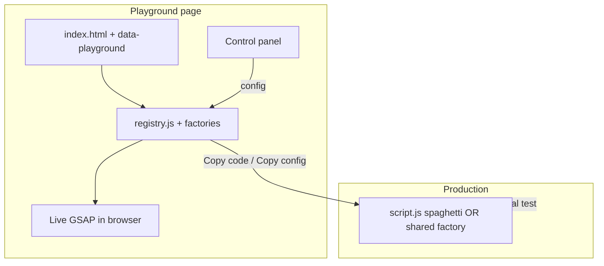

# Playground Plugin — Architecture Options & Recipes

> **Audience:** Senior JS/GSAP developers building a SplitText + ScrollTrigger tuning harness.  
> **Status:** v3 requirements locked — canonical spec moved to [`text-tuner/PLAYGROUND_V3_PRD.md`](../../text-tuner/PLAYGROUND_V3_PRD.md).  
> **References:** [DialKit](https://joshpuckett.me/dialkit) (config-driven dev panel), [Agentation](https://www.agentation.com/) (structured UI feedback for agents), current v2 in `playground-v2/`.

---

## 0. Locked requirements (v3)

These decisions supersede exploratory options elsewhere in this doc.

### 0.1 Principles

| Rule | Decision |
|------|----------|
| Dev execution model | **Runner + in-memory config** — panel edits config; generic runner applies GSAP. |
| Source of truth (while tuning) | In-memory config (+ optional `sessionStorage`). Not live `script.js`. |
| DOM binding | **Declarative marker**: `data-playground="id"` on the SplitText text target. |
| Instance list | Built from **Tier 0 `discover()`** or **Tier 1 `define()`** — validated against DOM. |
| Dev page default | **Strategy A** — no spaghetti for any `data-playground` element (see §0.12). |
| Production | **Copy code** → imperative spaghetti in `script.js`; no panel, no runner. |
| Viewport follow | Optional IO switches active instance in panel (not GSAP auto-detect). |
| GUI scope | Basic `gsap.set` + `gsap.to` + stagger + ScrollTrigger. Timelines / custom `onSplit` → Tier 2 later. |

### 0.2 HTML contract

Put `data-playground` on the element passed to `SplitText.create` (the text node wrapper):

```html
<section class="frame frame--2" aria-label="Animation frame">
  <p class="frame__copy split-target" data-playground="hero-lines">
    Line masks clip overflowing content…
  </p>
</section>
```

- **Attribute name:** `data-playground` (value = instance id, kebab-case recommended).
- **Uniqueness:** One id per page. Duplicate ids → boot warning, first match wins.
- **Production:** Attribute may stay (harmless) or be stripped at build time—team choice.

Default selectors in config use the attribute:

```javascript
targets: {
  element: ".frame--2",                              // ScrollTrigger trigger (section/container)
  text: '[data-playground="hero-lines"]',            // SplitText target
},
```

### 0.3 JS registry contract (Option A)

Each instance is a named entry. Registry key **must equal** `data-playground` value.

```javascript
const PLAYGROUND_REGISTRY = {
  "hero-lines": {
    label: "Hero lines",           // optional; dropdown falls back to id
    defaults: { /* DEFAULT_CONFIG shape */ },
    init: setupHeroLines,        // (config) => { teardown, runtime }
  },
  "footer-credits": {
    label: "Footer credits",
    defaults: { /* … */ },
    init: setupFooterCredits,
  },
};

SplitTextPlaygroundV2.attach({
  registry: PLAYGROUND_REGISTRY,
  activeId: "hero-lines",        // initial selection; ?playground=footer-credits overrides
});
```

Boot sequence:

1. Read `registry` from `attach()`.
2. Query `[data-playground]`; collect ids.
3. **Validate:** every registry key has a matching DOM node (warn if missing); every DOM id has a registry entry (warn if orphan).
4. Populate panel **instance dropdown** with registry keys (display `label` or id).
5. Init **all** instances (or lazy-init on first select—implementation detail; all-init is simpler for scroll testing).
6. Load panel form from **active** instance config (sessionStorage key per id: `playground-v2:hero-lines`).

### 0.4 Control panel — instance selector

- **Placement:** Panel header (above tabs).
- **Control:** `<select>` (or segmented list if ≤3 instances).
- **Options:** One option per registry entry; value = id, label = `entry.label ?? id`.
- **On change:** Commit current instance (save + rebuild that instance only), switch active, hydrate form from new instance’s stored config.
- **Export scope:** Copy config / Copy code applies to **active instance only** (footer shows active id).

### 0.5 Viewport follow (Intersection Observer)

Optional UX for multi-instance pages—not auto-detection of GSAP.

| Setting | Behavior |
|---------|----------|
| **Follow viewport** toggle (default: off) | When on, IO updates dropdown/active instance as user scrolls. |
| **Root margin** | Default `0px`; tune so switch happens when section is ~40–60% visible (implementation constant, not user-facing v1). |
| **Threshold** | Prefer `intersectionRatio` or single threshold `0.5` on the **trigger element** (`targets.element`), not the text node. |
| **Manual override** | User picks from dropdown → follow mode stays on but **pins manual selection** until user scrolls another instance past threshold *or* toggles follow off/on. |
| **Panel closed** | IO idle (no switching while panel closed)—avoids surprise rebuilds. |

Naming in UI: **“Follow viewport”** or **“Sync to scroll”**—avoid “auto-detect” (implies GSAP introspection).

### 0.6 Single-instance pages (tuner default)

Pages with one `[data-playground]` entry still use the same contract:

```html
<p data-playground="tuner-demo" …>
```

Registry has one key; dropdown shows one item (or hides selector when `registry.length === 1`—UX polish).

Existing 3-frame tuner markup stays; add one attribute + registry with one entry.

### 0.7 Explicit non-goals (v3)

- No runtime hooking of `SplitText.create` / `ScrollTrigger` for live sync.
- No reading or auto-writing animation source files from disk in the browser.
- No GUI for timelines, nested tweens, or arbitrary function calls in `onSplit` (Tier 2 hook only, future).
- No reliable parse of **arbitrary** spaghetti — Import converter accepts **canonical** blocks only (same shape as Copy code export).

**In scope for import:** Paste → AST convert → **Apply to in-memory config** (Import tab + shared CLI module). See §0.16.

### 0.8 File organization (ideal layout)

**Reference implementation:** [`examples/sample-playground/`](./examples/sample-playground/) — single `script.js` with runner, `define()`, `discover()`, and `attach()`.

**Always separate HTML, CSS, and JS.** Do not embed animation logic or styles in `index.html` beyond the DEV-only `attach()` bootstrap (3–10 lines).

| File | Role |
|------|------|
| `index.html` | Markup, `data-playground` attributes, script tags / module entry only |
| `styles.css` (or `page.css`) | Layout, frames, typography hooks (`--playground-*` vars) |
| `animations/registry.js` | `PLAYGROUND_REGISTRY` — ids, labels, default configs |
| `animations/<id>.js` | One factory per instance: `setupHeroLines(config) → { teardown, runtime }` |
| `animations/index.js` | Optional: re-exports registry, registers GSAP plugins once |
| `main.js` | Production entry: init all factories from registry **without** playground |
| `playground.bootstrap.js` | DEV ONLY: imports registry + calls `attach()` |

Shared plugin (not copied per project):

```
playground-v2/
├── playground-v2.js
└── playground-v2.css
```

#### Pattern A — Minimal single-page tuner (basic workflow)

```
my-tuner/
├── index.html
├── styles.css
├── animations/
│   ├── registry.js          # both instances + defaults
│   ├── paragraph-reveal.js  # factory for paragraph
│   └── header-reveal.js     # factory for header
├── main.js                  # production: run registry, no panel
└── playground.bootstrap.js  # dev: attach({ registry })
```

#### Pattern B — Playground sandbox beside production app (secondary workflow)

```
production-app/
├── index.html
├── css/
├── js/
│   └── script.js            # spaghetti or section code — paste target
└── playground/
    ├── index.html           # mirrors relevant sections + scroll spacers
    ├── playground.css
    ├── animations/          # factories tuned here
    │   ├── registry.js
    │   └── hero-lines.js
    └── playground.bootstrap.js
```

Production `script.js` stays untouched during design. You tune in `playground/`, then **Copy code** into `script.js` and verify on the real page.

#### Pattern C — Shared module (best long-term)

```
packages/
└── animations/
    ├── hero-lines.config.js   # HERO_LINES_DEFAULTS export
    └── hero-lines.js          # createHeroLines(config)

apps/site/js/script.js        # import + inline spaghetti-style calls OR createHeroLines(DEFAULTS)
apps/playground/              # same imports, plus attach()
```

One factory file is the source of truth; playground and production import the same module.

### 0.9 Workflows & spaghetti `script.js`

#### What the panel actually edits (v3)

The panel does **not** read or rewrite `script.js`. It edits a **config object** in memory and applies it through your **factory** (`init(config)` → SplitText + gsap + ScrollTrigger).

```
Panel sliders  →  workingConfig  →  setupX(config)  →  live GSAP on page
                      ↑
              sessionStorage (per data-playground id)
```

#### Can you keep spaghetti and paste back?

**Partially — with the right split of roles.**

| Role | Format | Edited by panel? |
|------|--------|------------------|
| **Tuning source (playground page)** | Registry + factories + `defaults` config | ✅ Yes |
| **Production paste target** | Spaghetti `SplitText.create(...)` in `script.js` | ❌ No (clipboard only) |

v3 **cannot** load arbitrary spaghetti, populate the panel, and sync bidirectionally without AST parsing (explicitly out of scope).

**Basic workflow that works today:**

1. **Draft** in playground using factories (even if production stays spaghetti).
2. **Tune** in browser; panel updates config → factory re-runs GSAP.
3. **Copy code** (v2 export) — emits a self-contained block you paste into `script.js`.
4. **Paste** into production `script.js`; remove DEV playground scripts from production HTML.

Example: your two spaghetti blocks become paste targets after tuning:

```javascript
// script.js — pasted from playground "Copy code" (one block per instance)

const paragraphSplit = SplitText.create('[data-playground="paragraph-reveal"]', {
  type: "chars,lines",
  autoSplit: true,
  onSplit(self) {
    gsap.set(self.lines, { yPercent: 100 });
    return gsap.to(self.lines, {
      yPercent: 0,
      duration: 1,
      ease: "power2.out",
      stagger: { amount: 0.1, from: "start" },
      scrollTrigger: {
        trigger: ".section-paragraph",
        start: "top 25%",
        end: "top top",
        scrub: true,
        markers: false,
      },
    });
  },
});

const headerSplit = SplitText.create('[data-playground="header-reveal"]', { /* … */ });
```

Note: GSAP 3.13+ uses `SplitText.create`, not `new SplitText()` — export should match your project’s API.

**Copy config** is the alternative paste: update `defaults` in `registry.js` or a shared `*.config.js` if production uses factories.

#### One-time migration from existing spaghetti

If `script.js` already has working splits:

1. Add matching `data-playground` attributes to HTML.
2. Extract each block into `animations/<id>.js` + defaults (manual, ~15 min once).
3. Wire registry; use playground for all future tuning.
4. Optional: keep spaghetti in production until next paste from **Copy code**.

You migrate **once**; you do not need to maintain two live-editable representations.

#### Workflow comparison

| | **Pattern 1: Basic tuner page** | **Pattern 2: Sandbox + production** |
|---|--------------------------------|--------------------------------------|
| **Where you tune** | Same page as test markup | Dedicated `playground/` folder |
| **Production code** | `main.js` or paste to `script.js` | Real app unchanged until paste |
| **Markup** | Full control (3-frame harness) | Copy/simplify production sections |
| **Best for** | New animations, learning | Existing apps, client sites |
| **Copy target** | `script.js` or section factory | Production `script.js` or timeline module |



#### HTML: what stays inline?

**In `index.html` only:**

- `<link>` / `<script>` tags (or one `<script type="module" src="main.js">`)
- DEV block:

```html
<!-- DEV ONLY -->
<link rel="stylesheet" href="../playground-v2.css" />
<script type="module" src="./playground.bootstrap.js"></script>
```

**Not in HTML:** `DEFAULT_CONFIG`, registry, factories, or GSAP calls.

#### Script load order (vanilla, unchanged)

1. GSAP + ScrollTrigger + SplitText  
2. `animations/*.js` + `registry.js` (or bundled `main.js`)  
3. DEV: `playground-v2.css` + `playground-v2.js` + `playground.bootstrap.js` → `attach({ registry })`

Production `main.js` calls each `registry[id].init(defaults)` and skips step 3.

### 0.10 Core architecture: runner + in-memory config

```text
┌──────────────────────────────────────────────────────────┐
│  HTML: data-playground="id" on SplitText target          │
├──────────────────────────────────────────────────────────┤
│  Tier 0 discover()  OR  Tier 1 define({ id: config })    │
│         ↓                                                │
│  In-memory config (per id)  ←──  Panel / Import Apply    │
│         ↓                                                │
│  Generic runner (setupAnimation)  →  SplitText + gsap    │
├──────────────────────────────────────────────────────────┤
│  sessionStorage (optional, per id, on commit)            │
├──────────────────────────────────────────────────────────┤
│  Copy config  →  Tier 1 define() in script (optional)    │
│  Copy code    →  production spaghetti (final)            │
└──────────────────────────────────────────────────────────┘
```

The runner is the single **owner** of GSAP for each `[data-playground]` element while the panel is active. Config does **not** override spaghetti in `script.js` — you must not run both on the same target (§0.15).

### 0.11 Onboarding tiers

| Tier | You write | Panel + runner | When |
|------|-----------|----------------|------|
| **0** | HTML + `data-playground` only | `discover()` scaffolds defaults | Cold start, teaching |
| **1** | Config object via `define({ id: { … } })` | Same generic runner | Known starting values, git-friendly |
| **2** | Custom `init(config)` factory | Runner + custom logic | Non-standard timelines (future / rare) |

Generic runner = current `tuner/animation.js` logic, promoted into the plugin (one copy, not per project).

### 0.12 Dev page contract — Strategy A (default)

On any page where the playground is attached:

| Target | What may run GSAP |
|--------|-------------------|
| Element **with** `data-playground` | **Runner only** — Tier 0/1. No spaghetti in `script.js` for that selector. |
| Element **without** `data-playground` | Spaghetti or other code OK (Workflow 3 coexistence on other elements). |

**Strategy B (optional):** one `script.js` for dev + prod — wrap legacy spaghetti:

```javascript
if (!SplitTextPlaygroundV2?.isActive?.()) {
  SplitText.create(".hero p", { /* … */ });
}
```

Use B only when you cannot split playground HTML from production HTML. **Default remains A.**

### 0.13 Three official workflows

#### Workflow 1 — Cold start (Tier 0)

1. Markup + styles only; add `data-playground="my-text"` to the element.
2. Load playground; call `discover()` (or zero-config attach).
3. Tune in panel (runner uses scaffold defaults).
4. **Copy code** → paste into production `script.js`.
5. Remove playground scripts from production HTML.
6. **Remove `data-playground`** from production HTML (recommended) or leave harmless.

No spaghetti exists until step 4.

#### Workflow 2 — Existing spaghetti → tune → ship

1. Playground page (Strategy A): markup + styles; **do not** load the old spaghetti block for this element.
2. Add `data-playground="paragraph-reveal"` to the target in HTML.
3. **Import tab:** paste old spaghetti → Convert → review warnings → **Apply** to active instance.  
   - Apply sets in-memory config and wires `targets.text` to `[data-playground="…"]`.  
   - **Delete or comment out** the source spaghetti you pasted from — it must not run on this page (see §0.14).
4. Tune in panel.
5. **Copy code** → paste into `script.js` as the **replacement** final block (production selectors — see below).
6. **Remove `data-playground`** from this element when done; move to the next element.

Repeat steps 2–6 per animation on a multi-element page.

#### Workflow 3 — Config in script → tune → ship as spaghetti

1. Playground page: `define({ "hero-lines": { …config } })` in dev bootstrap — **no** spaghetti for that id.
2. Tune in panel; optional **Copy config** to persist `define()` block in repo.
3. When locked: **Copy code** → replace `define()` entry with pasted spaghetti in production `script.js`.
4. Remove playground DEV block and `data-playground` from production markup.

End state for shipped elements: **imperative spaghetti only**, no config object, no playground attribute.

#### Production selectors after ship

Copy code may reference `[data-playground="id"]` if you keep the attribute. Prefer updating selectors to production classes when you remove the attribute:

```javascript
// After removing data-playground from <p class="hero__copy">
SplitText.create(".hero__copy", { /* … */ });
```

### 0.14 Stale spaghetti — comment out or delete?

| Situation | Recommended action |
|-----------|-------------------|
| **Right after Import Apply** (playground page) | **Delete** the old block from playground `script.js`, or leave it out entirely (Strategy A). Comment only if you need a short-lived reference while diffing. |
| **After Copy code (element shipped)** | **Replace** old spaghetti in production `script.js` with the new Copy code block — do not append. |
| **Never** | Old + new spaghetti for the **same selector** on the same page. |

Import Apply does **not** edit `script.js`. Stale code is a **manual hygiene** step. Ideal sequence:

```text
Paste into Import → Apply  →  delete/omit old block on playground page  →  tune  →  Copy code  →  replace in production script.js
```

### 0.15 Competing code — overlap warning

**Config does not override spaghetti.** If both run on the same DOM node:

- Double SplitText split (broken markup)
- Duplicate ScrollTriggers
- Panel changes appear to “not work”

**Document + implement:**

- Boot-time **console warning** if a `[data-playground]` node already has SplitText wrapper classes / `data-split` artifacts before runner init.
- Panel footer reminder: *“Runner owns `[data-playground]` targets. Remove spaghetti for this selector on the dev page.”*
- Optional future: dev-only assert that throws when overlap detected.

**Allowed:** spaghetti on `.nav-label` while runner tunes `[data-playground="hero-lines"]` — different elements.

### 0.16 Import converter (panel tab + CLI)

Shared module: `convert(source, { id }) → { config, warnings }`.

| Surface | Flow |
|---------|------|
| **Import tab** (bottom of panel) | Paste canonical block → Convert → warnings → **Apply to selected instance** → in-memory config + runner rebuild. **Primary path.** |
| **CLI** | `node convert.js snippet.js --id hero-lines --format define` → stdout only; user pastes into `define()` and reloads. Secondary / offline. |

Apply targets **in-memory config**, not `script.js`. Round-trip test: Copy code → Import convert → Apply should reproduce the same panel state (within canonical subset).

Import may set `targets.text` to `[data-playground="${id}"]` even if pasted code used a class selector — aligns HTML marker with config.

### 0.17 Reset and clear cache

| Action | Clears | Does not |
|--------|--------|----------|
| **Reset instance** | sessionStorage for active id; config → code defaults (`define` / discover scaffold) | Edit `script.js` |
| **Reset all** | All `playground-v2:*` session keys; rebuild all instances | Remove spaghetti |
| **Clear import session** | Same as reset instance (imported values are not separate layer — they became working config until reset) | — |

Full clean start on playground page:

1. Reset all instances in panel.
2. Confirm `script.js` has **no** spaghetti for any `[data-playground]` id (Strategy A).
3. Reload page.

---

---

## 1. Problem statement

You want a **draft board** for one (later: many) SplitText + ScrollTrigger animations:

- Keep the **3-frame scroll harness** (`frame--1` spacer → `frame--2` animation → `frame--3` spacer).
- Tune values in the browser with a **DialKit-like panel** (sliders, toggles, folders, copy/export).
- **Live preview** while editing; **commit** when structural options change.
- **Copy working code** back into section factory functions or production scripts.

The hard question is **source of truth**: should the panel *discover* GSAP usage automatically, or should animation code *declare* what is tunable?

**Short answer:** For reliable live editing and copy-back, **declare a config schema + factory** (what v2 already does). Pure auto-detection from arbitrary GSAP calls is possible only as a **best-effort dev overlay**, not as the primary contract.

---

## 2. What “auto-detect” can and cannot mean

| Interpretation | Feasibility | Notes |
|----------------|-------------|-------|
| Auto-generate UI from a **config object** | ✅ High | DialKit model; v2 `DEFAULT_CONFIG` |
| Auto-generate UI from **GSAP instances at runtime** | ⚠️ Partial | Patch/wrap APIs; read `ScrollTrigger.getAll()` |
| Parse **arbitrary production JS** into editable fields | ❌ Low | Factory patterns, closures, dynamic targets break static analysis |
| Read **external script file** from disk in browser | ❌ No | Browsers cannot read local files without user gesture or dev server |
| Sync from **dev server / MCP / File System Access API** | ✅ Medium | Opt-in write-back paths |

GSAP animations are **imperative** (targets resolved at runtime, `onSplit` callbacks, conditional logic). A panel needs a **stable, serializable snapshot** of intent. That snapshot is your config object—not the raw `gsap.to()` call graph.

---

## 3. Recommended architecture (evolve v2, don’t replace)

v2 already implements the right core split:

```
┌─────────────────────────────────────────────────────────────┐
│  Page HTML (frames, copy, data attributes)                  │
├─────────────────────────────────────────────────────────────┤
│  animation.js — DEFAULT_CONFIG + setupAnimation(config)     │
│    • SplitText.create, gsap.set/to, scrollTrigger vars      │
│    • returns { teardown, runtime: { applyLive, … } }        │
├─────────────────────────────────────────────────────────────┤
│  playground-v2.js — panel UI, persistence, export           │
│    • attach({ init, defaults, storageKey, targets })         │
└─────────────────────────────────────────────────────────────┘
```

**Treat `DEFAULT_CONFIG` as the DialKit config.** The panel auto-detects *controls* from schema shape (numbers → sliders, booleans → toggles, nested objects → folders)—not from parsing GSAP source.

### Why this beats “read my script tag”

1. **Copy code / copy config** is deterministic (v2 `exportCopyCode`).
2. **Live vs rebuild tiers** map cleanly to config sections (`splitText` vs `scrollTrigger`).
3. **Production port** = remove DEV block + paste export or call `setupAnimation(DEFAULT_CONFIG)`.
4. Same pattern scales to **section factories** in a larger site (one config per section module).

---

## 4. Where to keep configuration

### Option A — Config in `animation.js` (recommended default)

```javascript
// tuner/animation.js
const DEFAULT_CONFIG = { /* … */ };

function setupAnimation(config) { /* … */ }

window.DEFAULT_CONFIG = DEFAULT_CONFIG;
window.setupAnimation = setupAnimation;
```

```html
<script src="animation.js"></script>
<script src="../playground-v2.js"></script>
<script>
  SplitTextPlaygroundV2.attach({
    init: setupAnimation,
    defaults: DEFAULT_CONFIG,
    storageKey: "playground-v2-tuner",
    targets: ".split-target",
  });
</script>
```

| Pros | Cons |
|------|------|
| Single file to copy from panel → production | Config duplicated if you also hard-code literals in factory |
| Works with script tags, no bundler | Not “magic” auto-detect from legacy code |

**Recipe:** Production section file exports `DEFAULT_CONFIG` + `setupAnimation`. Tuner page imports the same module (or copies file for isolation).

---

### Option B — Inline JSON block in HTML

```html
<script type="application/json" id="gsap-playground-config">
{
  "targets": { "element": ".frame--2", "text": ".frame--2 .frame__copy" },
  "splitText": { "type": "words,lines", "mask": "lines" }
}
</script>
```

Panel boot: `JSON.parse(document.getElementById('gsap-playground-config').textContent)`.

| Pros | Cons |
|------|------|
| HTML-only demos; easy for designers | Splits config from factory logic |
| Good for CodePen / static hosts | Easy to drift from `animation.js` |

**Recipe:** Use for **quick prototypes** only; promote to Option A before copying to a section factory.

---

### Option C — Declarative markers in HTML (Agentation-style targeting)

```html
<section class="frame frame--2" data-playground="hero-lines">
  <p class="frame__copy split-target" data-split data-playground-text>
    …
  </p>
</section>
```

```javascript
SplitTextPlaygroundV2.attach({
  init: setupAnimation,
  defaults: DEFAULT_CONFIG,
  registry: '[data-playground]',  // future: discover instances
});
```

| Pros | Cons |
|------|------|
| Clear DOM ↔ animation binding | Still needs JS factory for GSAP calls |
| Enables click-to-select later | Selectors must stay in sync with config |

**Recipe:** Combine with Option A—markers for **selection**, config for **values**.

---

### Option D — Runtime introspection (dev overlay)

Wrap GSAP entry points when `?playground=1` or `attach()` runs:

```javascript
function installPlaygroundHooks() {
  const splits = new Map();
  const originalCreate = SplitText.create;

  SplitText.create = function (targets, options) {
    const instance = originalCreate.call(this, targets, options);
    splits.set(instance, { targets, options, ts: Date.now() });
    window.__PG_SPLITS__ = splits;
    return instance;
  };

  // Similarly: wrap ScrollTrigger.create or gsap.to when vars.scrollTrigger present
}
```

Then panel can:

- List `ScrollTrigger.getAll()` with `trigger`, `start`, `end`, `scrub`
- Match ScrollTrigger to DOM via `st.trigger` element
- Offer “Import from page” to **seed** config from last captured create

| Pros | Cons |
|------|------|
| Works on **legacy** pages without refactor | Incomplete (misses dynamic/refactored code paths) |
| Good bootstrap for migration | Cannot safely write back without schema |

**Recipe:** **Supplement**, not replace Option A. “Import last SplitText.create options into panel” button.

---

### Option E — Third-party / production script

**Browser cannot read** `../sections/section-2.js` from disk. Practical paths:

| Mechanism | Flow |
|-----------|------|
| **Shared module** | Tuner and site both `import { setupSection2, DEFAULT_CONFIG } from './section-2.js'` |
| **Dev server proxy** | Vite plugin serves section file; HMR on save |
| **Copy export only** | Panel → clipboard → manual paste (v2 today) |
| **File System Access API** | User picks `animation.js`; panel writes marked region (Chrome, user gesture) |
| **MCP / Agentation-style** | Agent reads annotations + file paths; applies patch in IDE |

**Recipe for this repo:** Section factories live in `scroll-trigger-architecture/js/timeline/section-N.js`. Tuner imports or re-exports the same factory during dev:

```javascript
// tuner/animation.js (dev shim)
import { createSection2Animation, SECTION_2_DEFAULTS } from '../../scroll-trigger-architecture/js/timeline/section-2.js';

export const DEFAULT_CONFIG = SECTION_2_DEFAULTS;
export function setupAnimation(config) {
  return createSection2Animation(config);
}
```

---

## 5. Folder layout recipes

### Recipe 1 — Minimal tuner page (current v2)

```
playground-v2/
├── playground-v2.js          # Panel runtime (future npm package)
├── playground-v2.css
├── fonts.css
└── tuner/
    ├── index.html            # 3-frame harness
    ├── animation.js          # DEFAULT_CONFIG + setupAnimation
    └── tuner.css             # Frame/layout typography hooks
```

**HTML load order** (non-negotiable):

1. GSAP + ScrollTrigger + SplitText  
2. User `animation.js`  
3. `playground-v2.css` + `playground-v2.js` (DEV ONLY)  
4. `attach({ … })`

---

### Recipe 2 — Per-section draft board

```
scroll-trigger-architecture/js/timeline/
├── section-2.js              # createSection2Animation(config), SECTION_2_DEFAULTS

split-text/playground-v2/tuner/
├── index.html
├── animation.js              # re-exports section-2 factory
```

Tune section 2 in isolation; paste export into `section-2.js` constants or inline config.

---

### Recipe 3 — Plugin package (future)

```
@your-org/gsap-playground/
├── dist/
│   ├── playground.js         # attach(), schema, UI
│   └── playground.css
├── schema/
│   └── split-scroll-v1.json  # JSON Schema for config migration
└── README.md

user-project/
├── index.html
└── animations/hero.js        # factory only, no panel code
```

Peer deps: `gsap`, `@gsap/shockingly` SplitText (document Club license).

---

## 6. DialKit-inspired panel patterns

DialKit’s `useDialKit('Card', { blur: [24,0,100], spring: { type:'spring', … } })` maps directly to a **schema-driven** playground:

### 6.1 Config → control inference

| Config shape | Control | GSAP mapping |
|--------------|---------|--------------|
| `[default, min, max, step?]` | Slider | `yPercent`, `duration`, scrub smooth |
| `number` | Slider (inferred range) | `opacity`, `scale` |
| `boolean` | Toggle | `autoSplit`, `markers`, `scrub` on/off |
| `"power2.out"` | Select / easing editor | `ease`, stagger ease |
| `{ type: 'select', options: [] }` | Dropdown | `animate`: lines/words/chars |
| Nested object + `_collapsed` | Folder | `stagger`, `scrollTrigger`, `typography` |
| `{ type: 'action' }` | Button | Replay scroll, reset, import |

**Implementation sketch:**

```javascript
const SCHEMA = {
  splitText: {
    _collapsed: false,
    type: { type: 'multiselect', options: ['chars','words','lines'] },
    mask: { type: 'select', options: ['none','lines','words','chars'] },
    autoSplit: true,
    smartSplit: true,
  },
  scrollTrigger: {
    start: { type: 'scrollPosition' },  // custom editor (v2 already has this)
    end: { type: 'scrollPosition' },
    scrub: { type: 'scrubTriState' },
    markers: false,
  },
  from: { yPercent: [-100, 100, 1] },
  to: { yPercent: [-100, 100, 1], duration: [1, 0.1, 5, 0.05] },
};
```

Panel renders from `SCHEMA` + current values; v2’s hand-built HTML migrates incrementally to a small **control registry**.

### 6.2 Folders mirroring mental model

```
Typography
Tween
  ├─ Timing (duration, ease, animate target)
  ├─ Properties (from | to grid)
  └─ Stagger
SplitText
ScrollTrigger
Actions
  ├─ Replay scroll
  ├─ Copy config
  ├─ Copy code
  └─ Copy patch (future)
```

### 6.3 Keyboard shortcuts (DialKit-style)

| Shortcut | Action |
|----------|--------|
| ⌘K | Toggle panel |
| ⌘1–4 | Tabs |
| Hold `S` + scroll | Adjust scrub / stagger (future) |
| Hold `M` | Toggle markers |
| Space | Pause/resume ScrollTrigger scrub preview |

---

## 7. Live edit + commit model (keep v2 tiers)

| Config section | Update strategy | Why |
|----------------|-----------------|-----|
| `from`, `to`, `duration`, `ease`, `stagger` | **Live** (`runtime.applyLive`) | Same split DOM; patch tween + ST |
| `scrollTrigger` (start/end/scrub/trigger/markers) | **Live** | ST vars updatable without re-split |
| `splitText.*`, `targets.*` | **Rebuild on commit** | DOM structure changes |
| `typography.*` | **Rebuild on commit** | Line breaks / metrics change |

On commit: sessionStorage → full teardown → `setupAnimation(config)` → `scrollTo(0)`.

This matches how you’d use DialKit during design, then “freeze” values into production code.

---

## 8. Copy-back strategies (script file sync)

### Tier 1 — Clipboard (shipped in v2)

- **Copy config** → paste into `DEFAULT_CONFIG` or factory argument.
- **Copy code** → paste literal `SplitText.create` block into section file.
- **Copy CSS** → typography vars.

Lowest friction; works everywhere.

### Tier 2 — Marked regions in source

```javascript
// @playground-config-start
const DEFAULT_CONFIG = { /* panel overwrites this block */ };
// @playground-config-end
```

Panel export includes **only the region** or a unified diff. IDE search/replace or a small CLI applies it.

### Tier 3 — File System Access API

User clicks “Save to file…” → picks `animation.js` → panel replaces marked region. Requires HTTPS or localhost; user gesture per save.

### Tier 4 — Dev server plugin

Vite/Rollup plugin watches panel WebSocket:

```javascript
// vite-plugin-gsap-playground
export function gsapPlayground() {
  return {
    name: 'gsap-playground',
    configureServer(server) {
      server.ws.on('gsap-playground:save', ({ file, config }) => {
        // rewrite marked region in file
      });
    },
  };
}
```

Best DX for daily tuning; more setup.

### Tier 5 — Agentation-style MCP

Panel or browser extension emits structured annotations:

```yaml
annotation:
  id: hero-lines
  file: scroll-trigger-architecture/js/timeline/section-2.js
  region: "@playground-config"
  config: { … }
```

Agent in Cursor applies patch. Best for multi-instance and team feedback later.

**Recommendation:** Ship Tier 1 + Tier 2 markers now; add Tier 4 when you adopt a bundler for the main site.

---

## 9. Multi-instance (v3 — see §0)

Implemented via **registry + `data-playground`**. No runtime GSAP introspection.

### 9.1 Registry + DOM validation

See §0.3. Registry keys match `data-playground` values; boot validates DOM ↔ registry.

### 9.2 Viewport follow

See §0.5. Intersection Observer on each instance’s `targets.element` (or nearest `section.frame`).

### 9.3 Deferred: click-to-select (Agentation-like)

Optional later enhancement—manual pick on canvas sets active id in dropdown. Not in v3 initial scope.

### 9.4 Copy-back per instance

Export formats:

```javascript
// Copy code — single instance
export function createHeroLines(config = HERO_LINES_DEFAULTS) { … }

// Copy registry snippet — all instances
export const SECTION_ANIMATIONS = {
  'hero-lines': { defaults: HERO_LINES_DEFAULTS, create: createHeroLines },
  'footer-credits': { defaults: FOOTER_DEFAULTS, create: createFooterCredits },
};
```

Section orchestrator:

```javascript
Object.values(SECTION_ANIMATIONS).forEach(({ defaults, create }) => {
  instances.push(create(defaults));
});
```

### 9.5 Isolation vs full-page tuning

| Mode | Use when |
|------|----------|
| **Single-frame tuner** (current 3-section page) | Drafting one animation |
| **Full-page overlay** | Tune real page with many sections; disable non-active ST while editing one |
| **Section iframe** | Embed production section markup in tuner frame |

For full-page: panel should **pause/kill** other ScrollTriggers while editing one instance (`st.disable()` / re-enable on commit).

---

## 10. Comparison matrix — pick your integration pattern

| Pattern | Auto-detect UI | Live edit | Copy-back | Multi-instance | Effort |
|---------|----------------|-----------|-----------|----------------|--------|
| **A. Config + factory (v2)** | From schema | ✅ | ✅ clipboard | Registry extension | Low (done) |
| **B. Inline JSON in HTML** | From JSON | ✅ | ✅ | Multiple JSON blocks | Low |
| **C. GSAP API hooks** | From runtime | ⚠️ partial | ⚠️ import only | List ST.getAll() | Medium |
| **D. AST parse production JS** | ⚠️ fragile | ❌ | ⚠️ | ❌ | High |
| **E. Shared ESM + Vite plugin** | From module export | ✅ | ✅ file write | ✅ | Medium–high |
| **F. MCP / agent annotations** | From annotations | via agent | ✅ agent patch | ✅ | Medium |

**Recommended path:** **A → A+registry → E** for this project. Use **C** as optional “Import from page” for legacy migrations.

---

## 11. Agentation-inspired UX (optional, high value later)

Not for GSAP auto-detect, but for **targeting and feedback**:

| Agentation idea | Playground adaptation |
|-----------------|----------------------|
| Click element → structured context | Click → set `targets.text` / `scrollTrigger.trigger` |
| CSS selector in output | Export uses selectors from picked element |
| Pause animation | Freeze scrub at progress `0.5` for inspection |
| MCP “address annotation 3” | “Apply playground config to section-2.js” |
| One issue per annotation | One registry entry per animation instance |

Combine with **Pick target** mode so you don’t hand-type `.frame--2 .frame__copy`.

---

## 12. Production vs dev boundaries

```html
<!-- production -->
<script type="module" src="/js/sections/section-2.js"></script>
<script type="module">
  import { createSection2Animation, SECTION_2_DEFAULTS } from './sections/section-2.js';
  createSection2Animation(SECTION_2_DEFAULTS);
</script>

<!-- development only -->
<?php if (DEV): ?>
<link rel="stylesheet" href="/playground-v2.css" />
<script src="/playground-v2.js"></script>
<script>
  SplitTextPlaygroundV2.attach({ … });
</script>
<?php endif; ?>
```

Or feature flag:

```javascript
if (import.meta.env.DEV) {
  const { attach } = await import('@your-org/gsap-playground');
  attach({ … });
}
```

**Never** ship panel CSS/JS to production bundles (DialKit’s `productionEnabled: false` equivalent).

---

## 13. Schema versioning

When panel fields grow, version the config:

```javascript
const DEFAULT_CONFIG = {
  __schema: 'split-scroll-v1',
  targets: { … },
  // …
};
```

Panel migrates `v0 → v1` on load from sessionStorage. Enables npm plugin releases without breaking saved sessions.

---

## 14. Concrete next steps for this repo

1. **Implement** Tier 0 `discover()` + Tier 1 `define()` on generic runner (promote `animation.js`).
2. **Extend** `attach({ registry })` with instance dropdown + per-id sessionStorage.
3. **Add** Import tab: shared `convert()` + Apply to in-memory config.
4. **Add** overlap console warning on boot (§0.15).
5. **Add** Reset instance / Reset all (§0.17).
6. **Update** `tuner/index.html` — `data-playground` + Strategy A (no competing spaghetti).
7. **Optional CLI** — same `convert()` module, stdout only.

---

## 15. FAQ

### Can I tune spaghetti `script.js` directly without factories?

Not with v3. The panel edits **config → factory → GSAP**. Spaghetti in `script.js` is a **paste destination** for **Copy code**, not a live source. One-time migration to factories on the playground page unlocks the panel; production can stay spaghetti until you paste.

### Should HTML, CSS, and JS be in one file?

No. Separate files: HTML for markup + `data-playground`, CSS for layout/type, JS for registry/factories. Only the tiny DEV `attach()` bootstrap may live as a module entry in HTML.

### Basic vs sandbox workflow?

**Basic:** one tuner project; factories + registry; paste export into your app’s `script.js`.  
**Sandbox:** `playground/` folder beside production; mirror section markup; tune there; paste into real app for integration testing. See §0.8–0.9.

### How does this relate to DialKit?

DialKit: React hook + config → controls for **your component props**.  
Playground: `attach()` + config → controls for **GSAP factory params**. Same **schema-driven panel** idea; different runtime (ScrollTrigger rebuild tiers, split DOM).

### Multiple animations on one page?

Use a **registry** (`id → { label, defaults, init }`), **`data-playground="id"`** on each text target, panel instance dropdown, optional **Follow viewport** IO. See §0.

---

## 16. References in this repo

| File | Role |
|------|------|
| [PLAYGROUND_V2_PRD.md](./PLAYGROUND_V2_PRD.md) | Locked v2 scope and tiers |
| [README.md](./README.md) | Load order, BYO HTML, porting |
| [tuner/animation.js](./tuner/animation.js) | Reference factory + `DEFAULT_CONFIG` |
| [playground-v2.js](./playground-v2.js) | Panel, live/commit, export |
| [tuner/index.html](./tuner/index.html) | 3-frame harness |

External:

- [DialKit](https://joshpuckett.me/dialkit) — config-driven control panel, folders, export
- [Agentation](https://www.agentation.com/) — element picking, structured agent context, MCP
