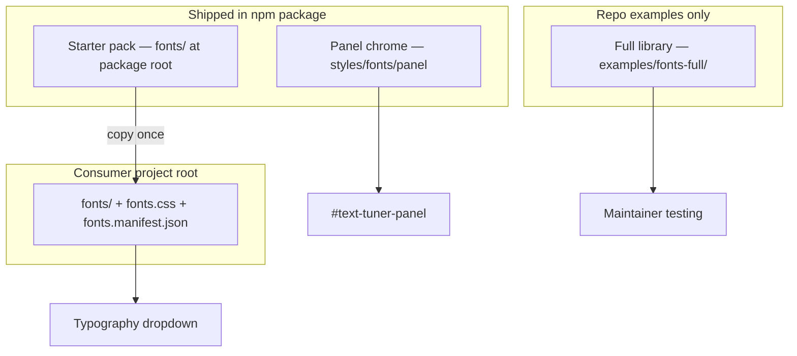

# Text Tuner v3 — Font management

> **Status:** Design locked (grill session)  
> **Related:** [ADDING_FONTS.md](./ADDING_FONTS.md) (user guide) · [INTERFACE_RULES.md](./INTERFACE_RULES.md) · [ADR-0005](../docs/adr/0005-font-tiers-and-starter-pack.md)

## Problem (v2)

One `fonts/` tree (~25 families, ~250 files) serves three different jobs:

| Job | v2 consumer | Problem |
|-----|-------------|---------|
| Panel UI chrome | `playground-v2.css` → `--pg-font: var(--font-giest)` | Panel depends on 2000-line `fonts.css` |
| Monospace values | `--font-monospace: var(--font-maple-mono)` | Same |
| Typography tab preview | `FONTS` array + `typography.fontVar` | Same files, plus **hand-maintained** JS list out of sync with generator |

v3 uses **four tiers**. Tiers 2 and 4 share one **root `fonts/` convention**.

---

## Four font tiers



| Tier | Purpose | Location | npm |
|------|---------|----------|-----|
| **1. Panel chrome** | Sidebar UI only | `styles/fonts/panel/` + `panel-fonts.css` | Yes (~3 woff2) |
| **2. Starter pack** | Copy template for new projects | **`fonts/`** + `fonts.css` + `fonts.manifest.json` at package root | Yes |
| **3. Full library** | Maintainer testing (all v2 families) | `examples/fonts-full/` | No |
| **4. Consumer** | User project (starter copy + additions) | **Project root `fonts/`** | User-owned |

### Unified folder convention (tiers 2 & 4)

```
fonts/                      # one subfolder per family slug
  fh-enso/
  editorial-new/
  my-brand/                 # user adds
fonts.css                   # generated
fonts.manifest.json         # generated
```

Same layout in the npm package (starter) and in the consumer repo after copy. No `starter-fonts/fonts/` nesting — **`fonts/` is always the binaries root.**

---

## Tier 1 — Panel chrome fonts

```
text-tuner/styles/
  fonts/panel/
    Geist-Regular.woff2
    Geist-Medium.woff2
    GeistMono-Regular.woff2
  panel-fonts.css
```

Imported by `text-tuner/styles.css`. Not in user's `fonts/` folder. Not in typography dropdown.

---

## Tier 2 — Starter pack (npm)

### Curated families (v1 — 6)

| Slug | Label |
|------|-------|
| `fh-enso` | FH Enso |
| `editorial-new` | Editorial New |
| `maple-mono` | Maple Mono |
| `fh-noetica` | FH Noetica |
| `lock-serif` | Lock Serif |
| `basier-circle` | Basier Circle |

Trim to essential weights per family (~25–40 woff2 total).

### Package layout

```
text-tuner/
  fonts/                    # starter binaries (shipped)
    fh-enso/
    ...
  fonts.css                 # generated, shipped
  fonts.manifest.json       # generated, shipped
  styles/fonts/panel/         # tier 1 — separate
```

### npm exports

```json
{
  "exports": {
    "./styles.css": "./styles/text-tuner.css",
    "./fonts.css": "./fonts.css",
    "./fonts.manifest.json": "./fonts.manifest.json"
  }
}
```

Note: `fonts/` binaries are included via package `"files"` field — consumers copy from `node_modules/text-tuner/fonts/`.

### Consumer first-time setup

```bash
cp -R node_modules/text-tuner/fonts ./fonts
cp node_modules/text-tuner/fonts.css ./fonts.css
cp node_modules/text-tuner/fonts.manifest.json ./fonts.manifest.json
```

See [ADDING_FONTS.md](./ADDING_FONTS.md) for full user workflow.

---

## Tier 3 — Full library (repo only)

```
text-tuner/examples/fonts-full/
  fonts/
  fonts.css
  fonts.manifest.json
```

All remaining v2 families for gsap-guide maintainer testing. Not published to npm.

Repo script: `pnpm run fonts:generate:full`

---

## Tier 4 — Consumer project

User copies tier 2 to project root, adds folders under `fonts/`, runs generator. **No Text Tuner code changes.**

```bash
npx text-tuner fonts generate
# defaults: --dir ./fonts --out-css ./fonts.css --out-manifest ./fonts.manifest.json
```

---

## Generator (`scripts/generate-preview-fonts.mjs`)

| Script | `--dir` | Outputs |
|--------|---------|---------|
| `pnpm run fonts:generate` | `fonts/` (package root) | `./fonts.css`, `./fonts.manifest.json` |
| `pnpm run fonts:generate:full` | `examples/fonts-full/fonts` | beside that dir |
| Consumer `npx text-tuner fonts generate` | `./fonts` (cwd default) | `./fonts.css`, `./fonts.manifest.json` |

### Slug rules

- Folder name = slug = `--font-{slug}` custom property
- Kebab-case: `my-brand` → `--font-my-brand` → label `"My Brand"`
- Skips: filenames with spaces, special chars, `[wght]` variable fonts

### Manifest schema

```json
{
  "version": 1,
  "families": [
    { "slug": "fh-enso", "label": "FH Enso", "cssVar": "--font-fh-enso", "family": "FH Enso" }
  ]
}
```

---

## `attach()` and typography tab

```text
1. Default (dev)     → load ./fonts.manifest.json if present
2. attach({ fontsManifest: path })
3. attach({ fonts: families[] })  → explicit override
```

Dropdown = manifest families. Warn once if `typography.fontVar` references unknown `--font-*`.

Default scaffold: `typography.fontVar: "--font-fh-enso"`.

---

## Live typography + commit

| Event | Behavior |
|-------|----------|
| Typography input (live) | CSS vars on `[data-playground="id"]`; debounce `document.fonts.load()` for family |
| Commit | Persist + re-split if typography changed |

---

## Migration from playground-v2

| v2 | v3 |
|----|-----|
| `fonts/giest*` | `styles/fonts/panel/` only |
| 6 starter families | `text-tuner/fonts/` |
| Remaining families | `examples/fonts-full/fonts/` |
| Monolith `fonts.css` | `panel-fonts.css` + root `fonts.css` |
| `FONTS` JS array | `fonts.manifest.json` |

---

## npm tarball

| Included | Excluded |
|----------|----------|
| `styles/fonts/panel/` + `panel-fonts.css` | `examples/fonts-full/**` |
| `fonts/`, `fonts.css`, `fonts.manifest.json` (starter) | |
| Generator / CLI | |

---

## Checklist (implementation)

- [ ] Panel chrome → `styles/fonts/panel/`
- [ ] Curate starter → package root `fonts/`
- [ ] Full library → `examples/fonts-full/`
- [ ] Generator with cwd defaults for consumer
- [ ] `package.json` exports `./fonts.css`, `./fonts.manifest.json`
- [ ] `attach()` default manifest path `./fonts.manifest.json`
- [ ] [ADDING_FONTS.md](./ADDING_FONTS.md) in package README link
- [ ] CLI `text-tuner fonts generate`
