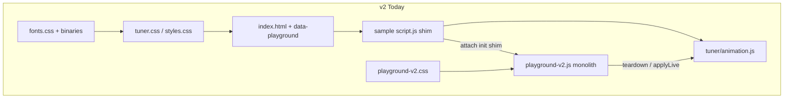
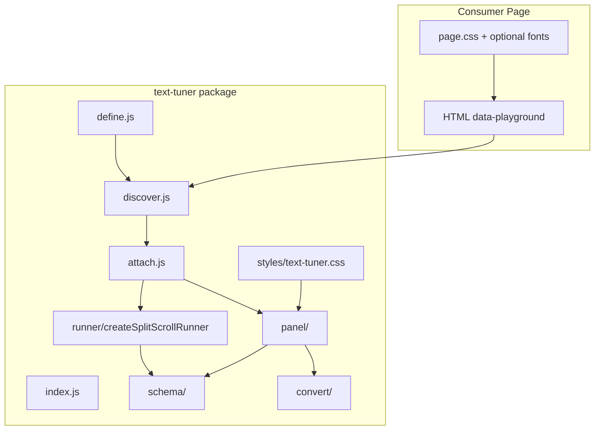

# Text Tuner v3 — Pre-Implementation Refactor Plan

> **Status:** Close-out complete — Phases 1–7 + Phase 8 hardening shipped  
> **Location:** `text-tuner/migration-refactor/`  
> **Related:** [PLAYGROUND_V3_PRD.md](../PLAYGROUND_V3_PRD.md) · [PLUGIN_MIGRATION.md](../PLUGIN_MIGRATION.md) · [ACCEPTANCE_TESTS.md](../ACCEPTANCE_TESTS.md)

> **Note:** `split-text/` removed from repo — all sources live in `text-tuner/`. Historical v2 paths below are git history only.

The PRD in [PLAYGROUND_V3_PRD.md](../PLAYGROUND_V3_PRD.md) is **aligned** with locked ADRs and migration-refactor docs (June 2025). Migration sources (formerly playground-v2) now live entirely in `text-tuner/`:

| Artifact | Path | Role today |
|----------|------|------------|
| Panel | `text-tuner/src/panel/` | UI, form I/O, export, lifecycle |
| Panel CSS | `text-tuner/styles/` | Light sidebar instrument |
| Runner | `text-tuner/src/runner/` | SplitText + gsap + ScrollTrigger |
| Registry | `text-tuner/src/discover.js`, `attach.js` | `discover()`, `define()`, multi-instance |
| Fonts (full) | `text-tuner/examples/fonts-full/fonts/` | Maintainer library (not npm) |

[`text-tuner/`](../) currently has **docs only** — no `src/`. The refactor goal is: **port v2 parity into clean modules first**, then layer v3 deltas from the PRD.

### Document hierarchy

| Layer | Role |
|-------|------|
| [PLAYGROUND_V3_PRD.md](../PLAYGROUND_V3_PRD.md) | **What** — features, API, workflows, success criteria |
| [docs/adr/](../docs/adr/) | **Why locked** — architectural decisions |
| `migration-refactor/` | **How** — extraction phases, CSS layers, font tiers, UI standards |
| [ACCEPTANCE_TESTS.md](../ACCEPTANCE_TESTS.md) | **Verify** — P0 scenarios per phase |
| [issues/QUEUE.md](../issues/QUEUE.md) | **Work queue** — phased issues + gates |

### Locked decisions (grill session)

| Topic | ADR / doc |
|-------|-----------|
| InstanceManager | [0001](../docs/adr/0001-instance-manager-owns-session-state.md) |
| Smart commit + live typography | [0002](../docs/adr/0002-smart-rebuild-and-live-typography.md) |
| Canonical Copy code module | [0003](../docs/adr/0003-shared-canonical-template.md) |
| `tt-` CSS + BEM | [0004](../docs/adr/0004-tt-css-prefix-and-bem.md) · [INTERFACE_RULES](./INTERFACE_RULES.md) · [COMPONENT_AUDIT](./COMPONENT_AUDIT.md) |
| Font tiers + root `fonts/` | [0005](../docs/adr/0005-font-tiers-and-starter-pack.md) · [FONT_MANAGEMENT](./FONT_MANAGEMENT.md) · [ADDING_FONTS](./ADDING_FONTS.md) |
| Import in dock | [0006](../docs/adr/0006-import-in-dock.md) |
| ESM only | [0007](../docs/adr/0007-esm-only-build.md) |
| v2 `attach({ init })` shim | [0008](../docs/adr/0008-v2-attach-shim.md) |
| JS + `.d.ts` | [0009](../docs/adr/0009-js-with-dts.md) |
| UI maintenance | [UI_MAINTENANCE](./UI_MAINTENANCE.md) |

---

## Current architecture (what we're escaping)



**Spaghetti patterns to fix during extraction** (not after):

- ~20 module-level `let` bindings shared across all panel functions
- Dual DOM access: `cacheElements()` refs **and** scattered `getElementById('pg-st-…')`
- `readConfigFromForm` / `fillFormFromConfig` / `injectPanel` / `cacheElements` / `bind*` must stay in sync for every new field
- `typeIncludes` / `buildStagger` duplicated in panel-adjacent runner code
- Typography applies to `:root` globally (breaks multi-instance preview)
- Single `storageKey` in panel; sample shim already uses `${prefix}:${id}` — panel doesn't own instance switching

---

## Target architecture (v3 module boundaries)



**Ownership rule (from PRD):** `attach.js` owns registry, per-id session, instance switch, overlap warnings. `panel/` owns UI only. `runner/` owns GSAP. `schema/` owns pure config. `canonical/` owns Copy code shape; `panel/export.js` and `convert/` are thin wrappers ([ADR-0003](../docs/adr/0003-shared-canonical-template.md)).

### Locked decision — InstanceManager ([ADR-0001](../docs/adr/0001-instance-manager-owns-session-state.md))

`attach.js` owns an **InstanceManager** with one **InstanceSession** per registry id. Each session holds code defaults, committed config, runner handles, and `${storageKey}:${id}` persistence. The panel is a view: hydrate/read form for `activeId`, call `manager.commit()`, `manager.applyLive()`, `manager.switchTo()` — never calls the runner directly.

```text
attach()
  └── InstanceManager
        ├── sessions[id]  →  { codeDefaults, committedConfig, teardown, runtime }
        ├── activeId
        └── commit() | applyLive() | switchTo() | reset() | resetAll() | initAll()
```

`panel/lifecycle.js` from Phase 3d is absorbed into InstanceManager (not a separate panel concern).

### Locked decision — Smart commit + live typography ([ADR-0002](../docs/adr/0002-smart-rebuild-and-live-typography.md))

| Update type | While panel open | On commit |
|-------------|------------------|-----------|
| Properties, ScrollTrigger | `applyLive()` — instant | Persist only (skip rebuild if unchanged) |
| Typography | `applyTypography()` scoped to active instance — instant CSS preview | Persist + full rebuild if typography changed |
| SplitText, targets | Pending tab badge only | Persist + full rebuild |

Typography live path is a **v3 UX improvement** over v2 (v2 waited until panel close to apply CSS vars).

---

## Phase 0 — PRD parity audit (docs before code) ✅

**Checkpoint complete.** v2 UI parity notes, live typography, smart commit, and doc cross-links are in [PLAYGROUND_V3_PRD.md](../PLAYGROUND_V3_PRD.md) §10–11, §20–21. No separate `V2_PARITY.md` needed.

### Captured in PRD

- 4 tabs, keyboard shortcuts, live vs smart-rebuild-on-commit model
- `SplitScrollConfig` schema, dock exports (Import · Config · Code · CSS)
- Multi-instance, `discover` / `define`, import drawer, follow viewport (v3 additions)
- Strategy A, `data-playground` contract
- InstanceManager ownership, `canonical/` module, font tiers, ESM + `.d.ts`

### v2 UI details — now in PRD §10.3

| v2 behavior | Where in v2 | PRD |
|-------------|-------------|-----|
| Tab labels: Type / Tween / Split / Scroll | `injectPanel` | §10.1 — renamed to Typography / Properties / SplitText / ScrollTrigger |
| Animation **sub-tabs** (stagger vs from/to grid) | `selectSubTab`, Properties HTML | §10.3 — `tt-subtab-panel` |
| Per-property **reset** buttons in from/to grid | `resetAnimProp`, `pg-prop-reset` | §10.3 — Properties |
| ScrollTrigger **edge vs offset** position UI + unit toggles | lines 209–432 in JS | §10.3 — `tt-st-position` |
| Stagger **grid** + **axis** fields | `normalizeStaggerConfig` | §10.3 + schema §6 |
| `?playground=id` URL override | sample `getActiveId` | Interim until instance dropdown; document in demo only |
| Panel `playground-v2-panel--syncing` state during rebuild | CSS + `setPanelSyncing` | §10.1 — `tt-panel--syncing` |
| 25 hardcoded `FONTS` entries | JS lines 10–134 | `fonts.manifest.json` + `attach({ fonts })` override |

### v2 features **not** in panel file (must be lifted, not rewritten)

- `discover()`, `define()`, `buildScaffoldConfig`, `validateDom`, `initAll` — in [`examples/sample-playground/script.js`](../examples/sample-playground/script.js)
- Overlap warning — already in sample `validateDom`, not in panel
- Runner `applyLive` — in `tuner/animation.js`

**Next:** Phase 1 — extract `schema/*` (no code in `text-tuner/src/` yet).

---

## Phase 1 — Extract pure modules (no DOM, no GSAP)

**Goal:** Testable units with zero panel coupling.

| New module | Source (v2) | Contents |
|------------|-------------|----------|
| `schema/config.js` | `deepClone`, `deepMerge`, `normalizeStaggerConfig` | Config merge + stagger legacy compat |
| `schema/defaults.js` | `DEFAULT_CONFIG` from animation.js + `buildScaffoldConfig` from sample | Scaffold per `data-playground` id |
| `schema/anim-props.js` | `ANIM_PROPS`, `EASE_OPTIONS`, `STAGGER_FROM`, `FONTS` | Constants; fonts overridable via `attach` |
| `schema/scroll-position.js` | lines 209–397 in panel JS | Parse/format `"top 25%"`, edge/offset modes |
| `schema/version.js` | new | `SCHEMA_VERSION`, `__schema` field |

**Design fix:** Single `typeIncludes` / `normalizeStagger` — delete duplicates from runner and panel paths.

**Tests (manual or unit):** stagger normalization, scroll position parse round-trip, scaffold defaults for unknown id.

---

## Phase 2 — Extract runner

| New module | Source | Notes |
|------------|--------|-------|
| `runner/create-split-scroll-runner.js` | `src/runner/create-split-scroll-runner.js` (ported from v2 `tuner/animation.js`) | Export `{ teardown, runtime: { applyLive, getConfig } }` |
| Remove duplicate | sample `script.js` §1 | Import from package instead |

**Contract:** Runner receives full `SplitScrollConfig`; never reads form DOM. Panel calls `applyLive(patch)` for live tabs only.

---

## Phase 3 — Extract panel (biggest refactor)

Split legacy `playground-v2.js` monolith in this order:

### 3a — UI components (pure HTML builders + binders)

| Module | v2 lines | Responsibility |
|--------|----------|----------------|
| `panel/components/track-slider.js` | 521–616 | Build, sync fill, bind input |
| `panel/components/segment-group.js` | 434–519 | Segment bars, exclusive groups |
| `panel/components/select-row.js` | dropdown helpers | Font, ease, animate selects |
| `panel/components/scroll-position-field.js` | 209–432, 400–432 | ST start/end UI |

### 3b — Tab templates

Split `injectPanel` (1216–1436) into `panel/templates/`:

- `shell.js` — header, instance slot (empty in phase 3, wired in phase 5), body, dock, footer
- `tab-typography.js`, `tab-properties.js`, `tab-split-text.js`, `tab-scroll-trigger.js`

### 3c — Form state + DOM

| Module | Responsibility |
|--------|----------------|
| `panel/dom.js` | All element refs; **no** raw `getElementById` outside this file |
| `panel/form-state.js` | `readConfigFromForm`, `fillFormFromConfig` |
| `panel/typography.js` | `applyTypography`, `exportTypographyCss`, `waitForFonts` |

**Design fix:** `createPanelController({ el, onCommit, onLive })` closure replaces module-level `let` soup.

**Design fix:** Scope typography CSS vars to `[data-playground="${activeId}"]` (or consumer `targets` selector), not `:root`.

### 3d — Panel bindings (view only)

| Module | Responsibility |
|--------|----------------|
| `panel/bindings/*.js` | One file per tab + dock + keyboard; delegates to InstanceManager |
| `panel/export.js` | `exportCopyCode`, `serializeConfig` — canonical shape for `convert/` |
| `panel/keyboard.js` | ⌘K, ⌘1–4, Esc |

### 3e — Attach + InstanceManager

| Module | Responsibility |
|--------|----------------|
| `attach/instance-manager.js` | Per-id sessions, `commit`, `applyLive`, `switchTo`, `reset`, `resetAll`, `initAll`, debounced rebuild |
| `attach/instance-session.js` | One id: defaults, committed config, teardown/runtime handles, storage read/write |
| `attach.js` | Wire discover/define registry → InstanceManager → panel |
| `discover.js` | Port from sample script §4 |
| `define.js` | Tier 1 merge |
| `index.js` | Public exports + v2 compat shim |

**v2 compat shim:** `attach({ init, defaults, storageKey })` → single-entry registry (PRD §7.3).

---

## Phase 4 — CSS architecture

Migrate legacy `playground-v2.css` into layered files under `text-tuner/styles/`:

```
text-tuner/styles/
├── tokens.css           # --tt-* (rename from --pg-*)
├── base.css             # sr-only, [hidden], focus
├── layout.css           # body grid, panel regions
├── components/
│   ├── segment.css
│   ├── field.css
│   ├── input.css
│   ├── track-slider.css
│   ├── control-bar.css
│   ├── select-row.css
│   ├── prop-grid.css
│   └── import.css
├── tabs/
│   ├── properties.css   # stagger, prop-list
│   └── scroll-trigger.css
└── text-tuner.css       # @import bundle for npm export
```

### Naming migration — locked ([ADR-0004](../docs/adr/0004-tt-css-prefix-and-bem.md), [INTERFACE_RULES.md](./INTERFACE_RULES.md))

| v2 | v3 |
|----|-----|
| `body.playground-v2-active` | `body.text-tuner-active` |
| `body.playground-v2-panel-open` | `body.text-tuner-panel-open` |
| `#playground-v2-panel` | `#text-tuner-panel` |
| `.playground-v2-canvas` | `.text-tuner-canvas` |
| `.pg-*` BEM | `.tt-*` BEM (full rename, no aliases) |
| `--pg-*` tokens | `--tt-*` tokens |
| Typography on `:root` | `--playground-*` on `[data-playground="id"]` |

### Page vs panel boundary (keep strict)

| Layer | Lives in | Contents |
|-------|----------|----------|
| **Package** | `text-tuner/styles.css` | Panel only |
| **Demo page** | `examples/sample-playground/styles.css` | Dark canvas, frames, `--playground-*` |
| **Fonts** | `text-tuner/fonts/` (demo asset) | Not required for npm consumers |

Follow [INTERFACE_RULES.md](./INTERFACE_RULES.md) and [COMPONENT_AUDIT.md](./COMPONENT_AUDIT.md): 40px control height, token-first spacing, light panel / dark canvas, `--tt-segment-pad` on header chips only.

### CSS fixes during migration

- Fix undefined `--pg-label-size-sm` (line ~911) → `--tt-font-size-sm`
- Consistent scoping: all rules under `#text-tuner-panel`
- Extract repeated label typography into `.tt-label`
- Panel UI font: Geist in `styles/fonts/panel/`; system stack fallback in `var(--tt-font)`

---

## Phase 5 — Fonts migration

See [FONT_MANAGEMENT.md](./FONT_MANAGEMENT.md) · [ADR-0005](../docs/adr/0005-font-tiers-and-starter-pack.md).

| Tier | Location | npm |
|------|----------|-----|
| Panel chrome | `styles/fonts/panel/` | Yes |
| Starter pack | **`fonts/`** at package root + `fonts.css` + `fonts.manifest.json` | Yes |
| Full library | `examples/fonts-full/` | No |
| Consumer | **Project root `fonts/`** (copy starter, add families, run generate) | User-owned |

User guide: [ADDING_FONTS.md](./ADDING_FONTS.md)

---

## Phase 6 — v3-only features (after parity compiles)

Only after Phases 1–5 pass v2 acceptance:

| Feature | PRD | Depends on |
|---------|-----|------------|
| Instance dropdown | §10.2 | `attach.js` registry |
| Per-id session (native) | §12 | Remove sample shim |
| Import drawer + `convert()` | §13 · [ADR-0006](../docs/adr/0006-import-in-dock.md) | `panel/import-drawer.js`, `canonical/` |
| Follow viewport IO | §10.2 | `attach.js` + panel header toggle |
| Reset instance / Reset all | §10.2 | per-id storage |
| Overlap boot warning | §10.2 | `discover.js` (port from sample) |
| `productionEnabled` guard | §17 | `attach.js` |
| CLI `text-tuner-convert` | §13 | `convert/` module |

Reference: [ACCEPTANCE_TESTS.md](../ACCEPTANCE_TESTS.md) — run AT-001+ after each phase.

---

## Phase 7 — Demo + package boundary

- Move sample playground → `text-tuner/examples/sample-playground/` (done)
- Slim `script.js` to: `define`, `discover`, `attach` imports only (no inline runner/registry)
- Add `package.json` with ESM-only exports per [PLUGIN_MIGRATION.md](../PLUGIN_MIGRATION.md) · [ADR-0007](../docs/adr/0007-esm-only-build.md)
- Remove legacy `split-text/` tree after fonts migrated to `examples/fonts-full/fonts/` (done)

---

## Refactor checklist (execution order)

### A — Document & inventory
- [x] Append v2 UI parity notes to PRD (sub-tabs, scroll position UI, prop reset, syncing state, live typography)
- [x] Cross-link ADRs, INTERFACE_RULES, COMPONENT_AUDIT in PRD §20
- [x] Map every `bind*` function → target module file ([V2_EXTRACTION_MAP.md](./V2_EXTRACTION_MAP.md) §1.9)
- [x] Map every CSS section → target stylesheet ([V2_EXTRACTION_MAP.md](./V2_EXTRACTION_MAP.md) §2)
- [x] Full v2 function → module inventory ([V2_EXTRACTION_MAP.md](./V2_EXTRACTION_MAP.md) §1)

### B — Pure extraction (Phase 1)
- [x] `schema/config.js` — deepMerge, stagger normalization, typeIncludes
- [x] `schema/scroll-position.js` — parse/format round-trip
- [x] `schema/version.js` — `SCHEMA_VERSION`
- [x] `schema/index.js` barrel export
- [x] Unit tests — `tests/schema/scroll-position.test.js` (8 passing)
- [x] `schema/defaults.js` — `buildScaffoldConfig`, `GLOBAL_SCAFFOLD`, `DEFAULT_CONFIG`
- [x] `schema/anim-props.js` — `ANIM_PROPS`, `EASE_OPTIONS`, `STAGGER_FROM`

### C — Runner (Phase 2)
- [x] `create-split-scroll-runner.js` from `tuner/animation.js`
- [x] Delete runner duplicate from sample script (imports text-tuner runner)
- [x] `animation.mjs` bridge for v2 tuner page
- [x] Phase 2 gate — manual AT-001 / AT-010 (TT-021)

### D — Panel decomposition (Phase 3)
- [x] `panel/components/*` (sliders, segments, scroll position)
- [x] `panel/templates/*` (split `injectPanel`)
- [x] `panel/dom.js` — single DOM gateway
- [x] `panel/form-state.js` — read/hydrate
- [x] `attach/instance-manager.js` — commit/rebuild/live debounce (not panel)
- [x] `panel/bindings/*` — per-tab listeners
- [x] `panel/export.js` — copy config/code/CSS
- [x] `createPanelController()` — replace module `let` state

### E — Registry API (Phase 3e)
- [x] `discover.js` + `define.js` from sample script
- [x] `attach.js` with registry + v2 compat shim
- [x] Per-id `sessionStorage` in attach (not panel)

### F — CSS layers (Phase 4)
- [x] Split `playground-v2.css` → `text-tuner/styles/*`
- [x] Rename `pg-` → `tt-`, fix token gaps
- [x] Update [INTERFACE_RULES.md](./INTERFACE_RULES.md) when tokens change (not v2 file)

### G — Fonts (Phase 5)
- [x] Panel chrome → `styles/fonts/panel/`
- [x] Starter pack → package root `fonts/` + generated css/manifest
- [x] Full library → `examples/fonts-full/` (symlink to v2 for maintainer dev)
- [x] Generator defaults: cwd `./fonts` → `./fonts.css` + `./fonts.manifest.json`
- [x] [ADDING_FONTS.md](./ADDING_FONTS.md) user guide

### H — v3 features (Phase 6)
- [x] Instance dropdown + switch-with-commit
- [x] Import drawer in dock + `convert()` round-trip with `canonical/`
- [x] Follow viewport, reset all, overlap warning
- [x] Run full `ACCEPTANCE_TESTS.md` P0 suite — see [issues/test-runs/2025-06-23-p0.md](../issues/test-runs/2025-06-23-p0.md)

### I — Package (Phase 7)
- [x] `package.json` exports, ESM build (no UMD), `styles.css` export
- [x] Move sample playground; verify cold start & v2 compat attach
- [x] Deprecate v2 folder

### J — Close-out (Phase 8)
- [x] Queue reconciliation (TT-080)
- [x] Smart commit ADR-0002 (TT-081)
- [x] InstanceManager lifecycle (TT-082)
- [x] Demo title typography CSS (TT-092)

### K — Post-close-out (Phase 9)
- [x] Typography × SplitText canvas contract — [CANVAS_TYPOGRAPHY.md](./CANVAS_TYPOGRAPHY.md) (TT-093)
- [x] AT-033a–d manual verification matrix — [test-runs/2025-06-24-tt093.md](../issues/test-runs/2025-06-24-tt093.md)
- [x] `canvas-typography.css` package export

---

## Success criteria for "refactor done, ready for v3 features"

1. **Single-instance parity:** v2 tuner page behaves identically when importing from `text-tuner` (AT-005).
2. **No monolith:** no file > ~400 lines; panel state encapsulated.
3. **One runner, one schema:** zero duplicated `typeIncludes` / stagger logic.
4. **CSS navigable:** tokens + components + tabs; panel scoped under `#text-tuner-panel`.
5. **Fonts optional:** demo loads fonts; package works with system fonts + consumer vars.
6. **Round-trip ready:** `exportCopyCode` output documented as canonical input for `convert()` (implement in Phase 6).

---

## Key files to treat as source of truth

| Concern | Primary source |
|---------|----------------|
| **Requirements** | [PLAYGROUND_V3_PRD.md](../PLAYGROUND_V3_PRD.md) |
| Panel behavior | `src/panel/` (ported from playground-v2.js) |
| Panel styles | `styles/` + [INTERFACE_RULES.md](./INTERFACE_RULES.md) + [COMPONENT_AUDIT.md](./COMPONENT_AUDIT.md) |
| Runner | `src/runner/create-split-scroll-runner.js` |
| Registry prototype | `examples/sample-playground/script.js` |
| Package contract | [PLUGIN_MIGRATION.md](../PLUGIN_MIGRATION.md) |
| Locked decisions | [docs/adr/](../docs/adr/) |
